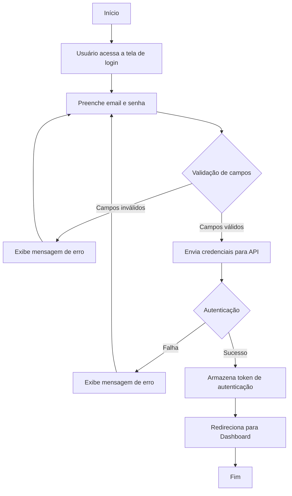

# 1 - Login

## Descrição
Tela de autenticação do sistema que permite aos usuários acessarem o sistema usando suas credenciais (e-mail e senha).

## Fluxograma do Processo de Login

## Componentes Principais

1. **Formulário de Login**
   - Campo de email
   - Campo de senha
   - Botão de entrar
   - Link para recuperação de senha

2. **Sistema de Validação**
   - Validação de formato de email
   - Validação de preenchimento de senha

3. **Recuperação de Senha**
   - Fluxo para solicitar redefinição de senha
   - Envio de email com link seguro

## Implementação

O login utiliza o Supabase para autenticação, conforme configurado em:
- URL: `VITE_SUPABASE_URL`
- Chave: `VITE_SUPABASE_ANON_KEY`
- Redirecionamento: `VITE_SUPABASE_REDIRECT_URL`

## Casos de Uso

1. **Login bem-sucedido**
   - Usuário insere credenciais válidas
   - Sistema autentica e redireciona para dashboard

2. **Credenciais inválidas**
   - Usuário insere email/senha incorretos
   - Sistema exibe mensagem de erro

3. **Recuperação de senha**
   - Usuário solicita recuperação
   - Sistema envia email com instruções

## Segurança

- Implementação de rate limiting para prevenir ataques de força bruta
- Tokens JWT para autenticação
- HTTPS para comunicação segura
- Validação de entrada para prevenir injeção
