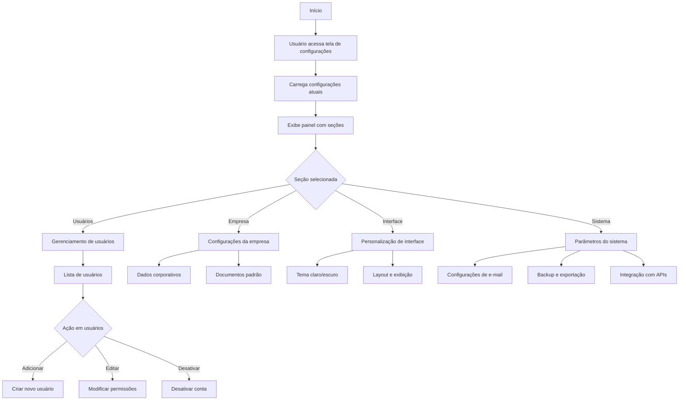

# 10 - Configurações

## Descrição
Tela que permite gerenciar as configurações do sistema, incluindo usuários, permissões, parâmetros gerais e personalização de interface.

## Fluxograma de Gestão de Configurações

## Componentes Principais

1. **Gerenciador de Usuários**
   - Lista completa de usuários
   - Controle de permissões por função
   - Histórico de atividades

2. **Configurações de Empresa**
   - Dados corporativos
   - Logotipos e marcas
   - Documentos padrão

3. **Personalização de Interface**
   - Seleção de tema (claro/escuro)
   - Opções de layout
   - Preferências de exibição

4. **Parâmetros de Sistema**
   - Configurações de SMTP
   - Períodos de backup
   - Chaves de API

## Implementação

A tela utiliza estilos definidos em `ConfiguracoesView.css` para organização visual e tabelas responsivas para gestão de usuários.

## Casos de Uso

1. **Gestão de usuários**
   - Criação de novas contas
   - Definição de perfis de permissão
   - Resetar senhas

2. **Personalização**
   - Escolha de tema de interface
   - Configuração de notificações
   - Definição de página inicial

3. **Configurações técnicas**
   - Configuração de e-mails
   - Agendamento de backups
   - Registros de auditoria

## Segurança

- Controle granular de permissões
- Registro de todas as alterações
- Autenticação em dois fatores (opcional)

## Recursos Especiais

- Importação/exportação de configurações
- Sincronização entre dispositivos
- Suporte a múltiplos idiomas
