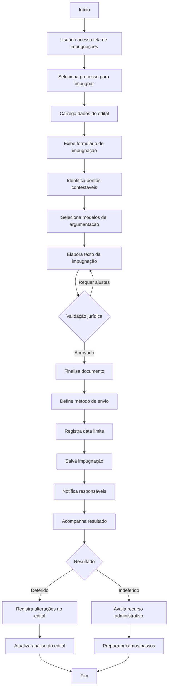

# 11 - Impugnações

## Descrição
Tela que permite gerenciar o processo de impugnação de editais, incluindo identificação de pontos questionáveis, elaboração de documentos e acompanhamento de resultados.

## Fluxograma de Gestão de Impugnações

## Componentes Principais

1. **Seletor de Processos**
   - Lista de editais em fase de impugnação
   - Indicação de prazos limites
   - Status de impugnações em andamento

2. **Editor de Impugnação**
   - Campo de texto rico para redação
   - Biblioteca de modelos e argumentos jurídicos
   - Validação de conteúdo por item

3. **Gerenciador de Envio**
   - Opções de envio (e-mail, protocolo presencial, plataforma)
   - Geração de comprovantes
   - Controle de prazos

4. **Acompanhamento de Resultados**
   - Status da impugnação
   - Registro de respostas
   - Avaliação de efetividade

## Implementação

A tela utiliza o componente `ImpugnacaoEditor.vue` para elaboração dos documentos e integração com a biblioteca de modelos de texto.

## Casos de Uso

1. **Identificação de pontos críticos**
   - Usuário marca cláusulas restritivas no edital
   - Sistema sugere argumentos legais aplicáveis

2. **Elaboração de documento**
   - Montagem do texto com base em modelos
   - Personalização para o caso específico

3. **Acompanhamento de resultados**
   - Registro da resposta do órgão
   - Análise do impacto no edital original

## Integração com Análise de Editais

- Pontos críticos identificados na análise são sugeridos para impugnação
- Após impugnação deferida, a análise de viabilidade é atualizada

## Biblioteca de Modelos

- Textos-padrão para tipos comuns de impugnação
- Referências à legislação aplicável
- Histórico de sucessos anteriores

## Recursos Especiais

- Contador de prazos com alertas
- Sugestão automática de pontos a impugnar
- Análise de precedentes em impugnações similares
