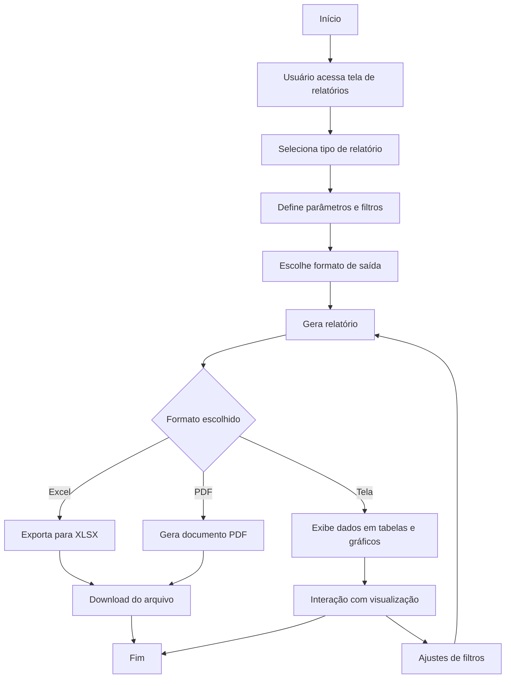

# 12 - Relatórios

## Descrição
Tela que permite gerar e visualizar relatórios analíticos e estatísticos sobre os processos licitatórios, análises de editais, propostas e resultados.

## Fluxograma de Geração de Relatórios

## Componentes Principais

1. **Seletor de Relatórios**
   - Lista de tipos de relatórios disponíveis
   - Descrição e parâmetros necessários
   - Visualização prévia

2. **Painel de Filtros**
   - Filtros por período
   - Filtros por status, região, valores
   - Seleção de campos a incluir

3. **Visualização de Dados**
   - Tabelas interativas
   - Gráficos dinâmicos
   - Mapas de calor

4. **Exportação**
   - Opções de formato (PDF, Excel, CSV)
   - Personalização de layout
   - Agendamento de envio periódico

## Implementação

O módulo utiliza Chart.js para geração de gráficos, xlsx para exportação para Excel e jsPDF para geração de documentos PDF.

## Tipos de Relatórios

1. **Desempenho em Licitações**
   - Taxa de sucesso por período
   - Volumes financeiros conquistados
   - Comparativo com períodos anteriores

2. **Análise de Concorrência**
   - Principais concorrentes por região
   - Preços praticados
   - Estatísticas de vitórias/derrotas

3. **Análise Regional**
   - Mapa de calor por taxa de sucesso
   - Volume de licitações por estado/município
   - Oportunidades por região

4. **Dashboard Executivo**
   - KPIs principais condensados
   - Tendências e projeções
   - Alertas de desvios e oportunidades

## Casos de Uso

1. **Relatório mensal para diretoria**
   - Resumo executivo dos resultados
   - Indicadores de desempenho chave
   - Projeções para próximo período

2. **Análise de efetividade comercial**
   - Desempenho por representante
   - Conversão de oportunidades
   - Valores médios de contratos

3. **Estudo de mercado**
   - Análise de tendências de preços
   - Identificação de nichos promissores
   - Comportamento da concorrência

## Recursos Especiais

- Agendamento de relatórios recorrentes
- Envio automático por e-mail
- Templates personalizáveis
- Dashboards interativos
