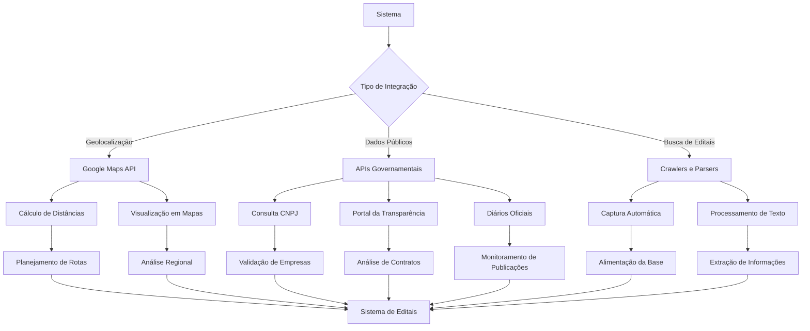

# 13 - Integração com APIs

## Descrição
Documentação das integrações com APIs externas utilizadas pelo sistema, incluindo serviços de geolocalização, consulta de dados públicos e automatização de captura de editais.

## Fluxograma de Integração com APIs

## APIs Integradas

### 1. Google Maps API
- **Finalidade**: Geolocalização, cálculo de distâncias e visualização em mapas
- **Endpoints Utilizados**:
  - Geocoding API: Conversão de endereços em coordenadas
  - Distance Matrix API: Cálculo de distâncias e tempos de viagem
  - Maps JavaScript API: Exibição de mapas interativos
- **Configuração**: Chave API definida em variável de ambiente `VITE_GOOGLE_MAPS_API_KEY`

### 2. APIs Governamentais
- **Finalidade**: Consulta de dados cadastrais e públicos
- **Endpoints Utilizados**:
  - API Receita Federal: Consulta de CNPJ e situação cadastral
  - API IBGE: Dados geográficos e estatísticos
  - API Portal da Transparência: Consulta de contratos públicos
- **Autenticação**: Varia conforme o serviço (chaves API, tokens ou acesso aberto)

### 3. Crawlers e Parsers
- **Finalidade**: Captura automática de editais e processamento de texto
- **Tecnologias Utilizadas**:
  - Web Scrapers: Captura de dados de portais públicos
  - OCR: Processamento de documentos PDF
  - NLP: Análise semântica para extração de informações relevantes
- **Implementação**: Serviços em background com agendamento para execução periódica

## Implementação e Segurança

### Armazenamento de Credenciais
- Todas as chaves de API são armazenadas em variáveis de ambiente
- Não há credenciais hardcoded no código-fonte
- Uso de proxy quando aplicável para ocultar chaves de API

### Cache e Rate Limiting
- Implementação de cache com Redis para reduzir chamadas repetidas
- Rate limiting para respeitar limites de uso das APIs
- Backoff exponencial para retry em caso de falhas

### Monitoramento e Logs
- Registro de todas as chamadas de API
- Alertas para falhas ou taxas de erro elevadas
- Monitoramento de uso para controle de custos

## Casos de Uso

1. **Cálculo de Distâncias para Representantes**
   - API usada: Google Maps Distance Matrix
   - Finalidade: Otimizar atribuição de representantes para licitações

2. **Verificação Automática de Empresas**
   - API usada: Receita Federal
   - Finalidade: Validar dados cadastrais de clientes e concorrentes

3. **Monitoramento de Diários Oficiais**
   - APIs usadas: Diários Oficiais estaduais e municipais
   - Finalidade: Captura automatizada de novos editais

## Configuração de Novas Integrações

Para adicionar uma nova integração:

1. Crie um serviço em `src/services/api/[nome-do-servico].js`
2. Implemente métodos de autenticação e requisição
3. Configure variáveis de ambiente no arquivo `.env`
4. Adicione middleware de cache e rate limiting
5. Documente os endpoints e parâmetros utilizados
