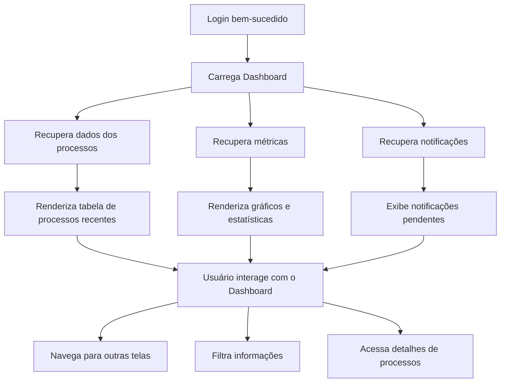

# 2 - Dashboard

## Descrição
Tela principal após o login que apresenta uma visão geral dos processos licitatórios, métricas e informações relevantes para o usuário.

## Fluxograma de Navegação do Dashboard

## Componentes Principais

1. **Cabeçalho**
   - Barra de navegação principal
   - Menu de usuário
   - Alternador de tema claro/escuro

2. **Visão Geral de Processos**
   - Tabela de processos recentes
   - Indicadores de status (em análise, em andamento, ganhos, perdidos)
   - Filtros rápidos

3. **Métricas e Gráficos**
   - Taxa de sucesso em licitações
   - Valores de contratos por período
   - Distribuição por tipo de processo

4. **Notificações**
   - Alertas para prazos próximos
   - Impugnações pendentes
   - Atualizações de processos

## Implementação

O dashboard utiliza gráficos com Chart.js para visualizações de dados e componentes Vue.js para renderização dinâmica de conteúdo.

## Casos de Uso

1. **Visualização de resumo**
   - Usuário acessa estatísticas gerais
   - Sistema exibe KPIs principais e gráficos

2. **Acesso rápido a processos**
   - Usuário visualiza processos recentes
   - Sistema permite acesso direto ao detalhe

3. **Monitoramento de prazos**
   - Sistema destaca processos com prazos próximos
   - Usuário recebe alertas visuais

## Responsividade

O layout se adapta a diferentes tamanhos de tela:
- Layout em grade para telas grandes
- Layout em coluna única para dispositivos móveis
- Menus colapsáveis em telas pequenas
