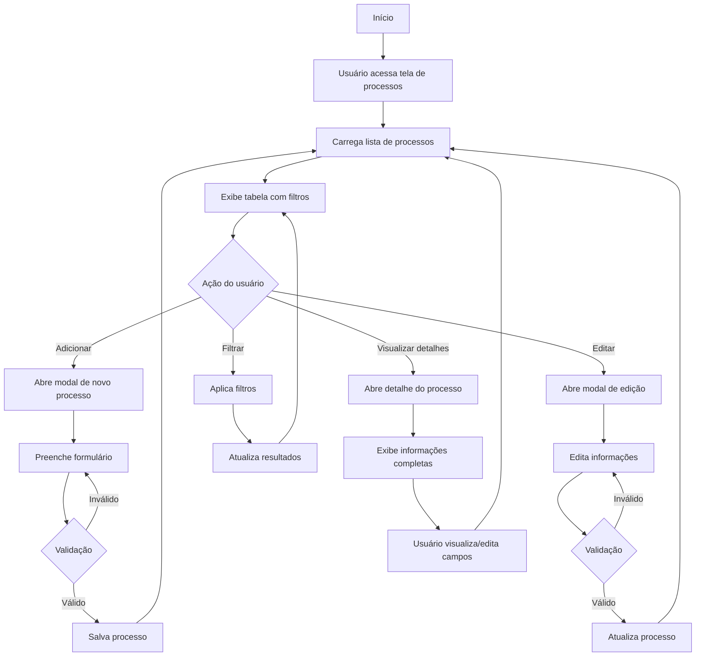

# 3 - Processos Licitatórios

## Descrição
Tela de gerenciamento de processos licitatórios que permite visualizar, adicionar, editar e filtrar processos em diferentes estágios.

## Fluxograma de Gerenciamento de Processos

## Componentes Principais

1. **Tabela de Processos**
   - Colunas configuráveis
   - Ordenação por qualquer coluna
   - Edição inline de células
   - Indicadores visuais de status

2. **Filtros Avançados**
   - Por status (em análise, em andamento, ganhamos, perdemos)
   - Por data (início/fim)
   - Por valor estimado
   - Por órgão licitante

3. **Formulário de Processo**
   - Dados básicos (número, modalidade, objeto)
   - Datas importantes (publicação, abertura)
   - Valores e prazos
   - Sistemas relacionados

4. **Funcionalidades de Edição**
   - Edição em massa
   - Histórico de alterações
   - Upload de documentos

## Implementação

A tela utiliza componentes reutilizáveis e composables para gerenciar o estado e as interações, como o `useEdicaoCelula.js` que permite edição inline dos dados.

## Casos de Uso

1. **Cadastro de novo processo**
   - Usuário preenche formulário completo
   - Sistema valida e salva informações

2. **Monitoramento de status**
   - Visualização clara do estágio atual
   - Atualização do status conforme progresso

3. **Análise de oportunidades**
   - Filtros para encontrar processos relevantes
   - Exportação de dados para análise externa

## Exportação e Importação

- Exportação para Excel, PDF e JSON
- Importação de dados de diversas fontes
- Integração com diários oficiais para alimentação automática

## Recursos Especiais

- Detecção automática de sistemas compatíveis
- Cálculo de distância para locais de prestação
- Integração com análise automática do edital
