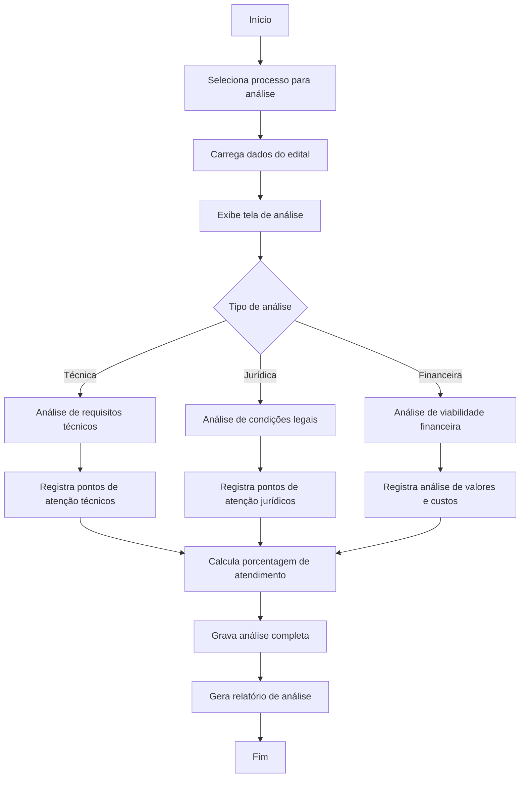

# 4 - Análises de Editais

## Descrição
Tela que permite realizar e visualizar análises detalhadas de editais de licitação, identificando requisitos, compatibilidade com sistemas e viabilidade de participação.

## Fluxograma de Análise de Editais

## Componentes Principais

1. **Seletor de Processo**
   - Lista de processos pendentes de análise
   - Status de análise (não iniciada, em andamento, concluída)

2. **Editor de Análise Técnica**
   - Checklist de requisitos do edital
   - Mapeamento com sistemas da empresa
   - Marcação de itens atendidos/não atendidos

3. **Editor de Análise Jurídica**
   - Verificação de cláusulas restritivas
   - Análise de pontos para impugnação
   - Verificação de documentação exigida

4. **Análise Financeira**
   - Estimativa de custos
   - Preço de referência
   - Margem de desconto possível

## Implementação

A tela utiliza o componente `AnaliseTable.vue` para exibição dos resultados da análise, com indicadores visuais de compatibilidade e atendimento.

## Casos de Uso

1. **Análise inicial de viabilidade**
   - Usuário verifica compatibilidade básica
   - Sistema calcula porcentagem de atendimento

2. **Detecção de pontos críticos**
   - Identificação de requisitos não atendidos
   - Marcação de itens para desenvolvimento

3. **Decisão de participação**
   - Baseada em indicadores objetivos
   - Relatório completo para tomada de decisão

## Integração com Sistemas

A análise conecta-se com:
- Cadastro de sistemas da empresa
- Módulo de impugnações
- Histórico de processos similares

## Recursos Especiais

- Comparação automática entre requisitos e sistemas
- Sugestão de itens para impugnação
- Histórico de análises anteriores para referência
