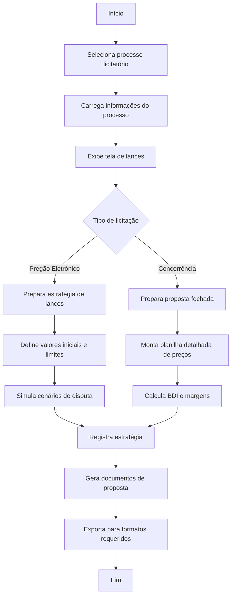

# 5 - Lances e Propostas

## Descrição
Tela que permite gerenciar os lances e propostas para processos licitatórios, incluindo preparação de planilhas de preços, estratégias de lance e readequação de valores.

## Fluxograma de Gestão de Lances

## Componentes Principais

1. **Seletor de Processo**
   - Lista de processos em fase de proposta
   - Indicação de prazos para submissão

2. **Planilha de Valores**
   - Editor de itens e preços
   - Cálculo automático de totais
   - Ajuste de margens e descontos

3. **Estratégia de Lances**
   - Definição de valor inicial
   - Configuração de decrementos
   - Valor mínimo aceitável

4. **Gerador de Propostas**
   - Templates personalizáveis
   - Exportação para múltiplos formatos
   - Validação de acordo com edital

## Implementação

A tela utiliza os componentes `PlanilhaValoresReadequada.css` para formatação das tabelas de valores e cálculos automáticos de diferenças e percentuais.

## Casos de Uso

1. **Preparação de proposta inicial**
   - Usuário preenche valores por item
   - Sistema calcula totalizações

2. **Simulação de cenários**
   - Análise de diferentes estratégias
   - Visualização de impacto na margem

3. **Readequação após vitória**
   - Ajuste de valores mantendo total
   - Geração de planilha final

## Exportação de Dados

- Exportação para Excel
- Geração de PDF para impressão
- Arquivos no formato exigido pelo sistema da licitação

## Recursos Especiais

- Comparação com preços anteriormente praticados
- Histórico de propostas similares como referência
- Alertas para preços inexequíveis ou acima do estimado
