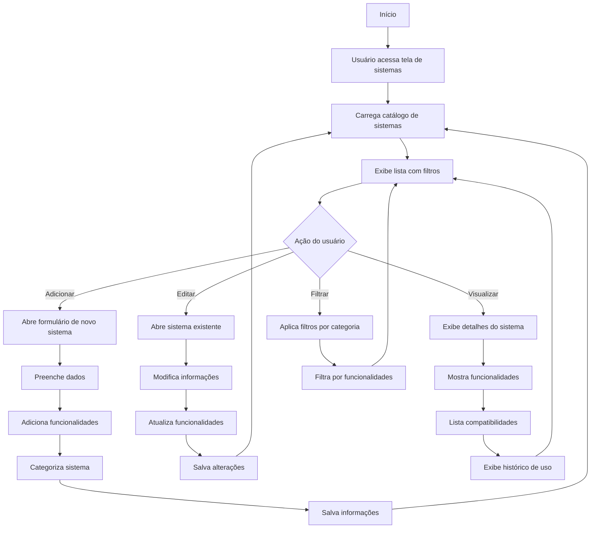

# 6 - Sistemas

## Descrição
Tela que permite gerenciar o catálogo de sistemas e produtos oferecidos pela empresa, incluindo suas funcionalidades, categorias e especificações técnicas.

## Fluxograma de Gestão de Sistemas

## Componentes Principais

1. **Catálogo de Sistemas**
   - Lista de todos os sistemas
   - Filtros por categoria/tipo
   - Visualização em cards ou tabela

2. **Detalhes do Sistema**
   - Informações gerais (nome, versão, etc.)
   - Descrição detalhada
   - Requisitos técnicos

3. **Gerenciador de Funcionalidades**
   - Lista de recursos/módulos
   - Categorização por área
   - Detalhamento de cada funcionalidade

4. **Seletor de Sistemas**
   - Interface para escolha de sistemas em análises
   - Visualização de compatibilidade

## Implementação

A tela utiliza os componentes e estilos definidos em `SistemasView.css` e `SistemasSelection.css` para organização visual dos sistemas e suas categorias.

## Casos de Uso

1. **Cadastro de novo sistema**
   - Usuário adiciona sistema com funcionalidades
   - Sistema categoriza e armazena informações

2. **Seleção para análise de edital**
   - Usuário seleciona sistemas compatíveis
   - Sistema verifica atendimento a requisitos

3. **Atualização de funcionalidades**
   - Adição de novos recursos
   - Atualização de especificações

## Categorização

Os sistemas são organizados em categorias como:
- Gestão Administrativa
- Gestão Financeira
- Portais e Transparência
- Sistemas Tributários
- Processos Eletrônicos

## Integração com Processos

- Vinculação automática de sistemas compatíveis com editais
- Análise histórica de utilização em licitações passadas
- Estatísticas de sucesso por sistema
