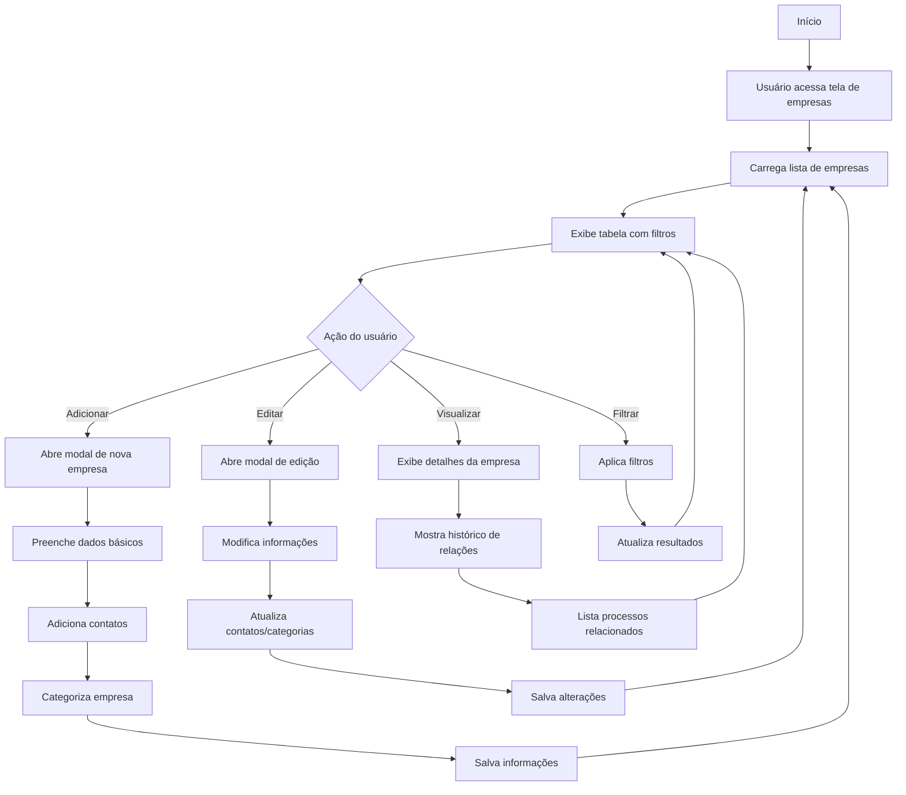

# 7 - Empresas

## Descrição
Tela que permite gerenciar o cadastro de empresas relacionadas aos processos licitatórios, incluindo empresas concorrentes, parceiras e clientes.

## Fluxograma de Gestão de Empresas

## Componentes Principais

1. **Tabela de Empresas**
   - Lista completa das empresas
   - Filtros por categoria/tipo
   - Ordenação por diversos critérios

2. **Formulário de Empresa**
   - Dados cadastrais (nome, CNPJ, etc.)
   - Endereço e contatos
   - Categorização (cliente, concorrente, parceira)

3. **Histórico de Relações**
   - Processos em que a empresa participou
   - Resultados anteriores
   - Comportamento em licitações

4. **Seletor de Empresas Vencedoras**
   - Interface para associar empresas a processos
   - Registro de contratos resultantes

## Implementação

A tela utiliza estilos definidos em `EmpresasView.css` e componentes como `EmpresaVencedoraColuna.vue` para integração com a tabela de processos.

## Casos de Uso

1. **Cadastro de concorrente**
   - Registro de empresas em mesmas licitações
   - Análise de padrões de comportamento

2. **Associação com processos**
   - Definição de empresa vencedora
   - Registro de contratos resultantes

3. **Análise de mercado**
   - Visualização de empresas por região
   - Estatísticas de participação

## Integração com Outras Funcionalidades

- Vinculação com processos licitatórios
- Associação com representantes
- Visualização em análises de mercado

## Recursos Especiais

- Importação de dados da Receita Federal
- Alertas para empresas com restrições legais
- Geolocalização de empresas para análises regionais
