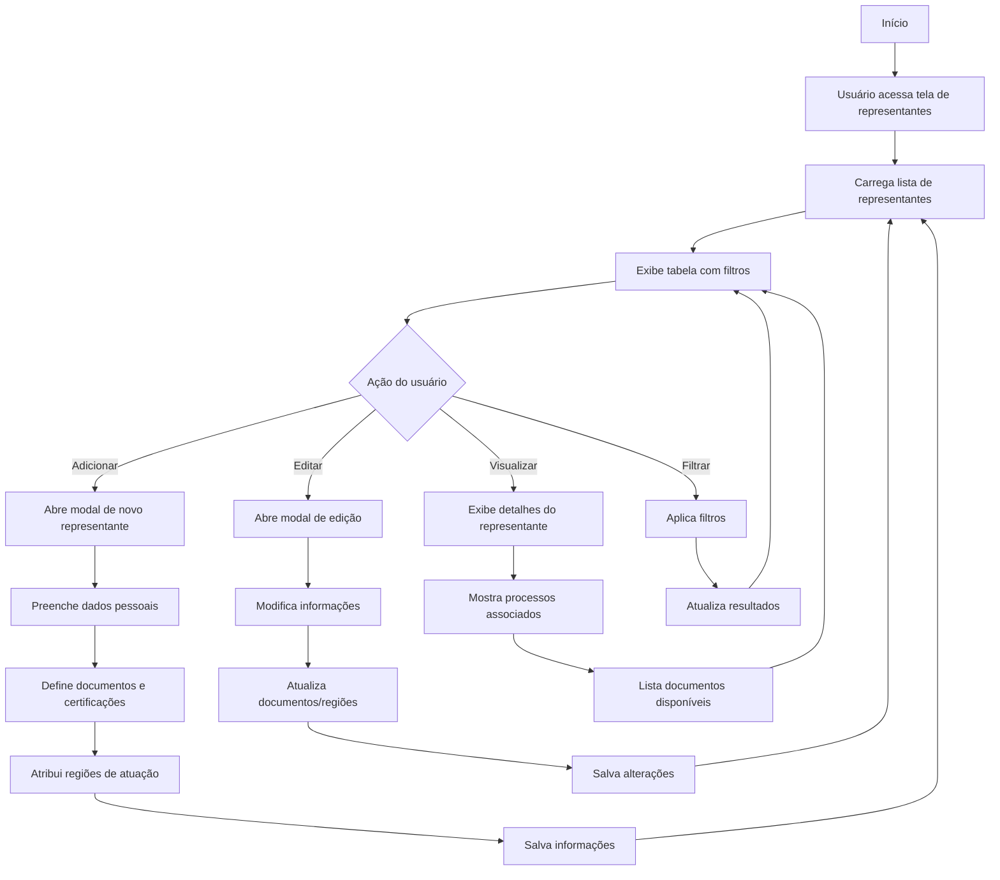

# 8 - Representantes

## Descrição
Tela que permite gerenciar os representantes comerciais e técnicos da empresa, que atuam na participação em licitações e execução de contratos.

## Fluxograma de Gestão de Representantes

## Componentes Principais

1. **Tabela de Representantes**
   - Lista completa dos representantes
   - Filtros por região/disponibilidade
   - Indicação visual de status (ativo/inativo)

2. **Formulário de Representante**
   - Dados pessoais (nome, CPF, contatos)
   - Documentos (RG, certificados, procurações)
   - Áreas e regiões de atuação

3. **Gerenciador de Documentos**
   - Upload e armazenamento de documentos
   - Controle de validade
   - Alertas para renovação

4. **Mapa de Atuação**
   - Visualização geográfica de representantes
   - Cobertura por regiões
   - Planejamento de deslocamentos

## Implementação

A tela utiliza estilos definidos em `RepresentantesView.css` para organização visual e componentes para gestão de documentos e localização.

## Casos de Uso

1. **Cadastro de novo representante**
   - Registro completo de dados e documentos
   - Definição de áreas de atuação

2. **Associação com processos**
   - Designação para participar em licitações
   - Registro de atividades realizadas

3. **Gestão de documentação**
   - Controle de validade de certificados
   - Renovação de procurações

## Integração com Distâncias

- Cálculo de distâncias para locais de licitação
- Otimização de deslocamentos
- Planejamento de agenda de participação

## Recursos Especiais

- Notificações automáticas para documentos a vencer
- Histórico de participação em processos
- Dashboard de efetividade por representante
