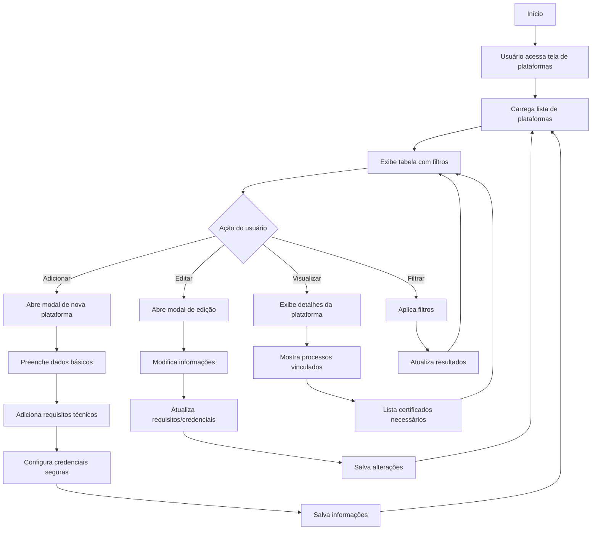

# 9 - Plataformas

## Descrição
Tela que permite gerenciar as plataformas de licitação eletrônica utilizadas em diversos processos, incluindo credenciais, especificidades e histórico de utilização.

## Fluxograma de Gestão de Plataformas

## Componentes Principais

1. **Tabela de Plataformas**
   - Lista de sistemas de licitação
   - Filtros por região/utilização
   - Indicadores de status de credenciamento

2. **Formulário de Plataforma**
   - Dados básicos (nome, URL, órgãos vinculados)
   - Requisitos técnicos
   - Instruções de acesso

3. **Gerenciador de Credenciais**
   - Armazenamento seguro de usuários
   - Controle de validade de tokens/certificados
   - Alertas para renovação

4. **Estatísticas de Uso**
   - Histórico de licitações por plataforma
   - Taxa de sucesso por plataforma
   - Problemas recorrentes

## Implementação

A tela utiliza estilos definidos em `PlataformasView.css` para organização visual e componentes para gestão de credenciais de forma segura.

## Casos de Uso

1. **Cadastro de nova plataforma**
   - Registro dos dados de acesso
   - Documentação dos requisitos específicos

2. **Preparação para processo**
   - Verificação de credenciais ativas
   - Testes de acesso e compatibilidade

3. **Renovação de credenciais**
   - Alerta para certificados a vencer
   - Processo guiado de renovação

## Integração com Processos

- Vinculação de processos a plataformas específicas
- Alertas em processos para plataformas sem credencial ativa
- Estatísticas de uso por região/período

## Recursos Especiais

- Armazenamento seguro de credenciais
- Tutoriais específicos por plataforma
- Registro de problemas e soluções encontradas
