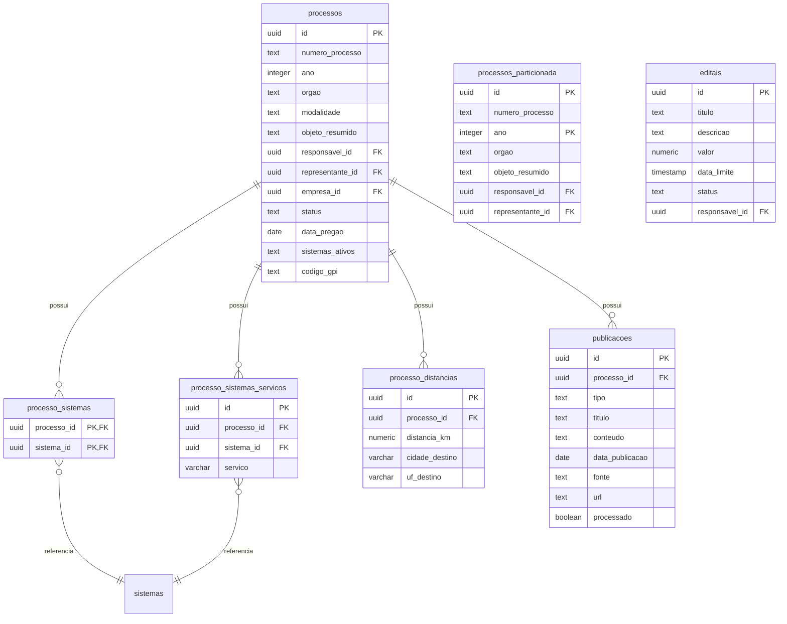
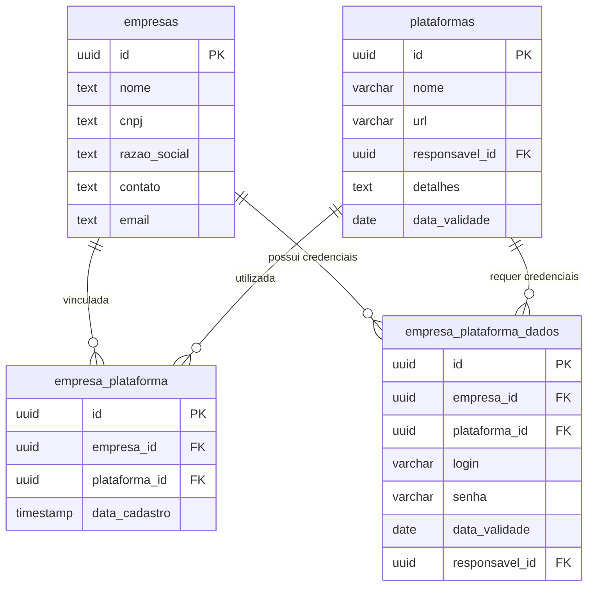
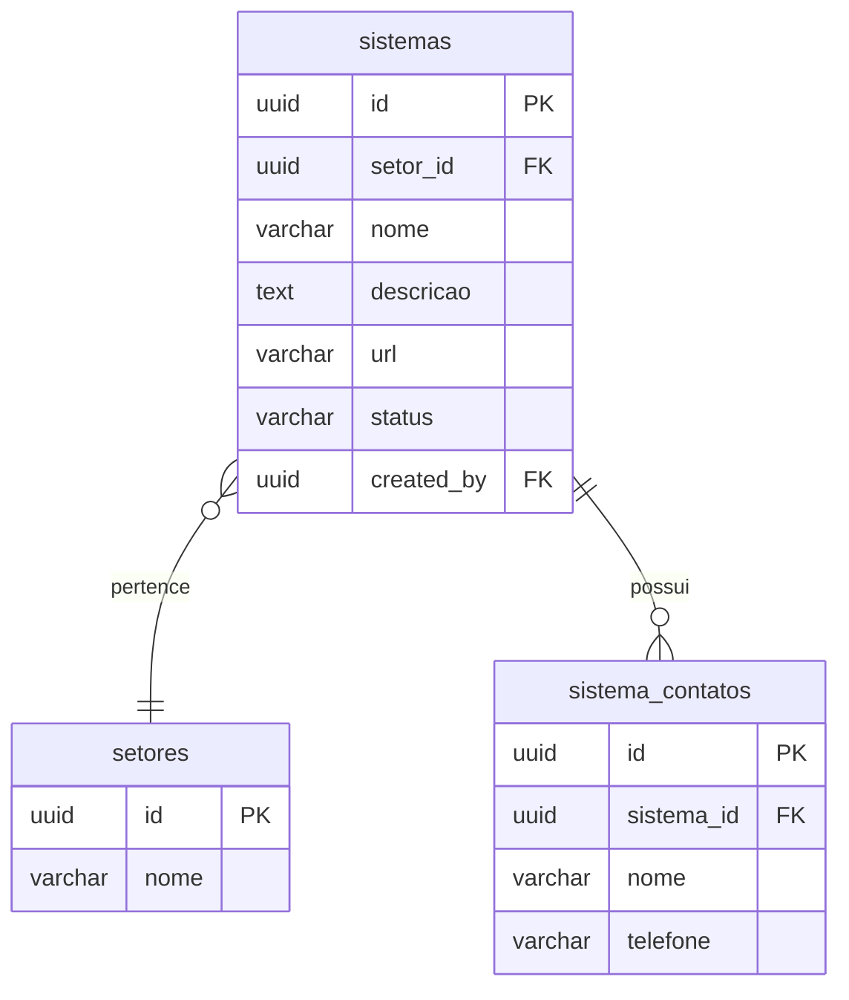
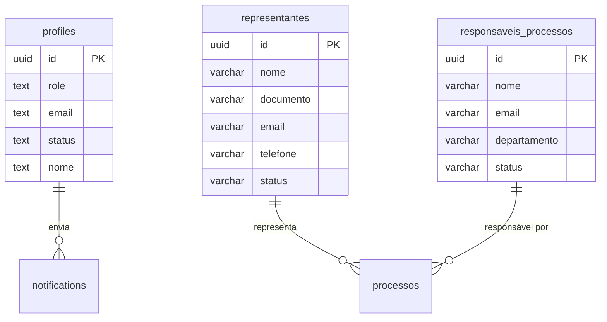
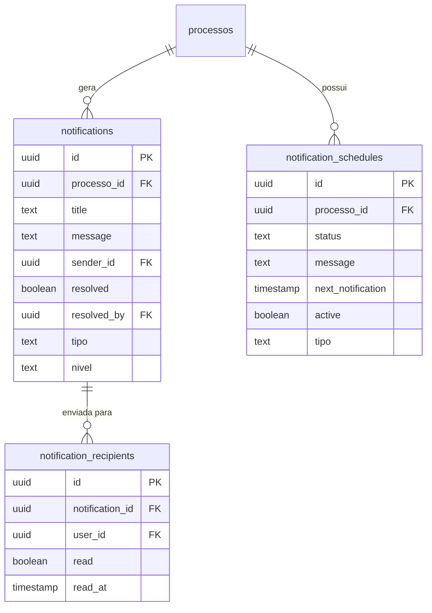
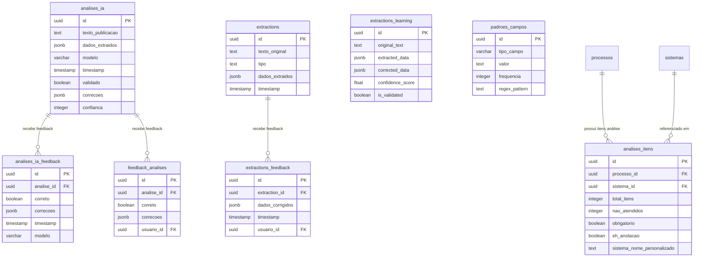
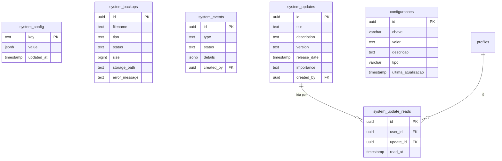

# Documentação do Banco de Dados

## Visão Geral do Esquema de Banco de Dados

Este documento apresenta um mapeamento das tabelas do banco de dados e suas relações, organizadas por domínios funcionais.

## Índice
1. [Processos e Licitações](#processos-e-licitações)
2. [Empresas e Plataformas](#empresas-e-plataformas)
3. [Sistemas e Setores](#sistemas-e-setores)
4. [Usuários e Perfis](#usuários-e-perfis)
5. [Notificações](#notificações)
6. [Análises e Extrações](#análises-e-extrações)
7. [Sistema e Configuração](#sistema-e-configuração)
8. [Inconsistências Identificadas](#inconsistências-identificadas)
9. [Correções Recomendadas](#correções-recomendadas)

## Processos e Licitações

Este grupo de tabelas gerencia os processos licitatórios e suas informações relacionadas.

## Empresas e Plataformas

Este grupo gerencia empresas e suas relações com plataformas de licitação.

## Sistemas e Setores

Este grupo gerencia os sistemas oferecidos e seus setores relacionados.

## Usuários e Perfis

Este grupo gerencia perfis de usuários e responsáveis por processos.

## Notificações

Este grupo gerencia o sistema de notificações da aplicação.

## Análises e Extrações

Este grupo gerencia análises de inteligência artificial e extrações de dados.

## Sistema e Configuração

Este grupo gerencia configurações do sistema e eventos de sistema.

## Inconsistências Identificadas

1. **Tabelas Redundantes**:
   - `processos` e `processos_particionada` parecem ser redundantes, com a segunda sendo uma versão particionada por ano da primeira
   - `feedback_analises` e `analises_ia_feedback` têm propósitos similares
   - `configuracoes` e `system_config` parecem ter funções sobrepostas

2. **Referências Ausentes**:
   - Várias tabelas referenciam `users.id` mas não há uma tabela `users` definida no esquema
   - A relação entre `profiles` e `users` não está claramente definida 
   - A tabela `system_logs` está sendo referenciada na aplicação mas não existe no banco de dados, causando erros 404

3. **Inconsistências de Nomenclatura**:
   - Algumas tabelas usam prefixo `system_` enquanto outras não seguem este padrão
   - Mistura de português e inglês nos nomes das tabelas e colunas

4. **Possíveis Problemas de Design**:
   - A tabela `processo_sistemas` parece ser apenas uma tabela de junção com duas colunas PK/FK
   - Há objetos de visualização como `vw_plataformas_completa` incluídos na lista de tabelas
   - Ambiguidade na coluna `sistema_id` em consultas envolvendo múltiplas tabelas (processo_sistemas, processo_sistemas_servicos)

5. **Tratamento de Timestamps**:
   - Algumas tabelas têm triggers para atualizar `updated_at` automaticamente, mas não está claro se todas seguem o mesmo padrão
   - Mistura de convenções como `updated_at`, `ultima_atualizacao` e `updated_at`

6. **Campos JSONB**:
   - Várias tabelas usam campos JSONB para armazenar dados estruturados, o que pode dificultar consultas e criar redundância
