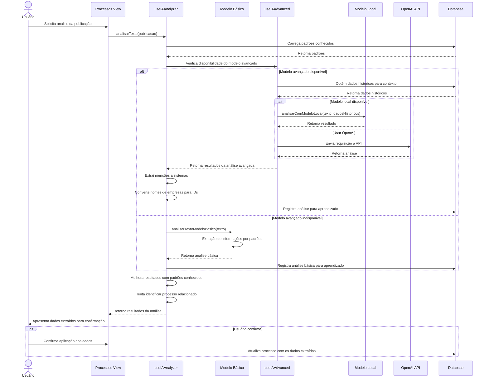

# Funcionalidade: Análise Avançada com IA

## Descrição

Esta funcionalidade utiliza modelos de inteligência artificial para realizar análise avançada das publicações contratuais, extraindo informações que não são facilmente detectáveis por expressões regulares simples, como empresas vencedoras, sistemas mencionados e números de contrato.

## Fluxo da Funcionalidade



## Interface de Usuário

- Botão para solicitar análise avançada da publicação
- Modal ou seção mostrando resultados da análise
- Indicadores visuais de confiança para cada campo analisado
- Interface para confirmação e correção dos dados extraídos
- Botões para aplicar ou ignorar os resultados

## Modelos de IA Utilizados

1. **Modelo Básico**: Utiliza regras e padrões pré-definidos para extração de informações
2. **Modelo Local (Ollama)**: Modelo local opcional para análise avançada sem dependências externas
3. **Modelo OpenAI**: Integração com a API da OpenAI para análises complexas

## Dados Analisados

| Dado | Descrição | Método de Extração |
|------|-----------|-------------------|
| Empresa vencedora | Empresa mencionada como vencedora | Padrões de texto, lista de empresas conhecidas |
| Sistemas mencionados | Sistemas de software citados | Comparação com lista de sistemas cadastrados |
| Número de contrato | Número do contrato gerado | Padrões específicos de numeração |
| Município | Município relacionado ao processo | Análise de contexto, lista de municípios |
| Estado | UF do processo | Análise de contexto, siglas de estados |

## Estrutura de Solicitação para OpenAI

```javascript
const prompt = `
  Você é um assistente especializado em análise de publicações contratuais e licitações. 
  Extraia as seguintes informações do texto abaixo e responda apenas com um objeto JSON:
  
  TEXTO DA PUBLICAÇÃO:
  ${texto}
  
  Responda APENAS com um objeto JSON válido no seguinte formato, sem explicações:
  {
    "numero_processo": "string ou null se não encontrado",
    "orgao": "string ou null se não encontrado",
    "municipio": "string ou null se não encontrado",
    "estado": "string ou null se não encontrado",
    "data_licitacao": "YYYY-MM-DD ou null se não encontrada",
    "empresa_vencedora": "string ou null se não encontrada",
    "numero_contrato": "string ou null se não encontrado"
  }
`;
```

## Tabelas do Banco de Dados

### Tabela: analises_ia

Armazena resultados de análises para aprendizado contínuo:

| Coluna | Tipo | Descrição |
|--------|------|-----------|
| id | uuid | Identificador único da análise |
| texto_publicacao | text | Texto analisado |
| dados_extraidos | jsonb | Dados extraídos em formato JSON |
| modelo | varchar | Modelo utilizado (basico, local, openai) |
| timestamp | timestamp | Data e hora da análise |
| validado | boolean | Indica se a análise foi validada pelo usuário |
| custo_estimado | decimal | Custo da operação (para modelos pagos) |

### Tabela: padroes_campos

Armazena padrões conhecidos para melhorar a extração:

| Coluna | Tipo | Descrição |
|--------|------|-----------|
| id | uuid | Identificador único do padrão |
| tipo_campo | varchar | Tipo do campo (numero_processo, orgao, etc.) |
| valor | text | Valor do padrão |
| regex_pattern | text | Expressão regular opcional |
| frequencia | int | Frequência de ocorrência |
| criado_em | timestamp | Data de criação/identificação |
| ultima_atualizacao | timestamp | Data da última atualização |

### Tabela: empresas

Cadastro de empresas que podem ser identificadas nas publicações:

| Coluna | Tipo | Descrição |
|--------|------|-----------|
| id | uuid | Identificador único da empresa |
| nome | varchar | Nome comercial da empresa |
| cnpj | varchar | CNPJ formatado |
| razao_social | varchar | Razão social completa |

### Tabela: sistemas

Cadastro de sistemas que podem ser mencionados nas publicações:

| Coluna | Tipo | Descrição |
|--------|------|-----------|
| id | uuid | Identificador único do sistema |
| nome | varchar | Nome do sistema |
| status | varchar | Status (ACTIVE, INACTIVE) |

## Processo de Feedback e Aprendizado

1. Resultados da análise são armazenados na tabela `analises_ia`
2. Quando o usuário confirma ou corrige os dados, a análise é marcada como validada
3. Padrões identificados repetidamente são adicionados à tabela `padroes_campos`
4. A frequência dos padrões é incrementada quando identificados novamente
5. Os modelos de IA utilizam dados históricos validados para melhorar precisão futura
