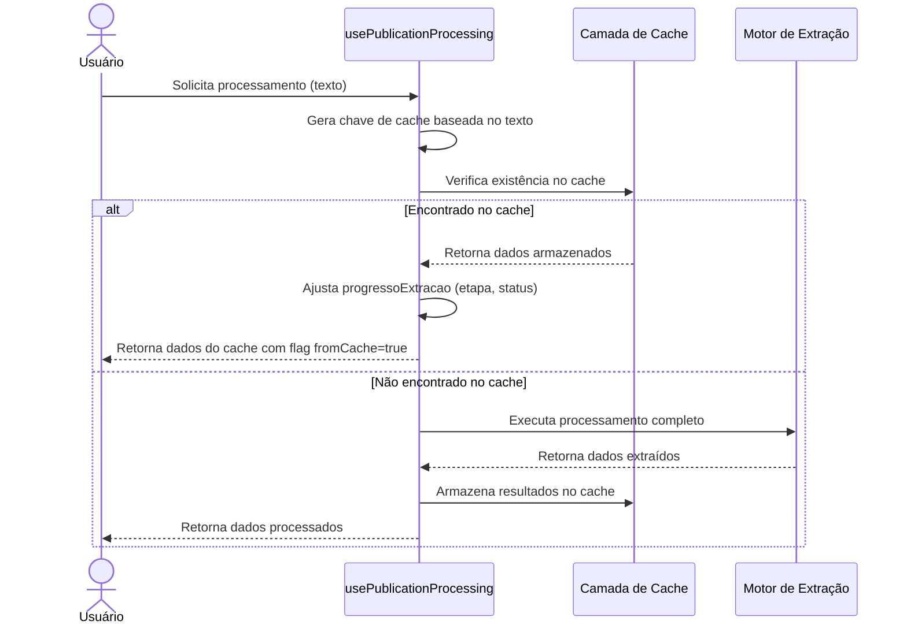

# Funcionalidade: Cache Inteligente

## Descrição

O sistema de cache inteligente armazena resultados de processamentos anteriores para evitar reprocessamento desnecessário de textos similares. Isso melhora significativamente o desempenho e reduz custos, especialmente quando se utiliza APIs pagas como a OpenAI.

## Fluxo da Funcionalidade



## Implementação do Cache

O sistema utiliza uma estrutura de cache em memória com múltiplos mapas para diferentes tipos de dados:

```javascript
const processamentosCache = {
  // Cache principal para dados extraídos
  dados: new Map(),
  
  // Cache para coordenadas geográficas
  coordenadas: new Map(),
  
  // Cache para identificação de órgãos
  orgaos: new Map(),
  
  // Método para limpar o cache
  limparCache() {
    this.dados.clear();
    this.coordenadas.clear();
    this.orgaos.clear();
    console.log('Cache limpo com sucesso');
  },
  
  // Gera uma chave única baseada no texto
  gerarChave(texto) {
    return texto.substring(0, 50).replace(/\s+/g, '').toLowerCase();
  },
  
  // Obtém dados do cache
  obter(chave) {
    return this.dados.get(chave);
  },
  
  // Salva dados no cache
  salvar(chave, dados) {
    this.dados.set(chave, dados);
  }
}
```

## Geração de Chaves de Cache

O cache utiliza um algoritmo simplificado para gerar chaves únicas:

1. Extrai os primeiros 50 caracteres do texto
2. Remove todos os espaços em branco
3. Converte para minúsculas
4. Usa o resultado como chave de hash

Esta abordagem permite identificar textos similares mesmo com pequenas diferenças de formatação.

## Estrutura de Dados do Cache

### Dados Armazenados no Cache Principal

```javascript
{
  numero: String,            // Número do processo
  ano: String,               // Ano do processo
  orgao: String,             // Órgão responsável
  data_pregao: String,       // Data no formato YYYY-MM-DD
  hora_pregao: String,       // Hora no formato HH:MM
  modalidade: String,        // Modalidade de licitação
  objeto_resumido: String,   // Resumo do objeto
  objeto_completo: String,   // Objeto completo extraído
  valor_estimado: String     // Valor formatado em padrão brasileiro
}
```

### Cache de Coordenadas

```javascript
{
  latitude: Number,
  longitude: Number,
  cidade: String,
  estado: String
}
```

### Cache de Órgãos

```javascript
{
  id: String,           // ID do órgão no sistema
  nome: String,         // Nome normalizado do órgão
  tipo: String,         // Tipo de órgão (prefeitura, secretaria, etc.)
  confianca: Number     // Nível de confiança na identificação (0-1)
}
```

## Tempo de Vida do Cache

O cache permanece em memória durante a sessão do usuário. Ele é:

- Criado quando o componente é montado
- Utilizado durante toda a sessão
- Limpo através da função `limparCache()` quando necessário
- Destruído quando o componente é desmontado ou a página é recarregada

## Benefícios do Cache

1. **Desempenho**: Reduz significativamente o tempo de processamento para textos similares
2. **Economia**: Diminui o número de chamadas à API da OpenAI, reduzindo custos
3. **Consistência**: Garante que textos iguais recebam o mesmo resultado
4. **Experiência do usuário**: Resposta instantânea para textos já processados

## Futuras Melhorias

- **Cache persistente**: Implementar armazenamento no banco de dados para manter cache entre sessões
- **Cache distribuído**: Permitir compartilhamento de cache entre diferentes usuários
- **Políticas de expiração**: Implementar expiração automática de entradas antigas do cache
- **Similaridade fuzzy**: Melhorar o algoritmo para detectar textos similares mesmo com diferenças maiores
