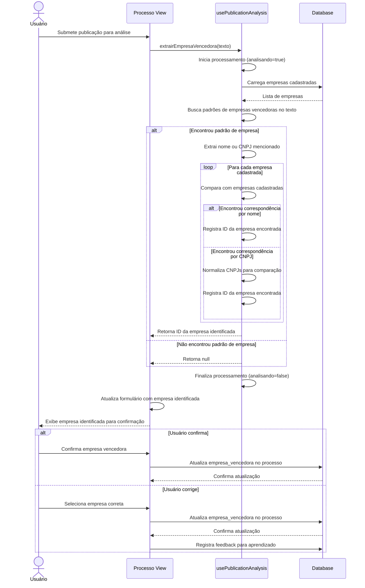
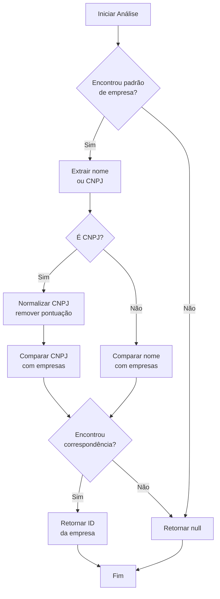

# Funcionalidade: Detecção de Empresas Vencedoras

## Descrição

Esta funcionalidade analisa o texto da publicação para identificar empresas mencionadas como vencedoras ou contratadas. O sistema compara o texto com uma base de dados de empresas cadastradas e identifica correspondências.

## Fluxo da Funcionalidade



## Interface de Usuário

- Campo no formulário mostrando a empresa detectada automaticamente
- Dropdown para selecionar outra empresa se a detecção for incorreta
- Indicador visual de confiança na detecção
- Opção para registrar nova empresa caso não esteja cadastrada

## Padrões de Detecção

O sistema busca padrões específicos no texto que indicam uma empresa vencedora:

```javascript
// Padrões para identificar empresas vencedoras
const padraoEmpresa = /empresa[\s.:]*(?:vencedora|contratada|adjudicada)[\s.:]*([^,.\n]+)/i;
const padraoCnpj = /cnpj[\s.:]*(\d{2}[\.\-\/]?\d{3}[\.\-\/]?\d{3}[\.\-\/]?\d{4}[\.\-\/]?\d{2})/i;
```

## Algoritmo de Correspondência



## Dados Armazenados

### Tabela: processos (Coluna relevante)

| Coluna | Tipo | Descrição |
|--------|------|-----------|
| empresa_vencedora | uuid | ID da empresa vencedora identificada |
| numero_contrato | varchar | Número do contrato associado (também pode ser extraído) |

### Tabela: empresas

Tabela consultada para identificar empresas:

| Coluna | Tipo | Descrição |
|--------|------|-----------|
| id | uuid | Identificador único da empresa |
| nome | varchar | Nome comercial da empresa |
| razao_social | varchar | Razão social completa |
| cnpj | varchar | CNPJ formatado |
| email | varchar | Email de contato |
| telefone | varchar | Telefone de contato |

## Implementação

```javascript
// Extrair informações de empresa vencedora
const extrairEmpresaVencedora = async (texto) => {
  try {
    analisando.value = true;
    
    // Carregar empresas para comparação
    const { data: empresas } = await supabase
      .from('empresas')
      .select('id, nome, cnpj, razao_social');
    
    if (!empresas || !empresas.length) return null;
    
    // Procurar por padrões de texto que indiquem empresa vencedora
    const padraoEmpresa = /empresa[\s.:]*(?:vencedora|contratada|adjudicada)[\s.:]*([^,.\n]+)/i;
    const padraoCnpj = /cnpj[\s.:]*(\d{2}[\.\-\/]?\d{3}[\.\-\/]?\d{3}[\.\-\/]?\d{4}[\.\-\/]?\d{2})/i;
    
    const matchEmpresa = texto.match(padraoEmpresa);
    const matchCnpj = texto.match(padraoCnpj);
    
    if (matchEmpresa || matchCnpj) {
      // Buscar correspondência por nome ou CNPJ
      const empresaEncontrada = empresas.find(empresa => {
        if (matchEmpresa && empresa.nome && matchEmpresa[1].includes(empresa.nome)) {
          return true;
        }
        
        if (matchCnpj) {
          const cnpjTexto = matchCnpj[1].replace(/[\.\-\/]/g, '');
          const cnpjEmpresa = empresa.cnpj.replace(/[\.\-\/]/g, '');
          return cnpjTexto === cnpjEmpresa;
        }
        
        return false;
      });
      
      return empresaEncontrada?.id || null;
    }
    
    return null;
  } catch (error) {
    console.error('Erro ao extrair empresa vencedora:', error);
    erro.value = error;
    return null;
  } finally {
    analisando.value = false;
  }
};
```

## Extração de Número de Contrato

Junto com a empresa vencedora, o sistema também tenta extrair o número do contrato:

```javascript
// Extrair número de contrato
const extrairNumeroContrato = (texto) => {
  try {
    // Padrões comuns para números de contrato
    const padroes = [
      /contrato[\s.:]*(?:n[º°\.ºo]|número|nro|numero)[\s.:]*(\d+[\/-]?\d*)/i,
      /(?:n[º°\.ºo]|número|nro|numero)[\s.:]*(?:do contrato|contrato)[\s.:]*(\d+[\/-]?\d*)/i,
      /(?:contrato)[\s.:]*(\d+[\/-]?\d*)/i
    ];
    
    for (const padrao of padroes) {
      const match = texto.match(padrao);
      if (match && match[1]) {
        return match[1].trim();
      }
    }
    
    return null;
  } catch (error) {
    console.error('Erro ao extrair número do contrato:', error);
    erro.value = error;
    return null;
  }
};
```

## Aplicação dos Resultados

Os resultados da análise podem ser aplicados ao processo:

```javascript
// Aplicar resultados da análise ao processo
const aplicarResultadosAnalise = async (processoId, resultados) => {
  if (!processoId || !resultados) return false;
  
  try {
    const atualizacoes = {};
    
    if (resultados.empresa_vencedora) {
      atualizacoes.empresa_vencedora = resultados.empresa_vencedora;
    }
    
    if (resultados.numero_contrato) {
      atualizacoes.numero_contrato = resultados.numero_contrato;
    }
    
    if (Object.keys(atualizacoes).length === 0) return false;
    
    const { error } = await supabase
      .from('processos')
      .update(atualizacoes)
      .eq('id', processoId);
    
    if (error) throw error;
    
    return true;
  } catch (error) {
    console.error('Erro ao aplicar resultados:', error);
    erro.value = error;
    return false;
  }
};
```
