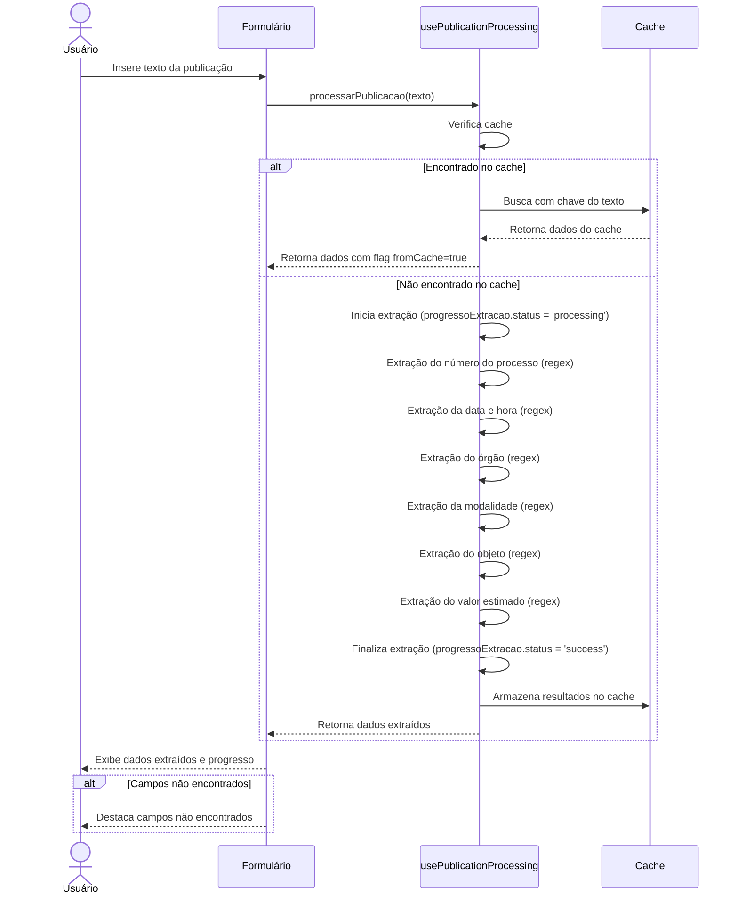

# Funcionalidade: Extração Básica de Dados

## Descrição

Esta funcionalidade realiza a extração inicial de dados de uma publicação contratual usando expressões regulares. O sistema identifica automaticamente o número do processo, data e hora de abertura, órgão, modalidade, objeto e valor estimado.

## Fluxo da Funcionalidade



## Interface de Usuário

- Modal de importação com área para colar o texto da publicação
- Indicador de progresso mostrando:
  - Status atual (idle, processing, success, error)
  - Etapa de processamento
  - Porcentagem concluída
  - Detalhes das operações realizadas
- Lista de campos não encontrados para preenchimento manual
- Botões para processar, cancelar e confirmar

## Padrões de Extração (Regex)

O componente utiliza expressões regulares específicas para cada tipo de dado:

| Campo | Padrão (Regex) | Exemplo de Captura |
|-------|----------------|-------------------|
| Número do Processo | `/(?:(?:PE\|PP\|processo)[\s.\/]*(\d+)[\s.\/]*(\d{4}))\|(?:(\d+)[\s.\/]*(\d{4}))\|(?:processo[\s.:]*(\d+)[\s.\/]*(\d{4}))/i` | "Processo 123/2023", "PE 456/2024" |
| Data e Hora | `/(?:(?:data\|prazo\|abertura)[\s.:]*(\d{2}\/\d{2}\/\d{4})(?:[\s,]*(?:às\|as\|a\|hora\|hs\|h)?[\s.:]*(\d{1,2}[:h]\d{2})?)\|(?:(\d{2}\/\d{2}\/\d{4})\s*(?:às\|as\|a\|hora\|hs\|h)?\s*(\d{1,2}[:h]\d{2})))/i` | "Data: 01/05/2023 às 10:30" |
| Órgão | `/(?:(?:órgão\|unid\.\s*licitante)[\s.:]+([^\n]+))\|(?:FACULDADE\s+[A-ZÀ-Ú\s]+)\|(?:FMJ)/i` | "Órgão: Prefeitura Municipal" |
| Modalidade | `/(?:modalidade[\s.:]*)?(?:(?:pregão\s+eletrônico\|PE\|licitação\s+eletrônica))/i` | "Modalidade: Pregão Eletrônico" |
| Objeto | `/(?:\*\s*([^*]+)\s*\*)\|(?:objeto[\s.:]+([^\n]+))/i` | "Objeto: Aquisição de software" |
| Valor | `/(?:valor[\s.:]*estimado\|valor[\s.:]*global\|valor[\s.:]*total\|valor[\s.:]*máximo)[\s.:]*(?:de)?[\s.:]*R\$[\s.]*([\d.,]+)\|\bR\$[\s.]*([\d.,]+)/i` | "Valor estimado: R$ 100.000,00" |

## Estrutura de Dados

### Dados de Entrada

```javascript
{
  publicacaoText: String // Texto da publicação a ser analisada
}
```

### Dados de Saída (Sucesso)

```javascript
{
  success: true,
  data: {
    numero: String,            // Número do processo
    ano: String,               // Ano do processo
    orgao: String,             // Órgão responsável
    data_pregao: String,       // Data no formato YYYY-MM-DD
    hora_pregao: String,       // Hora no formato HH:MM
    modalidade: String,        // Modalidade de licitação
    objeto_resumido: String,   // Resumo do objeto (limitado a 100 caracteres)
    objeto_completo: String,   // Objeto completo extraído
    valor_estimado: String     // Valor formatado em padrão brasileiro
  },
  fromCache: Boolean           // Indica se veio do cache
}
```

### Estrutura de Progresso

```javascript
{
  status: String,         // 'idle', 'processing', 'success', 'error'
  etapa: String,          // Descrição da etapa atual
  porcentagem: Number,    // 0-100
  detalhes: Array<String> // Lista de operações concluídas
}
```

## Armazenamento em Cache

O sistema utiliza um cache local para evitar processamento redundante:

```javascript
const processamentosCache = {
  dados: new Map(),
  coordenadas: new Map(),
  orgaos: new Map(),
  
  limparCache() { /* ... */ },
  gerarChave(texto) { /* ... */ },
  obter(chave) { /* ... */ },
  salvar(chave, dados) { /* ... */ }
}
```

## Tabela do Banco de Dados

Os dados extraídos são armazenados na tabela `processos`:

| Coluna | Tipo | Descrição |
|--------|------|-----------|
| publicacao_original | text | Texto original da publicação |
| numero | varchar | Número do processo |
| ano | varchar | Ano do processo |
| orgao | varchar | Nome do órgão responsável |
| data_pregao | date | Data de abertura da licitação |
| hora_pregao | time | Hora de abertura da licitação |
| modalidade | varchar | Modalidade da licitação |
| objeto_resumido | varchar | Resumo do objeto (primeiros 100 caracteres) |
| objeto_completo | text | Descrição completa do objeto |
| valor_estimado | numeric | Valor estimado da licitação |

## Tratamento de Erros

- Campos não encontrados são registrados em `camposNaoEncontrados` para preenchimento manual
- Erros no processamento são capturados e retornados com `success: false`
- Interface visual mostra feedback claro sobre o status de extração
