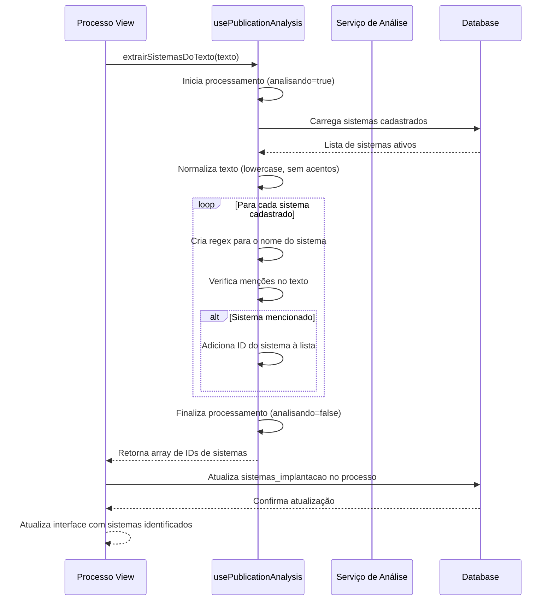

# Funcionalidade: Identificação de Sistemas

## Descrição

Esta funcionalidade analisa o texto da publicação para identificar menções a sistemas de software que a empresa comercializa. O objetivo é reconhecer automaticamente quais sistemas estão contemplados na licitação ou contrato, facilitando a gestão de implementação.

## Fluxo da Funcionalidade



## Interface de Usuário

- Seção na tela de detalhes do processo mostrando sistemas identificados
- Opção para confirmar ou ajustar sistemas identificados automaticamente
- Indicadores visuais para sistemas identificados com alta confiança
- Botão para solicitar nova análise ou análise manual

## Algoritmo de Identificação

O algoritmo utiliza várias estratégias para identificar sistemas no texto:

1. **Correspondência direta**: Busca pelo nome exato do sistema
2. **Correspondência com variações**: Aceita espaços e hífens variáveis
3. **Normalização**: Remove acentos e converte para minúsculas antes da comparação
4. **Reconhecimento de contexto**: Identifica menções baseadas no contexto (ex: "sistema de...")

```javascript
// Exemplo simplificado do algoritmo de identificação
sistemas.forEach(sistema => {
  // Cria regex que permite variações no nome
  const regex = new RegExp(
    `\\b${sistema.nome}\\b|\\b${sistema.nome.replace(/\s+/g, '[ -]+')}\\b`, 
    'i'
  );
  
  if (regex.test(textoNormalizado)) {
    sistemasMencionados.push(sistema.id);
  }
});
```

## Dados Armazenados

### Tabela: processos (Coluna relevante)

| Coluna | Tipo | Descrição |
|--------|------|-----------|
| sistemas_implantacao | jsonb | Objeto contendo informações sobre sistemas identificados |

### Estrutura do objeto sistemas_implantacao

```javascript
{
  sistemas_ids: Array<UUID>,         // Array de IDs de sistemas identificados
  informacoes_adicionais: String,    // Observações sobre a implantação
  data_identificacao: Timestamp,     // Data em que os sistemas foram identificados
  metodo_identificacao: String,      // 'automatico' ou 'manual'
  confianca: Number                  // Nível de confiança da identificação (0-1)
}
```

### Tabela: sistemas

Tabela consultada para identificação dos sistemas:

| Coluna | Tipo | Descrição |
|--------|------|-----------|
| id | uuid | Identificador único do sistema |
| nome | varchar | Nome do sistema |
| descricao | text | Descrição detalhada do sistema |
| aliases | jsonb | Array de nomes alternativos |
| status | varchar | Status (ACTIVE, INACTIVE) |

## Exemplo de Implementação

```javascript
// Extrair sistemas mencionados no texto
const extrairSistemasDoTexto = async (texto) => {
  if (!texto) return [];
  
  try {
    analisando.value = true;
    
    // Carregamento dos sistemas cadastrados
    const { data: sistemas } = await supabase
      .from('sistemas')
      .select('id, nome')
      .eq('status', 'ACTIVE');
    
    if (!sistemas || !sistemas.length) return [];
    
    // Normaliza o texto para facilitar a busca
    const textoNormalizado = texto.toLowerCase()
      .normalize("NFD")
      .replace(/[\u0300-\u036f]/g, "");
    
    // Algoritmo para identificar menções a sistemas no texto
    const sistemasMencionados = [];
    
    sistemas.forEach(sistema => {
      // Verifica se o nome do sistema (ou variações) é mencionado no texto
      const regex = new RegExp(
        `\\b${sistema.nome}\\b|\\b${sistema.nome.replace(/\s+/g, '[ -]+')}\\b`, 
        'i'
      );
      
      if (regex.test(textoNormalizado)) {
        sistemasMencionados.push(sistema.id);
      }
    });
    
    return sistemasMencionados;
  } catch (error) {
    console.error('Erro ao analisar texto:', error);
    erro.value = error;
    return [];
  } finally {
    analisando.value = false;
  }
};
```

## Aplicação dos Resultados

Após a identificação dos sistemas, os dados são aplicados ao processo:

```javascript
// Aplicar resultados da análise ao processo
const aplicarResultadosAnalise = async (processoId, resultados) => {
  if (!processoId || !resultados) return false;
  
  try {
    const atualizacoes = {};
    
    if (resultados.sistemas_ids && resultados.sistemas_ids.length > 0) {
      atualizacoes.sistemas_implantacao = {
        sistemas_ids: resultados.sistemas_ids,
        informacoes_adicionais: 'Extraído automaticamente',
        data_identificacao: new Date().toISOString(),
        metodo_identificacao: 'automatico',
        confianca: 0.8
      };
    }
    
    if (Object.keys(atualizacoes).length === 0) return false;
    
    const { error } = await supabase
      .from('processos')
      .update(atualizacoes)
      .eq('id', processoId);
    
    if (error) throw error;
    
    return true;
  } catch (error) {
    console.error('Erro ao aplicar resultados:', error);
    return false;
  }
};
```
