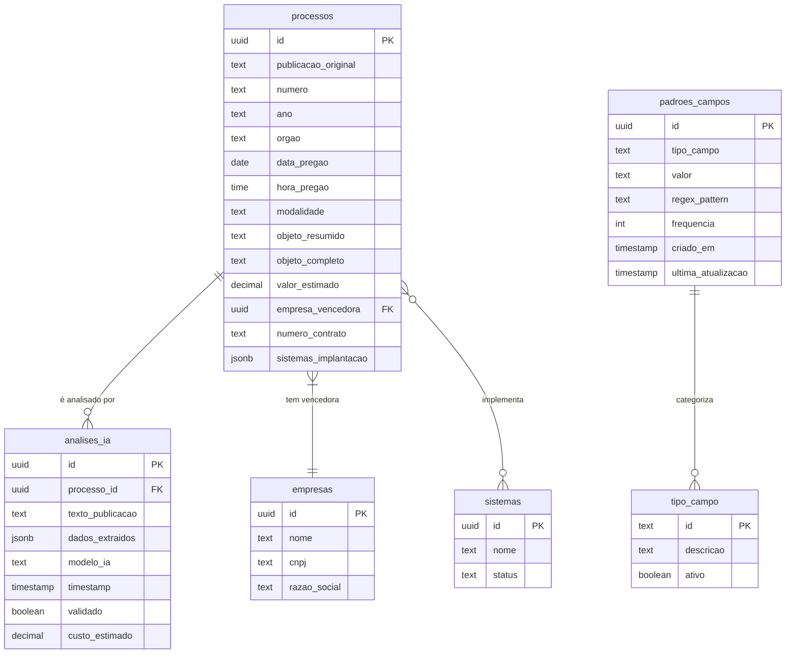

# Modelo de Dados - Análise de Publicações Contratuais

## Visão Geral do Modelo

O sistema de Análise de Publicações Contratuais utiliza várias tabelas para armazenar e analisar dados extraídos de publicações. Este documento detalha a estrutura das tabelas envolvidas nesse processo.

## Diagrama ER



## Detalhamento das Tabelas

### Tabela: processos

Esta tabela armazena as informações dos processos licitatórios, incluindo os dados extraídos das publicações.

| Coluna | Tipo | Nulável | Descrição | Restrições |
|--------|------|---------|-----------|------------|
| id | uuid | não | Identificador único do processo | Chave primária |
| publicacao_original | text | sim | Texto completo da publicação analisada | - |
| numero | varchar(100) | sim | Número do processo licitatório | - |
| ano | varchar(4) | sim | Ano do processo | - |
| orgao | varchar(255) | sim | Nome do órgão responsável | - |
| data_pregao | date | sim | Data de abertura da licitação | - |
| hora_pregao | time | sim | Horário de abertura | - |
| modalidade | varchar(100) | sim | Modalidade da licitação | - |
| objeto_resumido | varchar(255) | sim | Resumo do objeto (limitado) | - |
| objeto_completo | text | sim | Descrição completa do objeto | - |
| valor_estimado | numeric(15,2) | sim | Valor estimado da licitação | - |
| empresa_vencedora | uuid | sim | ID da empresa vencedora | Chave estrangeira |
| numero_contrato | varchar(100) | sim | Número do contrato gerado | - |
| sistemas_implantacao | jsonb | sim | Dados sobre sistemas a implementar | - |

### Tabela: analises_ia

Esta tabela registra cada análise realizada pelos modelos de IA para aprendizado contínuo.

| Coluna | Tipo | Nulável | Descrição | Restrições |
|--------|------|---------|-----------|------------|
| id | uuid | não | Identificador único da análise | Chave primária |
| processo_id | uuid | sim | ID do processo relacionado | Chave estrangeira |
| texto_publicacao | text | não | Texto analisado | - |
| dados_extraidos | jsonb | não | Dados extraídos em formato JSON | - |
| modelo_ia | varchar(50) | não | Modelo utilizado (basico, local, openai) | - |
| timestamp | timestamp | não | Data e hora da análise | Default: now() |
| validado | boolean | não | Indica se a análise foi validada | Default: false |
| custo_estimado | decimal(10,6) | sim | Custo da operação em dólares | - |

### Tabela: padroes_campos

Esta tabela armazena padrões conhecidos para melhorar a extração de campos específicos.

| Coluna | Tipo | Nulável | Descrição | Restrições |
|--------|------|---------|-----------|------------|
| id | uuid | não | Identificador único do padrão | Chave primária |
| tipo_campo | varchar(100) | não | Tipo do campo (numero_processo, orgao, etc) | - |
| valor | text | não | Valor do padrão | - |
| regex_pattern | text | sim | Expressão regular opcional | - |
| frequencia | integer | não | Frequência de ocorrência | Default: 1 |
| criado_em | timestamp | não | Data de criação | Default: now() |
| ultima_atualizacao | timestamp | não | Data da última atualização | Default: now() |

### Tabela: tipo_campo

Esta tabela define os tipos de campos que podem ser extraídos das publicações.

| Coluna | Tipo | Nulável | Descrição | Restrições |
|--------|------|---------|-----------|------------|
| id | varchar(100) | não | Identificador do tipo de campo | Chave primária |
| descricao | varchar(255) | não | Descrição do tipo de campo | - |
| ativo | boolean | não | Indica se o tipo está ativo | Default: true |

### Tabela: empresas

Esta tabela armazena as informações das empresas que podem ser identificadas nas publicações.

| Coluna | Tipo | Nulável | Descrição | Restrições |
|--------|------|---------|-----------|------------|
| id | uuid | não | Identificador único da empresa | Chave primária |
| nome | varchar(255) | não | Nome comercial da empresa | - |
| cnpj | varchar(18) | não | CNPJ formatado | Único |
| razao_social | varchar(255) | não | Razão social completa | - |
| email | varchar(255) | sim | Email de contato | - |
| telefone | varchar(20) | sim | Telefone de contato | - |

### Tabela: sistemas

Esta tabela armazena informações sobre os sistemas que podem ser mencionados nas publicações.

| Coluna | Tipo | Nulável | Descrição | Restrições |
|--------|------|---------|-----------|------------|
| id | uuid | não | Identificador único do sistema | Chave primária |
| nome | varchar(255) | não | Nome do sistema | - |
| descricao | text | sim | Descrição do sistema | - |
| aliases | jsonb | sim | Nomes alternativos do sistema | - |
| status | varchar(20) | não | Status (ACTIVE, INACTIVE) | Default: 'ACTIVE' |

## Estrutura do JSON em Campos JSONB

### Campo: sistemas_implantacao (tabela processos)

```javascript
{
  "sistemas_ids": ["uuid1", "uuid2", ...],
  "informacoes_adicionais": "String com observações",
  "data_identificacao": "2023-05-01T14:30:00Z",
  "metodo_identificacao": "automatico", // ou "manual"
  "confianca": 0.8 // número entre 0 e 1
}
```

### Campo: dados_extraidos (tabela analises_ia)

```javascript
{
  "numero_processo": "123/2023",
  "orgao": "Prefeitura Municipal de São Paulo",
  "municipio": "São Paulo",
  "estado": "SP",
  "data_licitacao": "2023-05-15",
  "empresa_vencedora": "Nome da Empresa Ltda",
  "numero_contrato": "45/2023",
  "sistemas_identificados": ["Sistema A", "Sistema B"],
  "confianca": {
    "numero_processo": 0.95,
    "orgao": 0.87,
    // outros campos com níveis de confiança
  }
}
```

### Campo: aliases (tabela sistemas)

```javascript
["nome alternativo 1", "abreviação", "sigla", ...]
```

## SQL para Criação das Principais Tabelas

### Tabela analises_ia

```sql
CREATE TABLE IF NOT EXISTS analises_ia (
  id UUID PRIMARY KEY DEFAULT uuid_generate_v4(),
  processo_id UUID REFERENCES processos(id),
  texto_publicacao TEXT NOT NULL,
  dados_extraidos JSONB NOT NULL,
  modelo_ia VARCHAR(50) NOT NULL,
  timestamp TIMESTAMP WITH TIME ZONE DEFAULT NOW(),
  validado BOOLEAN DEFAULT FALSE,
  custo_estimado DECIMAL(10,6)
);

CREATE INDEX idx_analises_modelo ON analises_ia(modelo_ia);
CREATE INDEX idx_analises_data ON analises_ia(timestamp);
CREATE INDEX idx_analises_processo ON analises_ia(processo_id);
```

### Tabela padroes_campos

```sql
CREATE TABLE IF NOT EXISTS padroes_campos (
  id UUID PRIMARY KEY DEFAULT uuid_generate_v4(),
  tipo_campo TEXT NOT NULL,
  valor TEXT NOT NULL,
  regex_pattern TEXT,
  frequencia INTEGER DEFAULT 1,
  criado_em TIMESTAMP WITH TIME ZONE DEFAULT NOW(),
  ultima_atualizacao TIMESTAMP WITH TIME ZONE DEFAULT NOW(),
  UNIQUE(tipo_campo, valor)
);

CREATE INDEX idx_padroes_tipo_campo ON padroes_campos(tipo_campo);
CREATE INDEX idx_padroes_frequencia ON padroes_campos(frequencia DESC);
```
