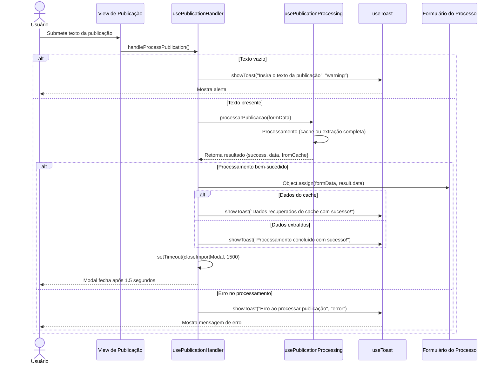

# Funcionalidade: Processamento e Aplicação de Publicações

## Descrição

Esta funcionalidade gerencia o processo de submissão, processamento e aplicação dos dados extraídos de publicações contratuais. Ela coordena a interface de usuário, validações e a integração com o serviço de processamento principal.

## Fluxo da Funcionalidade



## Interface de Usuário

- Modal para inserção do texto da publicação
- Botão para iniciar o processamento
- Indicador de progresso durante o processamento
- Feedback visual via toasts para sucesso ou erros
- Fechamento automático do modal após processamento bem-sucedido

## Componente usePublicationHandler

Este componente gerencia o fluxo de submissão e aplicação dos resultados:

```javascript
export function usePublicationHandler(publicacaoText, processarPublicacao, closeImportModal, formData) {
  const { showToast } = useToast()

  // Função para processar uma publicação
  const handleProcessPublication = async () => {
    if (!publicacaoText.value) {
      showToast('Insira o texto da publicação', 'warning')
      return
    }
    
    try {
      const result = await processarPublicacao(formData.value)
      
      if (result.success) {
        Object.assign(formData.value, result.data)
        
        showToast(result.fromCache 
          ? 'Dados recuperados do cache com sucesso!'
          : 'Processamento concluído com sucesso!', 'success')
        
        setTimeout(() => closeImportModal(), 1500)
      } else {
        showToast('Erro ao processar publicação', 'error')
      }
    } catch (error) {
      console.error('Erro ao processar publicação:', error)
      showToast('Erro ao processar publicação', 'error')
    }
  }

  return {
    handleProcessPublication
  }
}
```

## Integração com usePublicationProcessing

O handler depende do serviço `usePublicationProcessing` para realizar a extração dos dados, mas gerencia o fluxo de UI e feedback ao usuário:

| Componente | Responsabilidade |
|------------|------------------|
| usePublicationProcessing | Extração de dados, cache, lógica de processamento |
| usePublicationHandler | Fluxo UI, validações, feedback, atualização do formulário |

## Dados Manipulados

O handler recebe e manipula as seguintes estruturas de dados:

### Entrada

```javascript
publicacaoText: String // Texto da publicação a ser analisada
formData: Object       // Objeto com dados do formulário do processo
```

### Saída do processarPublicacao

```javascript
{
  success: Boolean,       // Indica se processamento teve sucesso
  data: {                 // Dados extraídos da publicação
    numero: String,
    ano: String,
    orgao: String,
    // ... outros campos extraídos
  },
  fromCache: Boolean      // Indica se veio do cache
}
```

## Comportamento e UX

- **Validação inicial**: Verifica se o texto foi inserido
- **Feedback imediato**: Toast warnings para formulários vazios
- **Feedback de progresso**: Utiliza os estados do processamento para feedback
- **Feedback de resultado**: Toast para sucesso ou erro
- **UX fluida**: Fechamento automático do modal após sucesso
- **Tratamento de erros**: Captura erros do processamento e exibe feedback apropriado

## Aplicação dos Dados no Formulário

Os dados extraídos são aplicados diretamente ao formulário através de `Object.assign(formData.value, result.data)`, o que permite:

1. Preservar dados existentes não alterados pela extração
2. Substituir ou adicionar os novos dados extraídos
3. Atualizar a UI automaticamente devido à reatividade

## Estados Possíveis Após Processamento

| Estado | Descrição | Feedback ao Usuário |
|--------|-----------|---------------------|
| Sucesso do Cache | Dados recuperados do cache | Toast verde, modal fecha automaticamente |
| Sucesso da Extração | Dados extraídos com sucesso | Toast verde, modal fecha automaticamente |
| Texto Vazio | Usuário não inseriu texto | Toast amarelo, modal permanece aberto |
| Erro na Extração | Falha no processamento | Toast vermelho, modal permanece aberto |
| Erro não Capturado | Exceção não tratada | Toast vermelho, erro logado no console |
