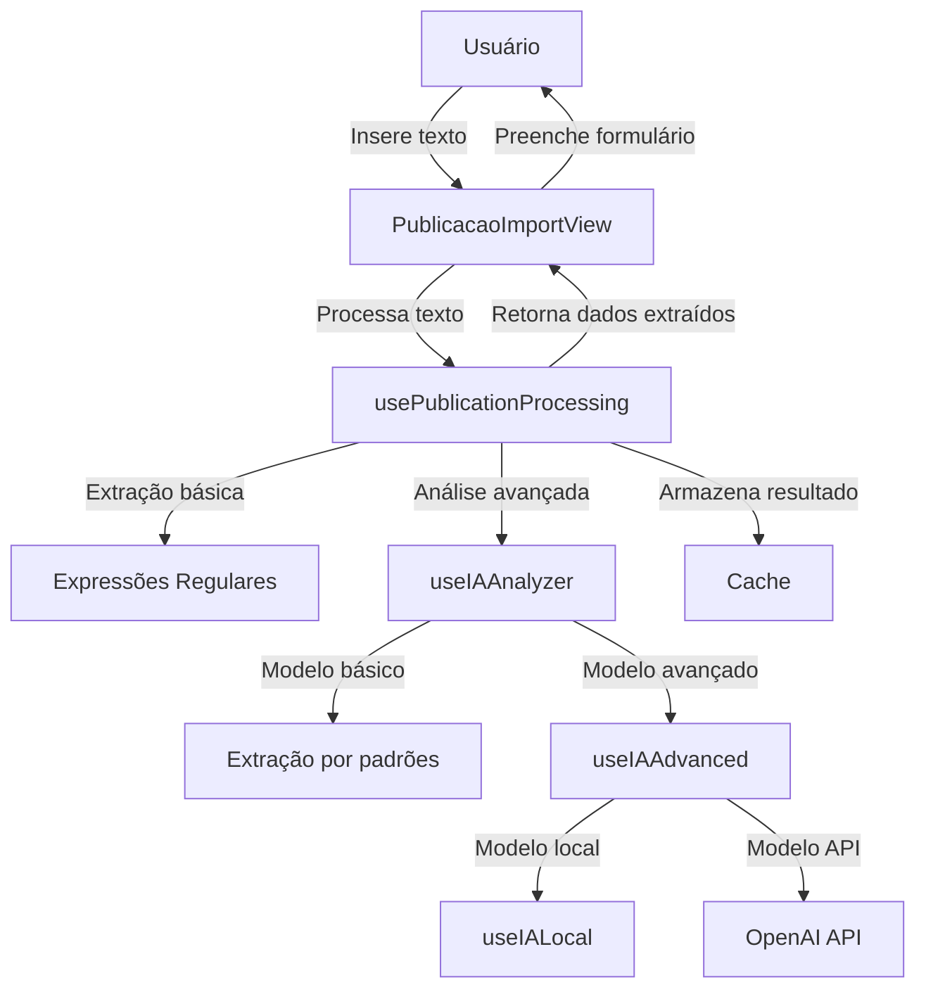
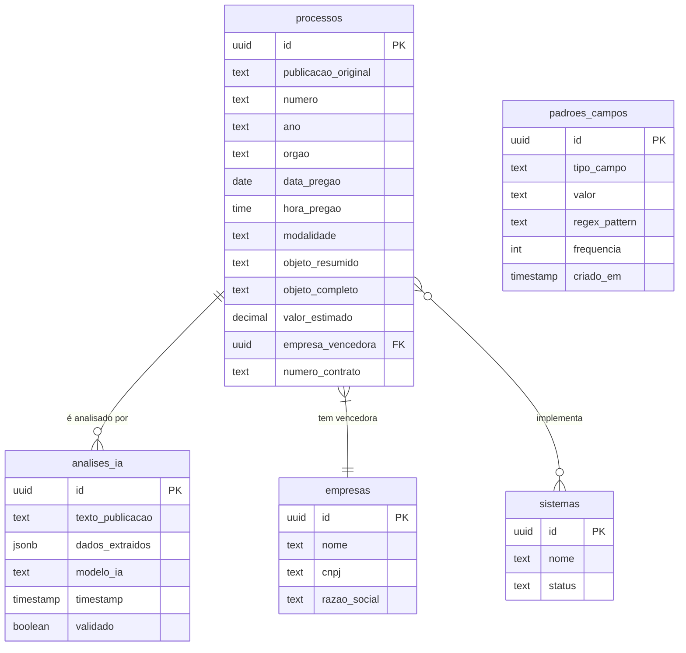
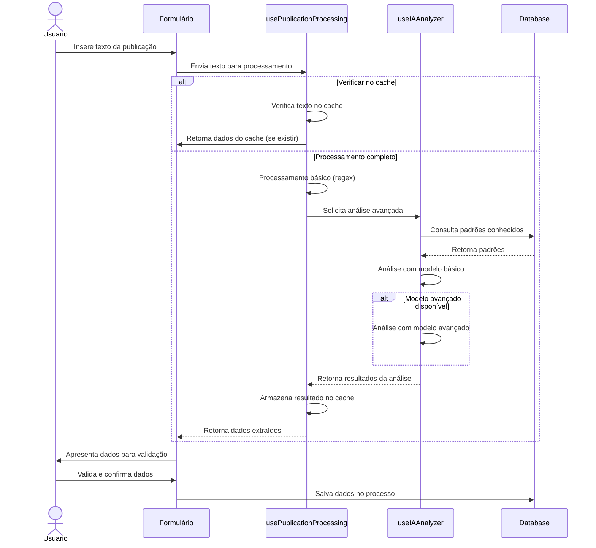

# Visão Geral - Análise de Publicações Contratuais

## Descrição da Funcionalidade

O módulo de "Análise de Publicações Contratuais" permite a extração automática e análise inteligente de dados de publicações oficiais relacionadas a processos licitatórios. O sistema é capaz de analisar o conteúdo textual de publicações para extrair informações como número de processo, órgão, modalidade, objeto, valor estimado, empresas vencedoras e sistemas a serem implantados.

## Acesso

- Disponível para todos os usuários autenticados
- Acessível a partir da tela de detalhes de um processo ou no formulário de criação de processos

## Funcionalidades Principais

1. **Extração de Dados Básicos**: Identificação automática de informações como número do processo, data, órgão e objeto
2. **Detecção de Empresas Vencedoras**: Identificação de empresas mencionadas como vencedoras nas publicações
3. **Identificação de Sistemas**: Reconhecimento de sistemas de software mencionados nas publicações
4. **Análise de Contratos**: Extração de números de contrato e valores contratuais
5. **Cache Inteligente**: Armazenamento em cache para processamentos recorrentes
6. **Múltiplos Modelos de IA**: Utilização de diferentes modelos de IA para aprimorar precisão

## Arquitetura do Módulo

## Modelo de Dados Simplificado

## Fluxo de Processamento

## Tabelas Principais do Banco de Dados

| Tabela | Descrição |
|--------|-----------|
| processos | Armazena as informações de processos licitatórios, incluindo dados extraídos das publicações |
| analises_ia | Registra as análises realizadas pelos modelos de IA para aprendizado futuro |
| padroes_campos | Armazena padrões conhecidos para diferentes campos para melhorar a extração |
| empresas | Cadastro de empresas que podem ser identificadas nas publicações |
| sistemas | Cadastro de sistemas que podem ser mencionados nas publicações |

## Tecnologias Utilizadas

- Expressões regulares para extração básica de dados
- Cache local para melhorar desempenho em textos similares
- Modelos de IA para análise avançada:
  - Modelo básico baseado em regras
  - Modelo local opcional (Ollama)
  - Integração com OpenAI API
- Feedback de usuário para aprendizado contínuo
