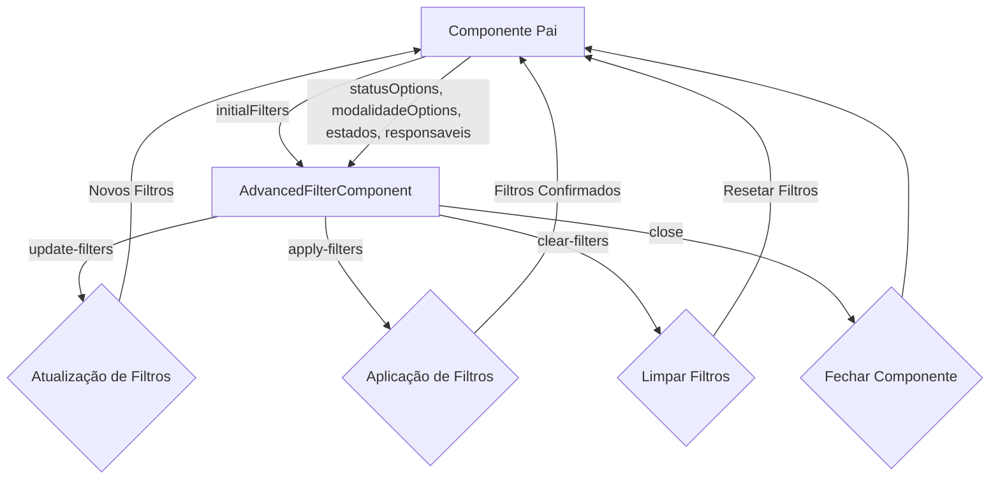

# Documentação do Componente de Filtro Avançado

## Visão Geral

O AdvancedFilterComponent é um componente Vue.js projetado para oferecer funcionalidades de filtragem avançada em listas e tabelas de dados. Ele fornece uma interface de usuário intuitiva para aplicar múltiplos filtros simultaneamente, com suporte para diversos tipos de dados e condições de filtragem.

## Recursos Principais

- Filtros por intervalo de datas (período)
- Filtros por estado/UF
- Seleção de modalidades através de checkboxes
- Filtros por status de processos
- Seleção de responsáveis
- Filtros por intervalo de valores monetários
- Visualização e remoção rápida de filtros ativos
- Limpar todos os filtros com um clique
- Interface responsiva e adaptável a diferentes tamanhos de tela

## Estrutura do Componente

### Props

| Nome | Tipo | Padrão | Descrição |
|------|------|--------|-----------|
| isActive | Boolean | false | Controla a visibilidade do componente |
| statusOptions | Array | [] | Opções disponíveis para filtro de status |
| modalidadeOptions | Array | [] | Opções disponíveis para filtro de modalidade |
| responsaveis | Array | [] | Lista de responsáveis disponíveis para filtro |
| estados | Array | [] | Lista de estados/UFs disponíveis para filtro |
| initialFilters | Object | {} | Estado inicial dos filtros |

### Eventos Emitidos

| Nome | Payload | Descrição |
|------|--------|-----------|
| close | - | Emitido quando o usuário fecha o componente |
| update-filters | Object (filters) | Emitido quando há mudanças nos filtros |
| apply-filters | Object (filters) | Emitido quando o usuário confirma os filtros |
| clear-filters | - | Emitido quando o usuário limpa todos os filtros |

## Fluxo de Dados



## Modelo de Dados do Filtro

```typescript
interface Filters {
  dataInicio: string;         // Data inicial do período (formato YYYY-MM-DD)
  dataFim: string;            // Data final do período (formato YYYY-MM-DD)
  estados: string[];          // Array de UFs selecionadas (Ex: ["RJ", "SP"])
  status: string[];           // Array de status selecionados
  modalidade: string[];       // Array de modalidades selecionadas
  responsavel: string[];      // Array de IDs de responsáveis selecionados
  valorMin: string;           // Valor mínimo formatado (Ex: "1.000,00")
  valorMax: string;           // Valor máximo formatado (Ex: "10.000,00")
}
```

## Exemplo de Uso

```vue
<template>
  <div class="container">
    <button @click="showFilter = !showFilter" class="btn-filter">
      Filtro Avançado
      <span v-if="activeFiltersCount > 0" class="filter-badge">
        {{ activeFiltersCount }}
      </span>
    </button>
    
    <div 
      class="advanced-filter-container-wrapper" 
      :class="{'is-visible': showFilter}"
    >
      <AdvancedFilterComponent
        :is-active="showFilter"
        :status-options="statusOptions"
        :modalidade-options="modalidadeOptions"
        :responsaveis="responsaveis"
        :estados="estados"
        :initial-filters="currentFilters"
        @close="showFilter = false"
        @update-filters="handleFilterUpdate"
        @apply-filters="applyFilters"
        @clear-filters="clearAllFilters"
      />
    </div>
    
    <!-- Tabela ou lista de dados filtrados -->
  </div>
</template>

<script>
import { ref, computed } from 'vue';
import AdvancedFilterComponent from '@/components/filters/AdvancedFilterComponent.vue';

export default {
  components: {
    AdvancedFilterComponent
  },
  setup() {
    const showFilter = ref(false);
    const currentFilters = ref({});
    
    // Dados para as opções de filtro
    const statusOptions = [
      { value: 'em_analise', label: 'Em Análise' },
      { value: 'vamos_participar', label: 'Vamos Participar' },
      // etc
    ];
    
    const modalidadeOptions = [
      { valor: 'pregao_eletronico', texto: 'Pregão Eletrônico' },
      { valor: 'pregao_presencial', texto: 'Pregão Presencial' },
      // etc
    ];
    
    const responsaveis = [
      { id: '1', nome: 'João Silva' },
      { id: '2', nome: 'Maria Santos' },
      // etc
    ];
    
    const estados = [
      { uf: 'SP', nome: 'São Paulo' },
      { uf: 'RJ', nome: 'Rio de Janeiro' },
      // etc
    ];
    
    // Contagem de filtros ativos
    const activeFiltersCount = computed(() => {
      let count = 0;
      
      if (currentFilters.value.dataInicio) count++;
      if (currentFilters.value.dataFim) count++;
      if (currentFilters.value.status?.length) count += currentFilters.value.status.length;
      if (currentFilters.value.modalidade?.length) count += currentFilters.value.modalidade.length;
      if (currentFilters.value.responsavel?.length) count += currentFilters.value.responsavel.length;
      if (currentFilters.value.estados?.length) count += currentFilters.value.estados.length;
      if (currentFilters.value.valorMin) count++;
      if (currentFilters.value.valorMax) count++;
      
      return count;
    });
    
    // Manipuladores de eventos
    const handleFilterUpdate = (filters) => {
      currentFilters.value = { ...filters };
    };
    
    const applyFilters = (filters) => {
      currentFilters.value = { ...filters };
      // Aqui você pode fazer chamadas de API ou filtrar dados localmente
      showFilter.value = false;
    };
    
    const clearAllFilters = () => {
      currentFilters.value = {};
      // Aqui você pode redefinir os dados para o estado não filtrado
    };
    
    return {
      showFilter,
      currentFilters,
      statusOptions,
      modalidadeOptions,
      responsaveis,
      estados,
      activeFiltersCount,
      handleFilterUpdate,
      applyFilters,
      clearAllFilters
    };
  }
};
</script>
```

## Integração com Composables

O componente de filtro avançado trabalha bem com os seguintes composables:

### useFormatters.js

Fornece funções para formatação de dados como datas, moedas, status:

```javascript
// Exemplo de integração com useFormatters
import { useFormatters } from '@/composables/useFormatters';

const { formatCurrency, formatStatus } = useFormatters();

// Formatar valores ao exibir
const formattedValue = formatCurrency(filters.valorMin);
```

### useFiltros.js

Pode ser utilizado para gerenciamento avançado de estado dos filtros e integração com APIs:

```javascript
// Exemplo de integração com useFiltros
import { useFiltros } from '@/composables/useFiltros';

const { 
  filtros, 
  processosFiltrados,
  limparFiltros,
  toggleFiltro
} = useFiltros(processos, anoSelecionado);

// Aplicar filtros
const applyAdvancedFilters = (advancedFilters) => {
  // Mapear filtros avançados para o formato usado por useFiltros
  filtros.status = advancedFilters.status;
  filtros.modalidade = advancedFilters.modalidade;
  // etc.
};
```

## Estilização e Responsividade

O componente utiliza um sistema de grid CSS para organizar os controles de filtro, adaptando-se a diferentes tamanhos de tela:

- Em telas grandes (desktop): 3 colunas de filtros
- Em telas médias (tablet): 2 colunas de filtros  
- Em telas pequenas (mobile): 1 coluna de filtros

Os estilos principais estão definidos em:

- Inline no componente (`<style scoped>`)
- Estilos globais em `src/assets/styles/components/filters.css`

## Considerações de Desempenho

Para melhorar o desempenho ao trabalhar com grandes conjuntos de dados:

1. Utilize computed properties para derivar dados filtrados
2. Considere debounce em campos de entrada de texto
3. Para listas muito longas, considere usar virtualização (vue-virtual-scroller)
4. Limite o número de opções visíveis em dropdowns com muitos itens

## Acessibilidade

O componente implementa várias práticas de acessibilidade:

- Uso de labels associados a controles de formulário
- Contraste adequado de cores para texto e elementos interativos
- Suporte a navegação por teclado
- Atributos ARIA para melhorar a experiência com leitores de tela

## Expansões Futuras

Possíveis melhorias futuras para o componente:

1. Suporte para pesquisa de texto completo
2. Filtros salvos/favoritos
3. Filtros condicionais (AND/OR)
4. Exportação de configurações de filtro
5. Histórico de filtros aplicados
