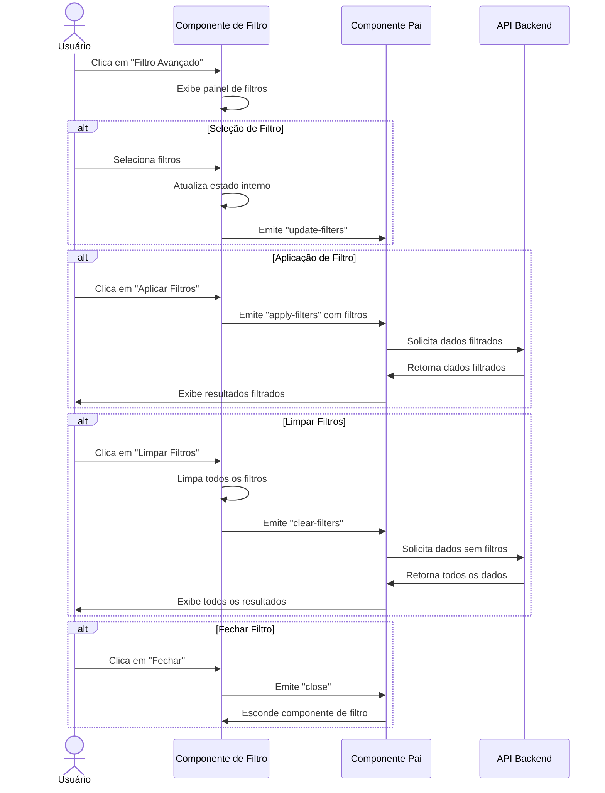
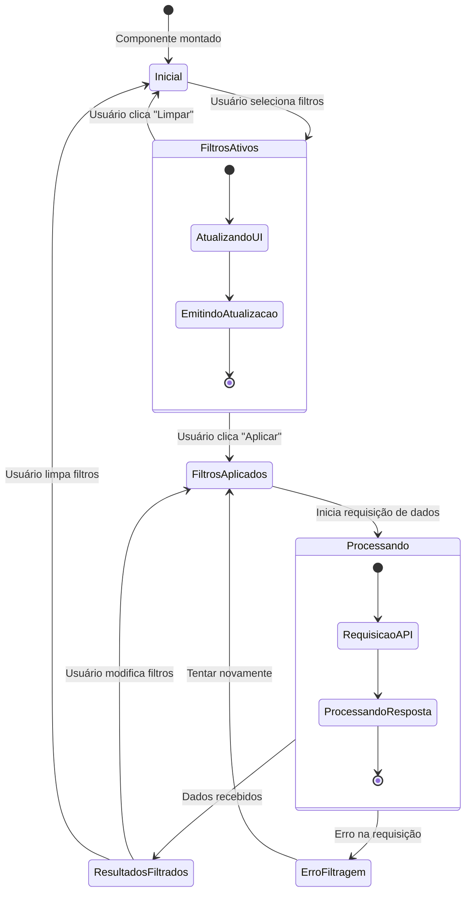
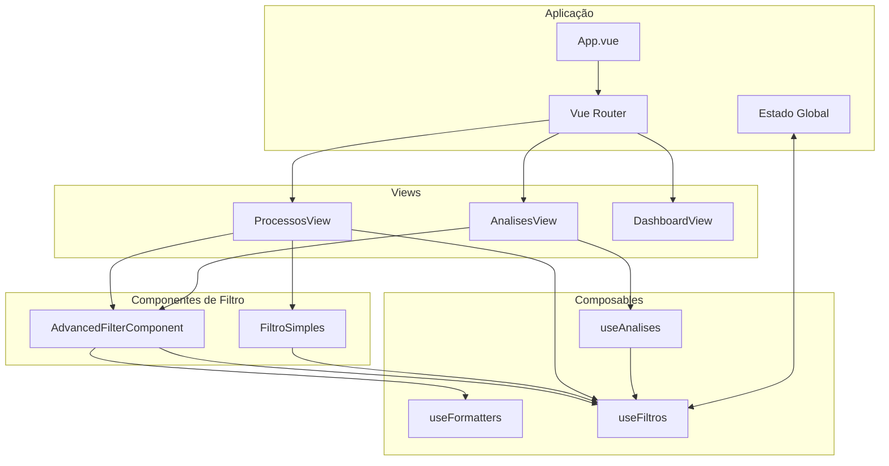
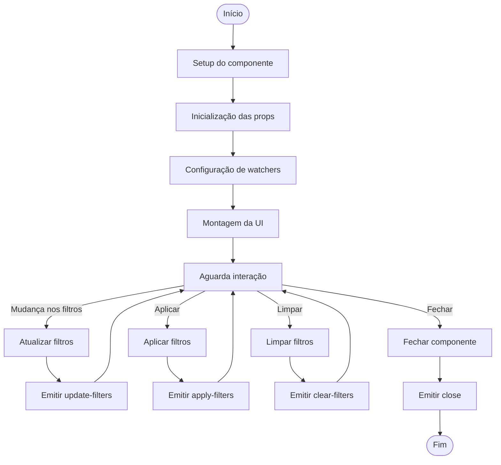

# Diagrama de Fluxo - Componente de Filtro Avançado

Este documento ilustra o fluxo de dados e estados do componente de filtro avançado, bem como sua interação com outros componentes do sistema.

## Fluxo de Interação do Usuário

## Estado dos Filtros e Processamento

## Arquitetura de Componentes

## Ciclo de Vida do Componente

