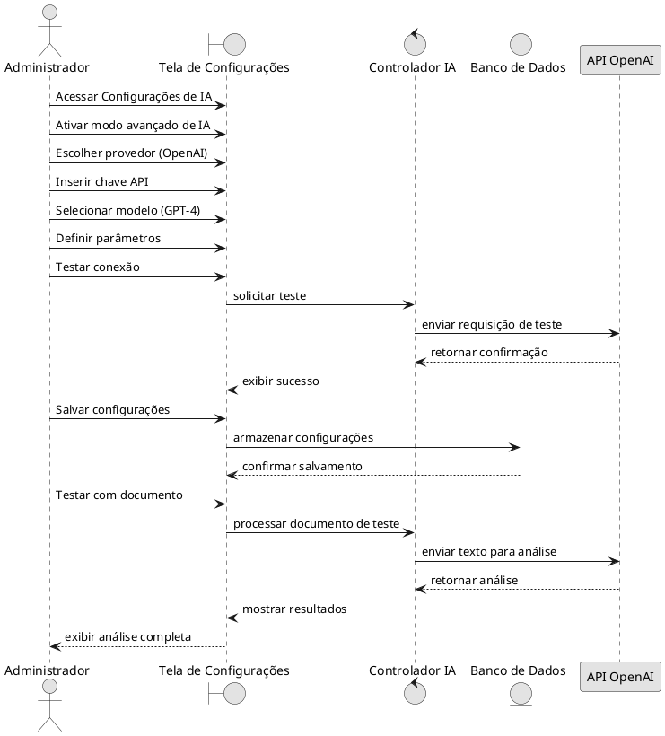
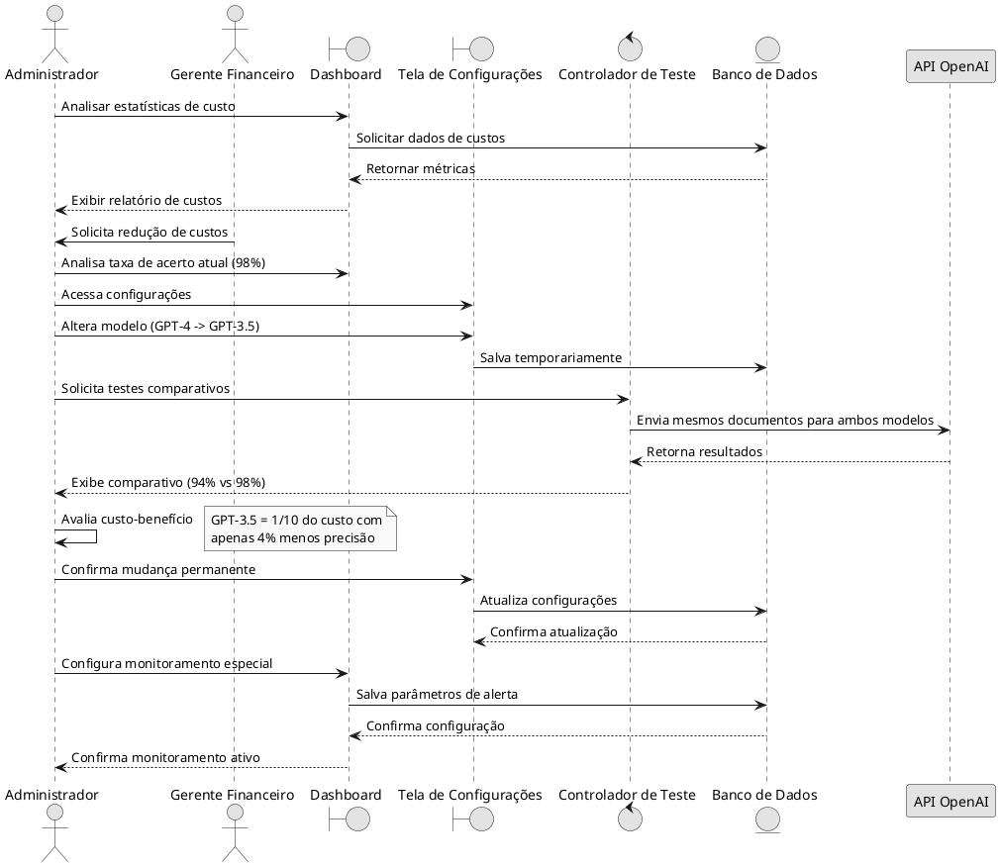
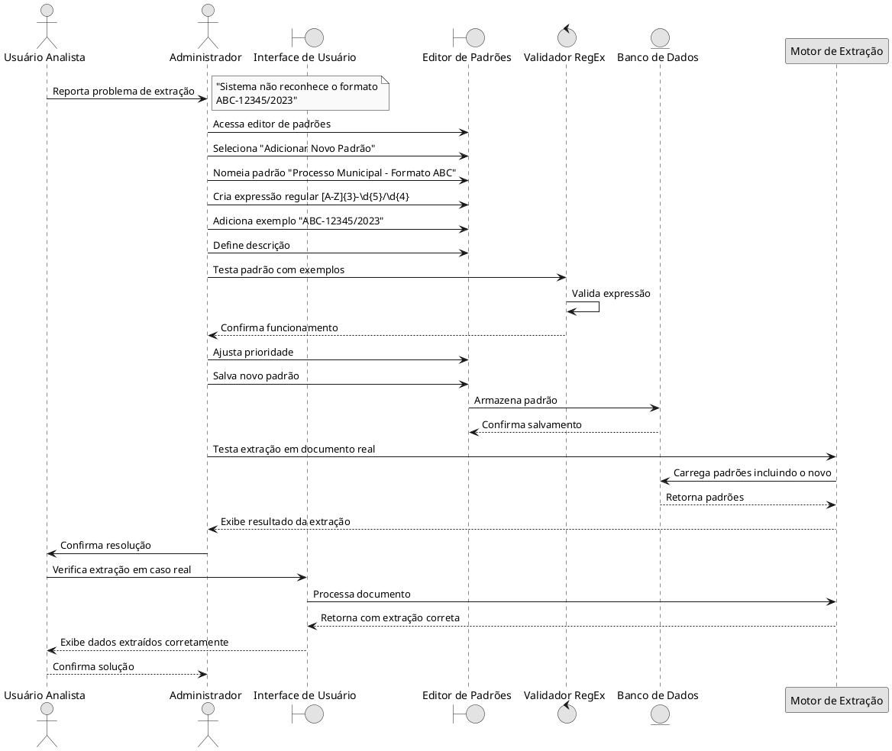
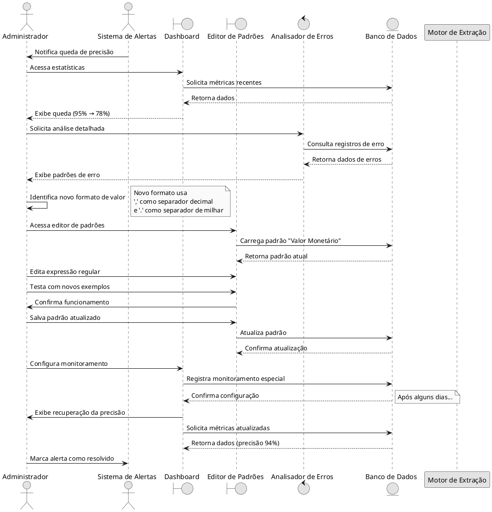
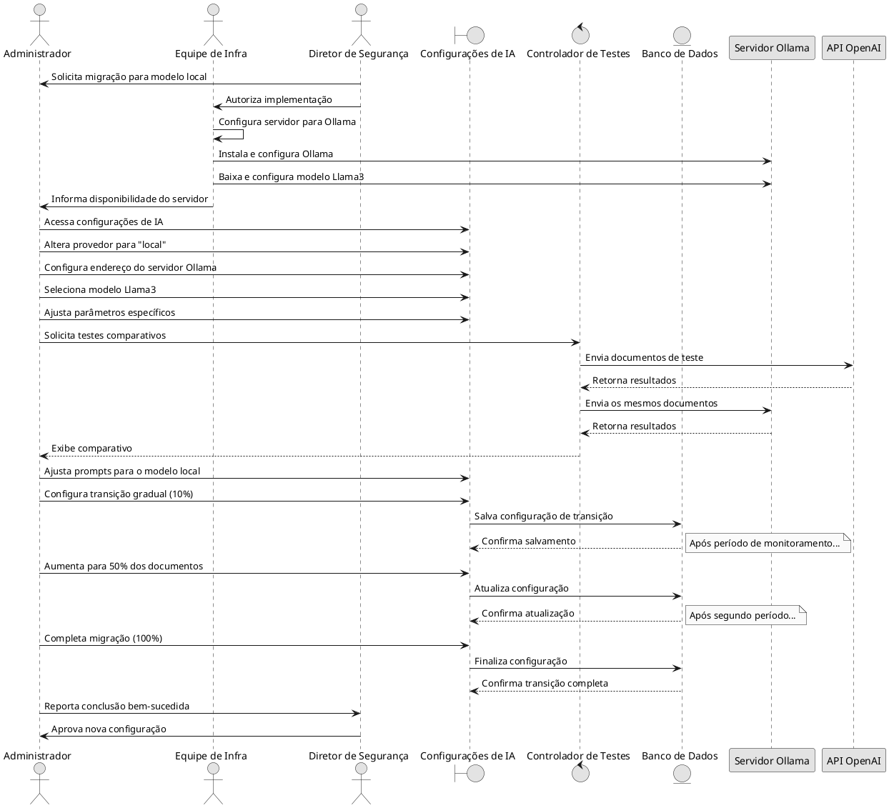
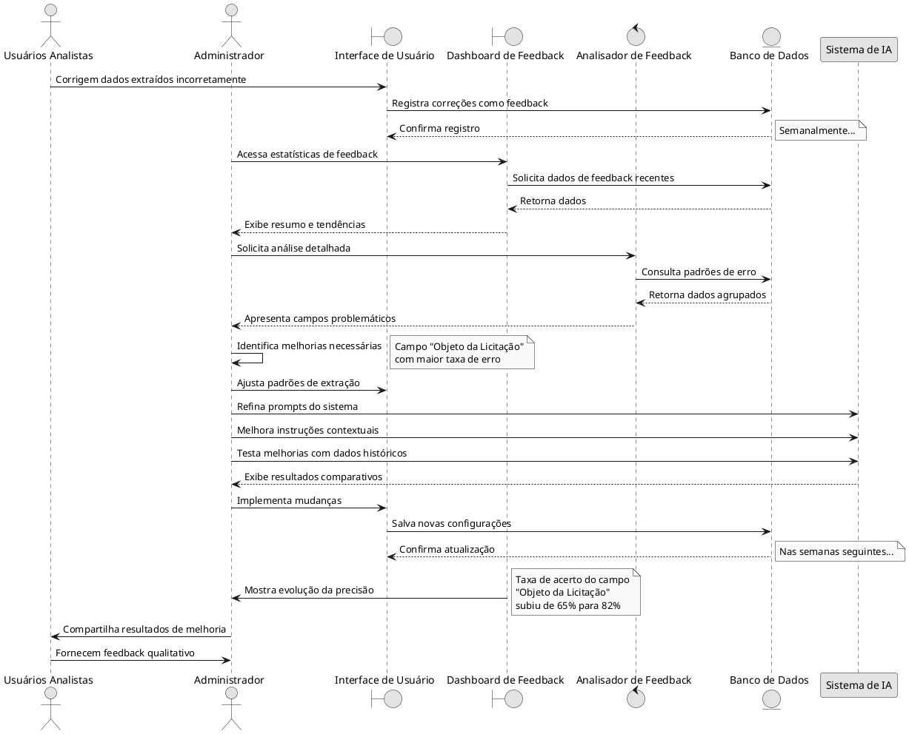

# Cenários de Uso - Configurações de IA

Este documento apresenta diferentes cenários de uso para o módulo de Configurações de IA, demonstrando como administradores e usuários podem interagir com o sistema em diversas situações.

## Cenário 1: Configuração Inicial do Sistema

### Contexto Inicial

Um administrador está configurando o sistema pela primeira vez e precisa ativar e configurar o processamento de IA para análise de editais.

### Atores do Cenário 1

- Administrador do Sistema

### Fluxo Principal - Cenário 1

1. O administrador acessa o módulo de Configurações de IA
2. Ativa o modo avançado de IA selecionando a opção correspondente
3. Escolhe a OpenAI como provedor de IA
4. Insere a chave de API da OpenAI obtida previamente
5. Seleciona o modelo GPT-4 como modelo preferencial
6. Define parâmetros básicos:
   - Temperatura: 0.3 (para manter respostas mais consistentes)
   - Máximo de tokens: 2000
   - Top P: 0.9
7. Testa a conexão com o serviço de IA
8. Salva as configurações
9. Realiza um teste de extração com um documento de exemplo
10. Verifica os resultados e confirma o funcionamento

### Resultado Esperado - Configuração Inicial

Sistema configurado e funcionando com o modelo de IA escolhido, pronto para processar documentos reais.

## Cenário 2: Ajuste de Modelo por Custo-Benefício

### Contexto de Custo

O administrador percebe que o custo do modelo GPT-4 está alto para o volume de documentos processados e decide avaliar alternativas de menor custo.

### Atores do Cenário 2

- Administrador do Sistema
- Gerente Financeiro (stakeholder)

### Fluxo Principal - Cenário 2

1. O administrador acessa o dashboard de estatísticas de IA
2. Analisa os custos acumulados no último mês
3. Verifica a taxa de acerto atual do modelo GPT-4 (98%)
4. Acessa as configurações de IA
5. Muda temporariamente para o modelo GPT-3.5 Turbo
6. Realiza testes comparativos com um conjunto de documentos padrão
7. Compara os resultados: GPT-3.5 com taxa de acerto de 94%
8. Avalia o custo-benefício: GPT-3.5 custa 1/10 do GPT-4 com apenas 4% menos precisão
9. Decide implementar a mudança permanentemente
10. Salva as novas configurações
11. Configura um monitoramento especial para os campos críticos durante o período de transição

### Resultado Esperado - Ajuste de Modelos

Redução significativa de custos com manutenção de nível aceitável de precisão.

## Cenário 3: Criação de Padrão Personalizado

### Contexto de Personalização

Um usuário identifica que o sistema frequentemente não consegue extrair corretamente números de processos em um formato específico usado por um órgão municipal. Um padrão personalizado precisa ser criado.

### Atores do Cenário 3

- Administrador do Sistema
- Usuário Analista

### Fluxo Principal - Cenário 3

1. O usuário analista identifica o problema e reporta ao administrador
2. O administrador acessa a seção de padrões de extração
3. Seleciona "Adicionar Novo Padrão"
4. Nomeia o padrão como "Processo Municipal - Formato ABC"
5. Analisa exemplos do formato: ABC-12345/2023
6. Cria a expressão regular: `[A-Z]{3}-\d{5}/\d{4}`
7. Adiciona descrição e exemplo
8. Testa o padrão contra exemplos reais
9. Ajusta a prioridade do padrão para garantir execução adequada
10. Salva o novo padrão
11. Testa a extração em documentos reais
12. Confirma o funcionamento com o usuário analista

### Resultado Esperado - Padrão Personalizado

Sistema capaz de identificar e extrair corretamente o novo formato de número de processo.

## Cenário 4: Análise e Resposta a Queda de Precisão

### Contexto de Problemas

O sistema de monitoramento detecta uma queda significativa na precisão da extração do campo "Valor Estimado" nos últimos dias.

### Atores do Cenário 4

- Administrador do Sistema
- Equipe de Suporte

### Fluxo Principal - Cenário 4

1. Sistema de alertas notifica o administrador sobre a queda de precisão
2. Administrador acessa o dashboard de estatísticas
3. Verifica que a precisão do campo "Valor Estimado" caiu de 95% para 78%
4. Analisa os padrões de erro mais comuns
5. Descobre que há um novo formato de valor sendo usado (com separador de milhar diferente)
6. Acessa a seção de padrões de campo
7. Edita o padrão existente para "Valor Monetário"
8. Atualiza a expressão regular para incluir o novo formato
9. Testa o padrão modificado
10. Implementa a mudança
11. Monitora a precisão nos dias seguintes
12. Confirma recuperação da taxa de acerto

### Resultado Esperado - Correção de Precisão

Identificação da causa da queda de precisão, correção do problema e restauração dos níveis anteriores de eficiência.

## Cenário 5: Migração para Modelo Local

### Contexto de Migração

A organização decide, por questões de privacidade e custos, migrar de um provedor de IA em nuvem para um modelo local (Ollama) executado em servidores próprios.

### Atores do Cenário 5

- Administrador do Sistema
- Equipe de Infraestrutura
- Diretor de Segurança da Informação

### Fluxo Principal - Cenário 5

1. Equipe de infraestrutura configura servidor local com Ollama
2. Instala e configura modelo LLama3
3. Administrador acessa configurações de IA
4. Altera o provedor de "OpenAI" para "local"
5. Configura parâmetros de conexão com servidor Ollama
6. Seleciona o modelo Llama3 como modelo padrão
7. Ajusta parâmetros específicos para o modelo local:
   - Número de threads: 8
   - Context window: 16000
   - Temperatura: 0.5
8. Realiza testes comparativos entre o modelo em nuvem e o local
9. Ajusta prompts e parâmetros para otimizar o desempenho do modelo local
10. Implementa a transição gradualmente (10% dos documentos, 50%, 100%)
11. Monitora métricas de desempenho e precisão
12. Finaliza a transição quando os resultados são considerados aceitáveis

### Resultado Esperado - Migração Local

Migração bem-sucedida para um modelo local com manutenção de níveis aceitáveis de precisão e eliminação dos custos de API externa.

## Cenário 6: Integração de Feedback para Melhoria Contínua

### Contexto de Feedback

O sistema está implementando um ciclo de feedback para melhorar continuamente a precisão da extração de dados.

### Atores do Cenário 6

- Administrador do Sistema
- Usuários Analistas
- Sistema de IA

### Fluxo Principal - Cenário 6

1. Usuários corrigem dados extraídos incorretamente durante seu trabalho diário
2. Sistema registra automaticamente todas as correções como feedback
3. Administrador acessa o módulo de feedback da IA semanalmente
4. Analisa os padrões de erro mais frequentes
5. Identifica campos problemáticos
6. Implementa melhorias baseadas no feedback:
   - Ajusta padrões de extração
   - Refina prompts do sistema
   - Melhora instruções ao modelo de IA
7. Testa as melhorias com dados históricos
8. Implementa as mudanças
9. Monitora a evolução da precisão
10. Compartilha resultados com os usuários

### Resultado Esperado - Feedback Contínuo

Processo de melhoria contínua estabelecido, com aumento gradual da precisão do sistema ao longo do tempo.

## Matriz de Recursos e Casos de Uso

| Recurso | Cenário 1 | Cenário 2 | Cenário 3 | Cenário 4 | Cenário 5 | Cenário 6 |
|---------|:---------:|:---------:|:---------:|:---------:|:---------:|:---------:|
| Seleção de Modelo | ✓ | ✓ | | | ✓ | |
| Configuração de API | ✓ | | | | ✓ | |
| Ajuste de Parâmetros | ✓ | ✓ | | | ✓ | ✓ |
| Criação de Padrões | | | ✓ | | | |
| Edição de Padrões | | | | ✓ | | ✓ |
| Análise de Estatísticas | | ✓ | | ✓ | ✓ | ✓ |
| Testes Comparativos | ✓ | ✓ | ✓ | | ✓ | ✓ |
| Gestão de Feedback | | | | ✓ | | ✓ |
| Migração de Provedor | | | | | ✓ | |
| Monitoramento Contínuo | | ✓ | | ✓ | ✓ | ✓ |

## Conclusão

Os cenários acima demonstram a versatilidade e importância do módulo de Configurações de IA em diferentes situações de negócio. O sistema precisa ser flexível o suficiente para acomodar esses diferentes casos de uso, permitindo aos administradores responder rapidamente às necessidades em constante evolução.
