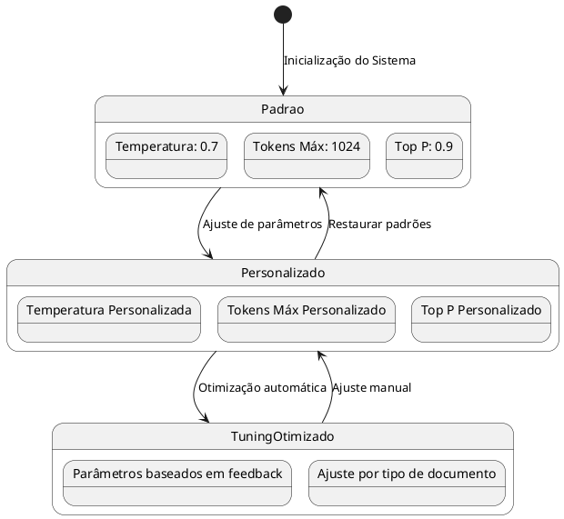

# Configuração de Parâmetros de IA

## Descrição

Este módulo permite ajustar os parâmetros específicos de cada modelo de IA, configurando aspectos como temperatura, número máximo de tokens, e outras configurações que afetam o comportamento e resultados do processamento de linguagem natural.

## Diagrama de Estados dos Parâmetros



## Fluxo de Configuração de Parâmetros

```plantuml
@startuml
start
:Acesso à tela de Configuração de Parâmetros;

if (Modelo de IA selecionado?) then (sim)
  :Carregar parâmetros disponíveis para o modelo;
else (não)
  :Exibir mensagem para selecionar modelo;
  stop
endif

:Exibir formulário de configuração com valores atuais;

fork
  :Ajustar temperatura;
  note right: Entre 0.0 (determinístico) e 1.0 (criativo)
fork again
  :Ajustar tokens máximos;
  note right: Limitado pelo modelo selecionado
fork again
  :Ajustar Top P;
  note right: Controla diversidade de saída
fork again
  :Configurar parâmetros específicos do modelo;
end fork

:Salvar configurações;

if (Testar configurações?) then (sim)
  :Executar teste com texto de amostra;
  if (Resultado satisfatório?) then (sim)
    :Confirmar configurações;
  else (não)
    :Ajustar parâmetros;
    backward:Voltar para formulário;
  endif
else (não)
  :Configurações salvas sem teste;
endif

stop
@enduml
```

## Parâmetros Configuráveis

### Parâmetros Gerais

- **Temperatura**: Controla a aleatoriedade das respostas (0.0 a 1.0)
- **Tokens Máximos**: Define o comprimento máximo da resposta
- **Top P**: Controla a diversidade da saída (0.0 a 1.0)
- **Penalidade de Frequência**: Reduz repetições de palavras

### Parâmetros Específicos por Modelo

#### OpenAI

- Modelo específico (GPT-4, GPT-3.5-Turbo)
- Frequency penalty
- Presence penalty

#### Claude

- Modelo específico (Claude 3 Opus, Sonnet, Haiku)
- Temperature scaling
- Top K

#### Mistral

- Modelo específico (Mistral Large, Medium, Small)
- Mirostat mode
- Mirostat tau

#### Google Gemini

- Modelo específico (Gemini 1.5 Pro, Flash)
- Top K
- Safety settings

#### Modelo Local (Ollama)

- Modelo específico (Llama3, Mistral, Phi)
- Número de threads
- Context window size

## Tabelas e Campos do Banco de Dados

### Tabela: `configuracoes`

| Coluna | Tipo | Descrição | Exemplo |
|--------|------|-----------|---------|
| chave | TEXT | Identificador da configuração | 'temperatura_ia' |
| valor | TEXT | Valor do parâmetro | '0.7' |
| descricao | TEXT | Descrição do parâmetro | 'Controla aleatoriedade das respostas' |
| created_at | TIMESTAMP | Data de criação | 2023-01-01 12:00:00 |
| updated_at | TIMESTAMP | Data da última atualização | 2023-01-01 12:00:00 |
| updated_by | UUID | ID do usuário que atualizou | uuid |

### Configurações de Parâmetros Armazenadas

| Chave | Descrição | Valores Possíveis |
|-------|-----------|-------------------|
| temperatura_ia | Controla aleatoriedade | '0.0' a '1.0' (string) |
| max_tokens | Comprimento máximo de resposta | '100' a '4000' (string) |
| top_p | Sampling com nucleus | '0.0' a '1.0' (string) |
| freq_penalty | Penalidade por repetição | '-2.0' a '2.0' (string) |
| presence_penalty | Penalidade por presença | '-2.0' a '2.0' (string) |
| timeout_consulta | Tempo máximo de resposta em segundos | '30' a '120' (string) |
| prompt_sistema | Prompt de sistema para contextualização | string |
| contexto_maximo | Tamanho máximo do contexto em tokens | '4000' a '128000' (string) |
