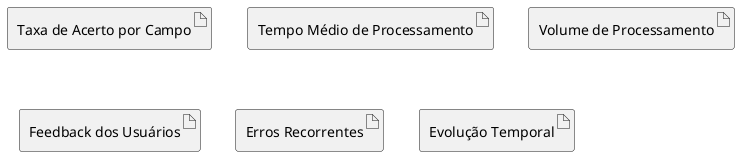
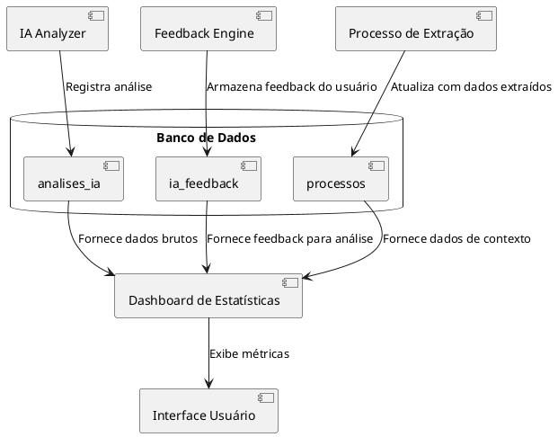
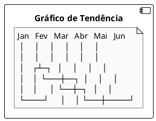
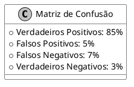

# Estatísticas de IA

## Descrição

O módulo de Estatísticas de IA fornece métricas e análises sobre o desempenho dos modelos de inteligência artificial utilizados no sistema. Essas estatísticas ajudam a avaliar a precisão e eficiência dos modelos, identificar áreas de melhoria, e acompanhar o progresso ao longo do tempo.

## Métricas Principais



## Diagrama de Fluxo de Dados para Estatísticas



## Visualizações Disponíveis

### 1. Gráfico de Precisão por Campo

Visualização da taxa de acerto na extração para cada campo (CNPJ, datas, valores monetários etc.).

```plantuml
@startuml
skinparam monochrome true

!define ACCENT_COLOR #888
!define BAR(value) "<color:ACCENT_COLOR>█████████████████████</color>" 

component "Gráfico de Precisão" {
  note "CNPJ                 [BAR(95%)] 95%\nData Publicação      [BAR(92%)] 92%\nValor Estimado       [BAR(78%)] 78%\nObjeto Licitação    [BAR(65%)] 65%\nÓrgão Responsável    [BAR(89%)] 89%" as chart
}
@enduml
```

### 2. Tendência de Precisão ao Longo do Tempo



### 3. Matriz de Confusão

Análise detalhada dos erros e acertos do modelo para ajustes finos.



## Tabelas e Campos do Banco de Dados

### Tabela: `ia_feedback`

| Coluna | Tipo | Descrição | Exemplo |
|--------|------|-----------|---------|
| id | UUID | Identificador único do feedback | uuid |
| campo | TEXT | Nome do campo avaliado | 'objeto_licitacao' |
| valor_original | TEXT | Valor extraído pela IA | 'Aquisição de software...' |
| valor_corrigido | TEXT | Valor corrigido pelo usuário | 'Aquisição de licenças de software...' |
| correto | BOOLEAN | Se o valor original estava correto | false |
| user_id | UUID | ID do usuário que forneceu feedback | uuid |
| processo_id | UUID | ID do processo relacionado | uuid |
| modelo_ia | TEXT | Modelo de IA usado | 'openai' |
| created_at | TIMESTAMP | Data do feedback | 2023-01-01 12:00:00 |

### Tabela: `analises_ia`

| Coluna | Tipo | Descrição | Exemplo |
|--------|------|-----------|---------|
| id | UUID | Identificador único da análise | uuid |
| texto_analisado | TEXT | Texto que foi submetido à análise | 'Edital de licitação...' |
| modelo_ia | TEXT | Modelo utilizado | 'gpt-4' |
| tempo_processamento | INTEGER | Tempo de processamento em ms | 1520 |
| tokens_entrada | INTEGER | Quantidade de tokens de entrada | 245 |
| tokens_saida | INTEGER | Quantidade de tokens de saída | 128 |
| custo_estimado | DECIMAL | Custo estimado da operação | 0.0238 |
| resultado | JSONB | Resultado da análise em formato JSON | {objeto: "Aquisição..."} |
| created_at | TIMESTAMP | Data da análise | 2023-01-01 12:00:00 |
| created_by | UUID | ID do usuário que solicitou a análise | uuid |

## Integração com outros Módulos

O módulo de Estatísticas de IA integra-se com:

1. Dashboard do Administrador - Fornece visão geral de desempenho
2. Sistema de Aprendizado de Máquina - Permite reforço de aprendizado baseado em feedback
3. Módulo de Configurações - Auxilia na tomada de decisão sobre ajustes de parâmetros
4. Sistema de Alertas - Aciona notificações quando a precisão cai abaixo de determinado limiar
