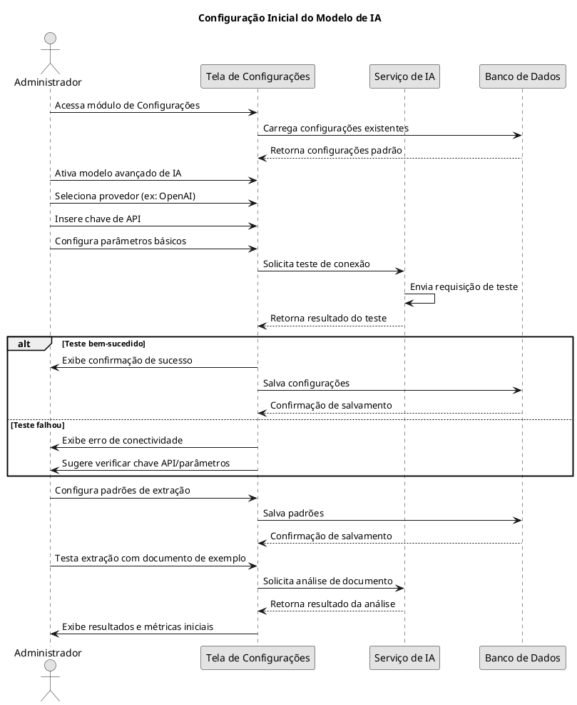
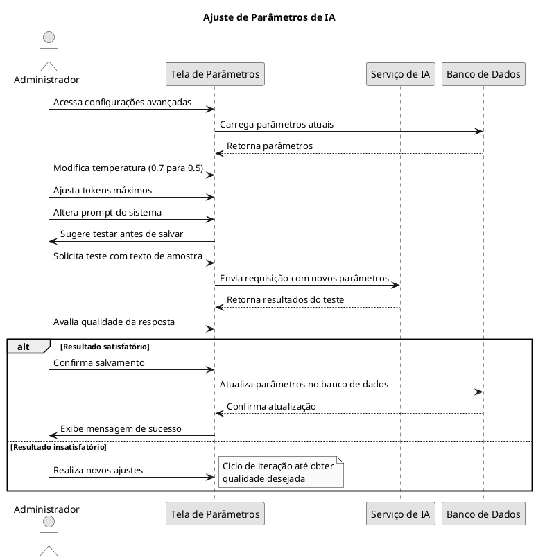
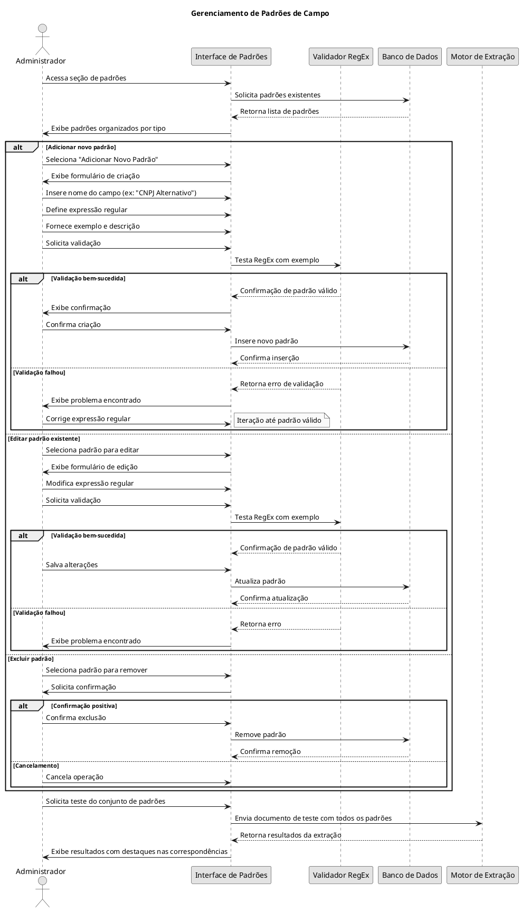
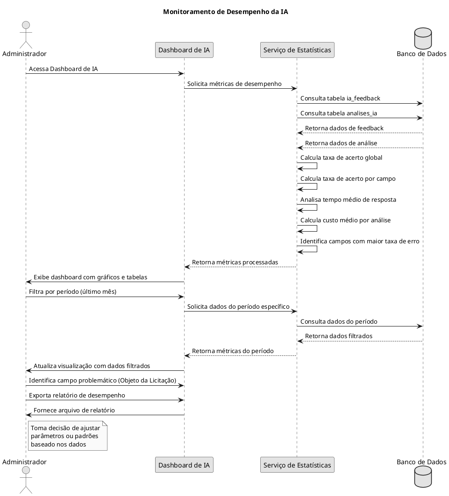
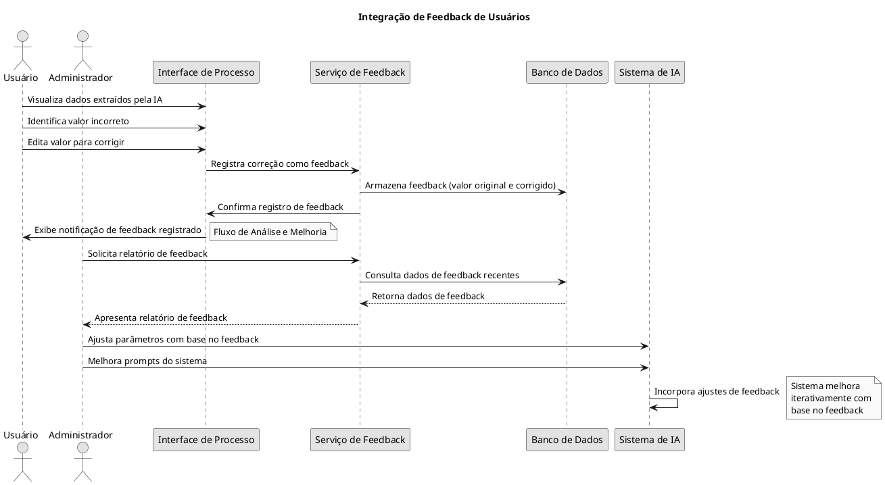
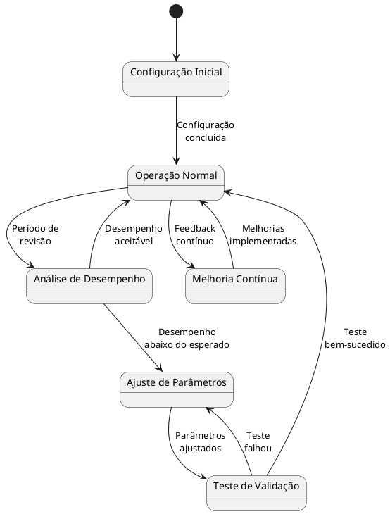

# Fluxos de Trabalho - Configurações de IA

Este documento descreve os principais fluxos de trabalho relacionados às configurações de IA no sistema, incluindo configuração inicial, manutenção e monitoramento.

## Fluxo de Configuração Inicial

## Fluxo de Ajuste de Parâmetros

## Fluxo de Gerenciamento de Padrões de Campo

## Fluxo de Monitoramento e Análise de Desempenho

## Fluxo de Integração de Feedback

## Ciclo de Vida das Configurações de IA

## Check-list de Configuração de IA

1. **Configuração Inicial**
   - [ ] Ativar modelo avançado de IA
   - [ ] Selecionar provedor de IA adequado
   - [ ] Configurar chave API
   - [ ] Definir parâmetros básicos
   - [ ] Realizar teste de conectividade

2. **Configuração de Padrões**
   - [ ] Definir padrões para campos críticos
   - [ ] Validar expressões regulares
   - [ ] Testar extração com documentos reais
   - [ ] Ajustar prioridades de padrões

3. **Configuração de Parâmetros Avançados**
   - [ ] Ajustar temperatura conforme necessidade
   - [ ] Definir limites de tokens
   - [ ] Configurar prompts do sistema
   - [ ] Testar diferentes configurações

4. **Monitoramento**
   - [ ] Configurar alertas para falhas
   - [ ] Definir métricas de acompanhamento
   - [ ] Estabelecer período de revisão regular
   - [ ] Configurar coleta de feedback
