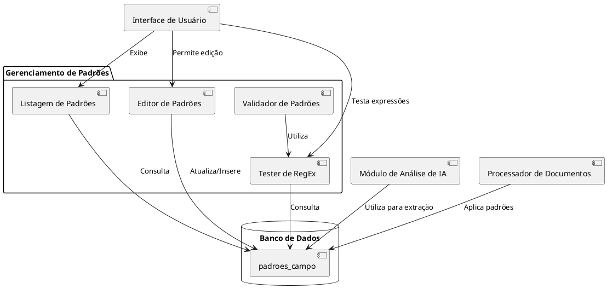

# Padrões de Extração de Dados

## Descrição

O módulo de Padrões de Extração permite configurar e gerenciar os padrões utilizados para extrair informações específicas de documentos de licitação. Esses padrões podem ser baseados em expressões regulares ou estruturas de texto que ajudam a identificar dados relevantes em editais e outros documentos relacionados.

## Fluxo de Gerenciamento de Padrões

```plantuml
@startuml
skinparam monochrome true

start
:Acessar seção de Padrões de Extração;

fork
  :Listar padrões existentes;
  :Filtrar por tipo de campo;
  :Visualizar detalhes do padrão;
  
  if (Editar padrão?) then (sim)
    :Abrir formulário de edição;
    :Modificar expressão regular;
    :Atualizar descrição/exemplo;
    :Salvar alterações;
  else (não)
  endif
  
fork again
  :Adicionar novo padrão;
  :Selecionar tipo de campo;
  :Informar nome do campo;
  :Definir expressão regular;
  :Adicionar exemplo;
  :Testar padrão;
  
  if (Teste bem-sucedido?) then (sim)
    :Salvar novo padrão;
  else (não)
    :Ajustar expressão;
    backward:Tentar novamente;
  endif

fork again
  :Remover padrão existente;
  :Confirmar exclusão;
  :Remover padrão do banco de dados;
end fork

stop
@enduml
```

## Diagrama de Componentes



## Tipos de Campos e Padrões

### Campos Comuns em Licitações

1. **Número do Processo**
   - Identificador único do processo licitatório
   - Exemplo de padrão: `\d{2,6}[\/.-]\d{4,6}[\/.-]\d{2,6}`

2. **CNPJ**
   - Cadastro Nacional de Pessoa Jurídica
   - Exemplo de padrão: `\d{2}\.\d{3}\.\d{3}\/\d{4}-\d{2}`

3. **Datas**
   - Datas de abertura, encerramento, publicação, etc.
   - Exemplo de padrão: `\d{2}\/\d{2}\/\d{4}`

4. **Valores Monetários**
   - Valores de contratos, propostas, etc.
   - Exemplo de padrão: `R\$\s?[\d.,]+`

5. **E-mail**
   - Contatos por e-mail
   - Exemplo de padrão: `[a-zA-Z0-9._%+-]+@[a-zA-Z0-9.-]+\.[a-zA-Z]{2,}`

6. **URL/Website**
   - Endereços de sites para consulta
   - Exemplo de padrão: `(https?:\/\/)?[a-zA-Z0-9\-\.]+\.[a-zA-Z]{2,}(\/\S*)?`

## Tabelas e Campos do Banco de Dados

### Tabela: `padroes_campo`

| Coluna | Tipo | Descrição | Exemplo |
|--------|------|-----------|---------|
| id | UUID | Identificador único do padrão | uuid |
| nome_campo | TEXT | Nome do campo associado ao padrão | 'cnpj' |
| regex | TEXT | Expressão regular do padrão | '\d{2}\.\d{3}\.\d{3}/\d{4}-\d{2}' |
| descricao | TEXT | Descrição do padrão | 'Formato de CNPJ' |
| exemplo | TEXT | Exemplo de valor que atende ao padrão | '12.345.678/0001-90' |
| ativo | BOOLEAN | Indica se o padrão está ativo | true |
| prioridade | INTEGER | Ordem de prioridade na execução | 10 |
| created_at | TIMESTAMP | Data de criação | 2023-01-01 12:00:00 |
| updated_at | TIMESTAMP | Data da última atualização | 2023-01-01 12:00:00 |
| created_by | UUID | ID do usuário que criou | uuid |
| updated_by | UUID | ID do usuário que atualizou | uuid |

### Exemplos de Registros

| nome_campo | regex | descricao | exemplo | ativo |
|------------|-------|-----------|---------|-------|
| cnpj | \d{2}\.\d{3}\.\d{3}/\d{4}-\d{2} | Formato de CNPJ com pontuação | 12.345.678/0001-90 | true |
| cnpj_sem_pontuacao | \d{14} | CNPJ sem formatação | 12345678000190 | true |
| processo | \d{2,6}[\/.-]\d{4,6}[\/.-]\d{2,6} | Número de processo administrativo | 123/2023/45 | true |
| valor_monetario | R\$\s?[\d.,]+ | Valor em reais | R$ 123.456,78 | true |
| data | \d{2}/\d{2}/\d{4} | Data no formato brasileiro | 31/12/2023 | true |
| email | [a-zA-Z0-9._%+-]+@[a-zA-Z0-9.-]+\.[a-zA-Z]{2,} | Endereço de e-mail | <contato@exemplo.com.br> | true |
| telefone | (\(\d{2}\)\s?)?\d{4,5}-\d{4} | Número de telefone com ou sem DDD | (11) 98765-4321 | true |
