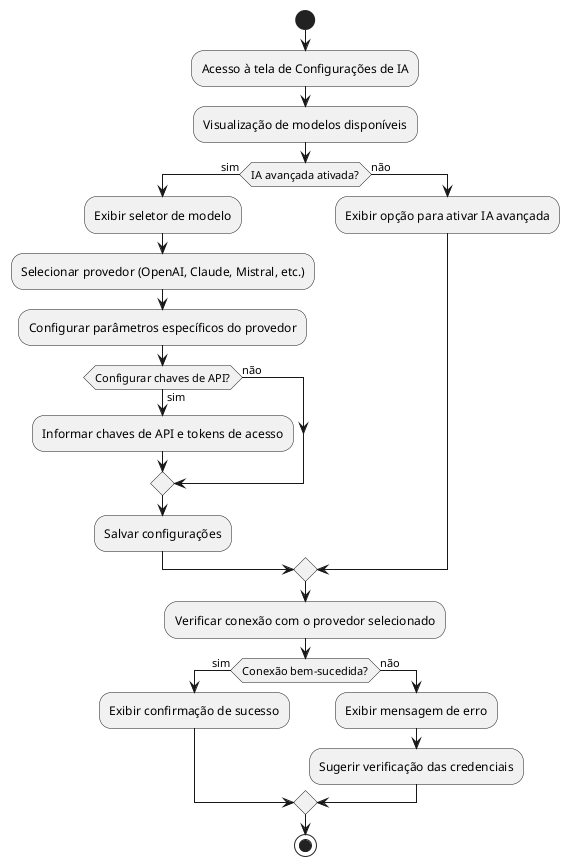
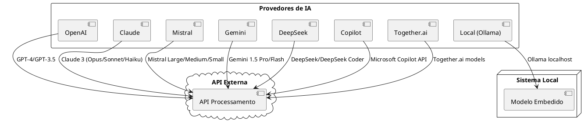

# Seleção de Modelos de IA

## Descrição

Este módulo permite configurar qual provedor e modelo de IA será utilizado pelo sistema para processamento de texto e análise de documentos. O sistema suporta múltiplos provedores, cada um com suas características e capacidades específicas.

## Fluxo de Seleção de Modelo

## Modelos Suportados

## Interface de Configuração

A interface de configuração permite:

- Ativar/desativar o uso de IA avançada
- Selecionar o provedor de serviços de IA
- Configurar chaves de API e tokens de acesso
- Definir parâmetros específicos de cada modelo

## Tabelas e Campos do Banco de Dados

### Tabela: `configuracoes`

| Coluna | Tipo | Descrição | Exemplo |
|--------|------|-----------|---------|
| chave | TEXT | Identificador da configuração | 'modelo_ia' |
| valor | TEXT | Valor configurado | 'openai' |
| descricao | TEXT | Descrição da configuração | 'Provedor de IA utilizado' |
| created_at | TIMESTAMP | Data de criação | 2023-01-01 12:00:00 |
| updated_at | TIMESTAMP | Data da última atualização | 2023-01-01 12:00:00 |
| updated_by | UUID | ID do usuário que atualizou | uuid |

### Configurações armazenadas

| Chave | Descrição | Valores Possíveis |
|-------|-----------|-------------------|
| modelo_ia | Provedor de IA selecionado | 'openai', 'claude', 'mistral', 'gemini', 'deepseek', 'copilot', 'local' |
| ia_avancada_ativa | Status de ativação da IA avançada | 'true', 'false' |
| openai_api_key | Chave de API para OpenAI | string (valor encriptado) |
| claude_api_key | Chave de API para Claude | string (valor encriptado) |
| mistral_api_key | Chave de API para Mistral | string (valor encriptado) |
| gemini_api_key | Chave de API para Google Gemini | string (valor encriptado) |
| deepseek_api_key | Chave de API para DeepSeek | string (valor encriptado) |
| openai_modelo | Modelo específico da OpenAI | 'gpt-4', 'gpt-3.5-turbo' |
| claude_modelo | Modelo específico do Claude | 'claude-3-opus', 'claude-3-sonnet', 'claude-3-haiku' |
| mistral_modelo | Modelo específico do Mistral | 'mistral-large', 'mistral-medium', 'mistral-small' |
| gemini_modelo | Modelo específico do Gemini | 'gemini-1.5-pro', 'gemini-1.5-flash' |
| deepseek_modelo | Modelo específico do DeepSeek | 'deepseek', 'deepseek-coder' |
| local_modelo | Modelo local do Ollama | 'llama3', 'mistral', 'phi' |
