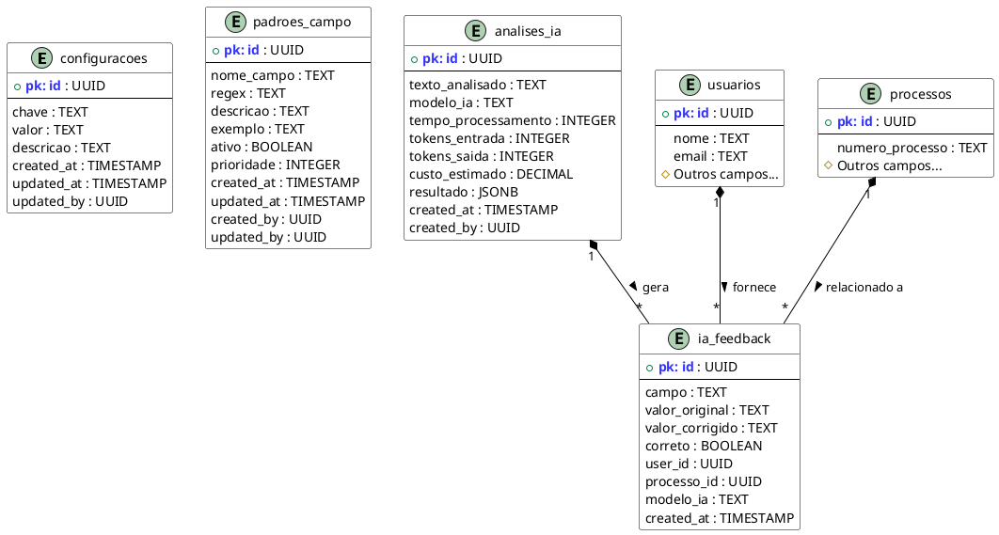

# Tabelas do Banco de Dados para Configurações de IA

Este documento descreve as tabelas do banco de dados utilizadas pelo módulo de Configurações de IA, incluindo suas estruturas, relacionamentos e propósitos.

## Diagrama de Entidade-Relacionamento



## Descrição das Tabelas

### 1. Tabela `configuracoes`

Armazena todas as configurações relacionadas aos modelos de IA e seus parâmetros.

| Coluna | Tipo | Descrição | Exemplo | Observações |
|--------|------|-----------|---------|------------|
| id | UUID | Identificador único | uuid | Chave primária, gerada automaticamente |
| chave | TEXT | Identificador da configuração | 'modelo_ia' | Deve ser único |
| valor | TEXT | Valor da configuração | 'openai' | Armazenado como texto mesmo para valores numéricos |
| descricao | TEXT | Descrição da configuração | 'Modelo de IA utilizado' | Para fins de documentação |
| created_at | TIMESTAMP | Data de criação | 2023-01-01 12:00:00 | Preenchido automaticamente |
| updated_at | TIMESTAMP | Data da última atualização | 2023-01-01 13:30:00 | Atualizado automaticamente |
| updated_by | UUID | ID do usuário que atualizou | uuid | Referência à tabela `usuarios` |

#### Índices da Tabela Configurações

- `idx_configuracoes_chave` - Índice na coluna `chave` para busca rápida

#### Gatilhos

- `trg_configuracoes_updated_at` - Atualiza o campo `updated_at` automaticamente

### 2. Tabela `padroes_campo`

Armazena os padrões de expressão regular utilizados para extrair informações de documentos.

| Coluna | Tipo | Descrição | Exemplo | Observações |
|--------|------|-----------|---------|------------|
| id | UUID | Identificador único | uuid | Chave primária, gerada automaticamente |
| nome_campo | TEXT | Nome do campo associado ao padrão | 'cnpj' | Nome legível do campo |
| regex | TEXT | Expressão regular do padrão | '\d{2}\.\d{3}\.\d{3}/\d{4}-\d{2}' | Padrão de reconhecimento |
| descricao | TEXT | Descrição do padrão | 'Formato de CNPJ' | Para documentação |
| exemplo | TEXT | Exemplo de valor que atende ao padrão | '12.345.678/0001-90' | Auxilia a validação |
| ativo | BOOLEAN | Indica se o padrão está ativo | true | Permite desativar sem remover |
| prioridade | INTEGER | Ordem de prioridade na execução | 10 | Define a ordem de aplicação |
| created_at | TIMESTAMP | Data de criação | 2023-01-01 12:00:00 | Preenchido automaticamente |
| updated_at | TIMESTAMP | Data da última atualização | 2023-01-01 13:30:00 | Atualizado automaticamente |
| created_by | UUID | ID do usuário que criou | uuid | Referência à tabela `usuarios` |
| updated_by | UUID | ID do usuário que atualizou | uuid | Referência à tabela `usuarios` |

#### Índices da Tabela Padrões Campo

- `idx_padroes_campo_nome` - Índice na coluna `nome_campo` para busca rápida
- `idx_padroes_campo_ativo` - Índice na coluna `ativo` para filtrar apenas padrões ativos

### 3. Tabela `ia_feedback`

Registra feedback dos usuários sobre a precisão das extrações feitas pela IA.

| Coluna | Tipo | Descrição | Exemplo | Observações |
|--------|------|-----------|---------|------------|
| id | UUID | Identificador único do feedback | uuid | Chave primária, gerada automaticamente |
| campo | TEXT | Nome do campo avaliado | 'objeto_licitacao' | Campo que recebeu feedback |
| valor_original | TEXT | Valor extraído pela IA | 'Aquisição de software...' | Valor antes da correção |
| valor_corrigido | TEXT | Valor corrigido pelo usuário | 'Aquisição de licenças de software...' | Valor após correção |
| correto | BOOLEAN | Se o valor original estava correto | false | Indicador de precisão |
| user_id | UUID | ID do usuário que forneceu feedback | uuid | Referência à tabela `usuarios` |
| processo_id | UUID | ID do processo relacionado | uuid | Referência à tabela `processos` |
| modelo_ia | TEXT | Modelo de IA usado | 'openai' | Para análise de performance |
| created_at | TIMESTAMP | Data do feedback | 2023-01-01 12:00:00 | Timestamp do feedback |

#### Índices da Tabela IA Feedback

- `idx_feedback_campo` - Índice na coluna `campo` para análise por tipo de campo
- `idx_feedback_modelo` - Índice na coluna `modelo_ia` para análise por modelo
- `idx_feedback_correto` - Índice na coluna `correto` para análise de precisão

### 4. Tabela `analises_ia`

Registra dados sobre cada análise realizada pela IA, incluindo métricas de desempenho e custos.

| Coluna | Tipo | Descrição | Exemplo | Observações |
|--------|------|-----------|---------|------------|
| id | UUID | Identificador único da análise | uuid | Chave primária, gerada automaticamente |
| texto_analisado | TEXT | Texto que foi submetido à análise | 'Edital de licitação...' | Conteúdo analisado |
| modelo_ia | TEXT | Modelo utilizado | 'gpt-4' | Identificador do modelo |
| tempo_processamento | INTEGER | Tempo de processamento em ms | 1520 | Métrica de desempenho |
| tokens_entrada | INTEGER | Quantidade de tokens de entrada | 245 | Para cálculo de custo |
| tokens_saida | INTEGER | Quantidade de tokens de saída | 128 | Para cálculo de custo |
| custo_estimado | DECIMAL | Custo estimado da operação | 0.0238 | Em dólares americanos |
| resultado | JSONB | Resultado da análise em formato JSON | {objeto: "Aquisição..."} | Estrutura dinâmica |
| created_at | TIMESTAMP | Data da análise | 2023-01-01 12:00:00 | Timestamp da análise |
| created_by | UUID | ID do usuário que solicitou a análise | uuid | Referência à tabela `usuarios` |

#### Índices da Tabela Análises IA

- `idx_analises_modelo` - Índice na coluna `modelo_ia` para análise por modelo
- `idx_analises_data` - Índice na coluna `created_at` para análise temporal
- `idx_analises_tempo` - Índice na coluna `tempo_processamento` para análise de performance

## Estrutura SQL das Tabelas

### Tabela `configuracoes`

```sql
CREATE TABLE configuracoes (
  id UUID DEFAULT gen_random_uuid() PRIMARY KEY,
  chave TEXT NOT NULL UNIQUE,
  valor TEXT,
  descricao TEXT,
  created_at TIMESTAMP WITH TIME ZONE DEFAULT CURRENT_TIMESTAMP,
  updated_at TIMESTAMP WITH TIME ZONE DEFAULT CURRENT_TIMESTAMP,
  updated_by UUID REFERENCES usuarios(id)
);

CREATE INDEX idx_configuracoes_chave ON configuracoes(chave);

CREATE TRIGGER set_updated_at
BEFORE UPDATE ON configuracoes
FOR EACH ROW
EXECUTE FUNCTION trigger_set_updated_at();
```

### Tabela `padroes_campo`

```sql
CREATE TABLE padroes_campo (
  id UUID DEFAULT gen_random_uuid() PRIMARY KEY,
  nome_campo TEXT NOT NULL,
  regex TEXT NOT NULL,
  descricao TEXT,
  exemplo TEXT,
  ativo BOOLEAN DEFAULT true,
  prioridade INTEGER DEFAULT 100,
  created_at TIMESTAMP WITH TIME ZONE DEFAULT CURRENT_TIMESTAMP,
  updated_at TIMESTAMP WITH TIME ZONE DEFAULT CURRENT_TIMESTAMP,
  created_by UUID REFERENCES usuarios(id),
  updated_by UUID REFERENCES usuarios(id)
);

CREATE INDEX idx_padroes_campo_nome ON padroes_campo(nome_campo);
CREATE INDEX idx_padroes_campo_ativo ON padroes_campo(ativo);

CREATE TRIGGER set_updated_at
BEFORE UPDATE ON padroes_campo
FOR EACH ROW
EXECUTE FUNCTION trigger_set_updated_at();
```

### Tabela `ia_feedback`

```sql
CREATE TABLE ia_feedback (
  id UUID DEFAULT gen_random_uuid() PRIMARY KEY,
  campo TEXT NOT NULL,
  valor_original TEXT,
  valor_corrigido TEXT,
  correto BOOLEAN NOT NULL,
  user_id UUID REFERENCES usuarios(id),
  processo_id UUID REFERENCES processos(id),
  modelo_ia TEXT,
  created_at TIMESTAMP WITH TIME ZONE DEFAULT CURRENT_TIMESTAMP
);

CREATE INDEX idx_feedback_campo ON ia_feedback(campo);
CREATE INDEX idx_feedback_modelo ON ia_feedback(modelo_ia);
CREATE INDEX idx_feedback_correto ON ia_feedback(correto);
```

### Tabela `analises_ia`

```sql
CREATE TABLE analises_ia (
  id UUID DEFAULT gen_random_uuid() PRIMARY KEY,
  texto_analisado TEXT,
  modelo_ia TEXT NOT NULL,
  tempo_processamento INTEGER,
  tokens_entrada INTEGER,
  tokens_saida INTEGER,
  custo_estimado DECIMAL(10,6),
  resultado JSONB,
  created_at TIMESTAMP WITH TIME ZONE DEFAULT CURRENT_TIMESTAMP,
  created_by UUID REFERENCES usuarios(id)
);

CREATE INDEX idx_analises_modelo ON analises_ia(modelo_ia);
CREATE INDEX idx_analises_data ON analises_ia(created_at);
CREATE INDEX idx_analises_tempo ON analises_ia(tempo_processamento);
```
