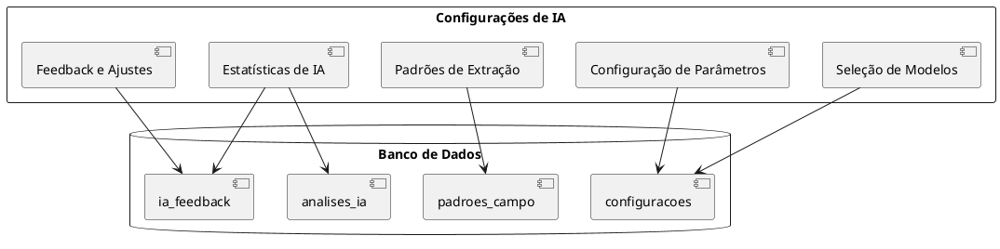

# Visão Geral das Configurações de IA

## Introdução

O módulo de Configurações de IA permite o gerenciamento centralizado dos recursos de inteligência artificial do sistema, possibilitando a escolha de diferentes modelos de IA, ajuste de parâmetros e monitoramento de desempenho.

## Estrutura do Módulo

## Funcionalidades Principais

### 1. Seleção de Modelos

Permite escolher entre diferentes provedores de serviços de IA:

- OpenAI (GPT-4/GPT-3.5)
- Modelo Local (Ollama)
- Mistral AI
- Anthropic Claude
- DeepSeek
- Google Gemini
- Microsoft Copilot
- Together.ai

### 2. Configuração de Parâmetros

Ajuste de parâmetros específicos para cada modelo:

- Chaves de API
- Temperatura (criatividade)
- Tokens máximos
- Modelos específicos de cada provedor

### 3. Padrões de Extração

Gerenciamento de padrões utilizados para extração de dados:

- Expressões regulares
- Exemplos de padrões
- Descrições de campos
- Ativação/desativação de padrões

### 4. Estatísticas de IA

Visualização de métricas de desempenho:

- Taxa de acerto por campo
- Evolução temporal de precisão
- Histórico de feedback

### 5. Feedback e Ajustes

Registro e análise de feedback para melhoria contínua:

- Correções manuais registradas
- Análise de erros recorrentes
- Sugestões de melhorias
