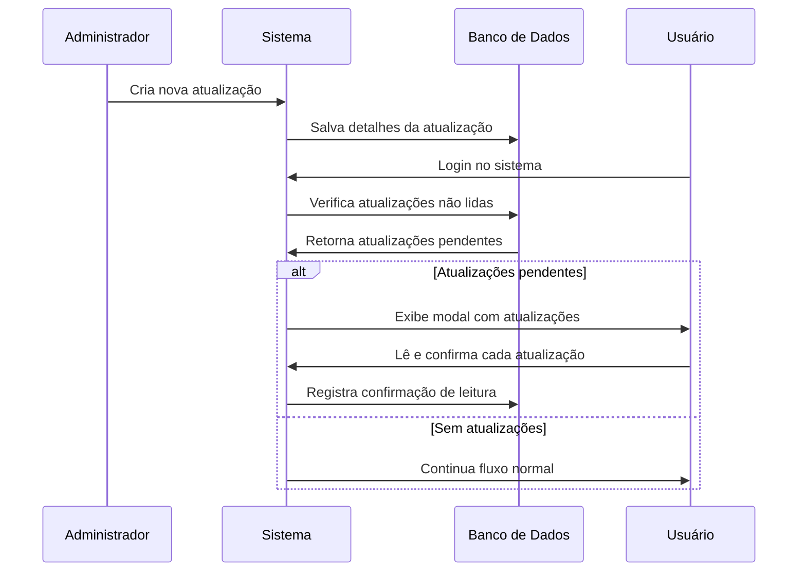
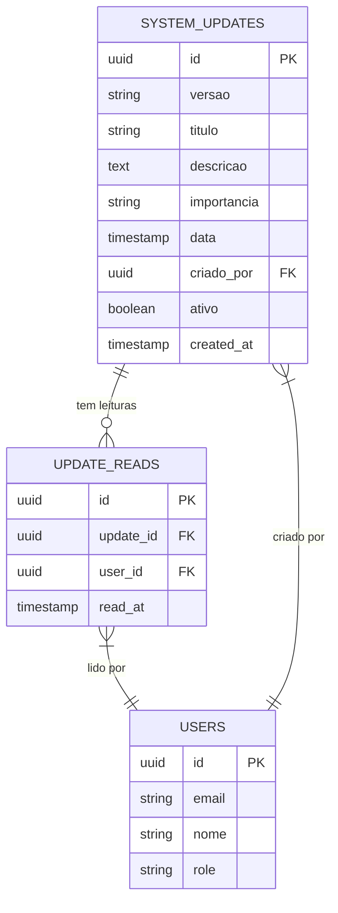
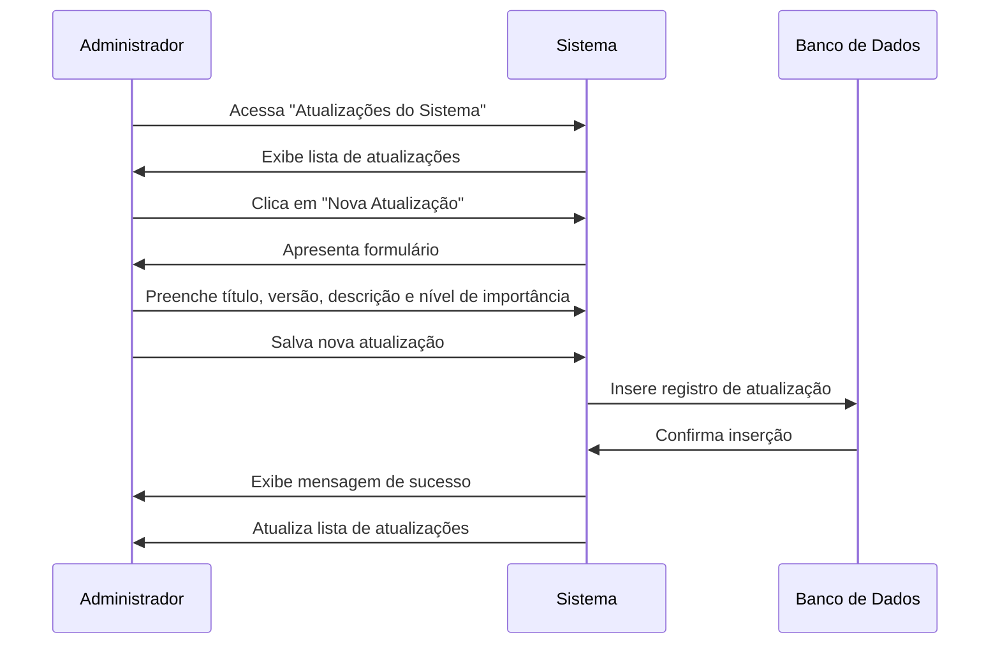
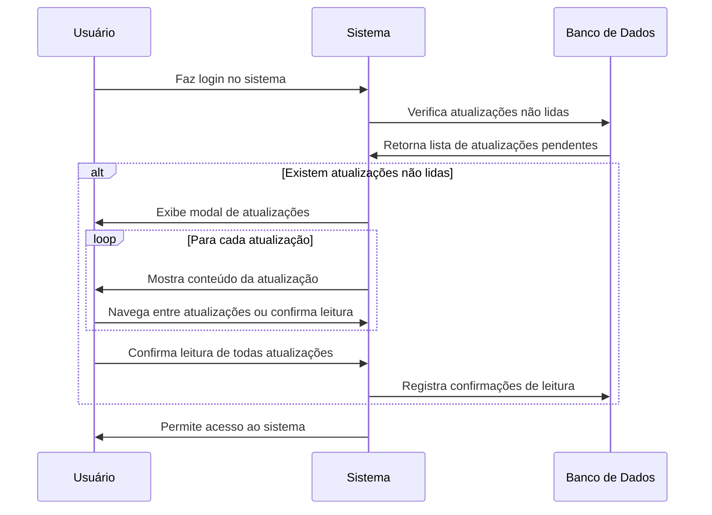

# Atualizações do Sistema

## Visão Geral

O módulo de Atualizações do Sistema permite criar, gerenciar e exibir informações sobre novas funcionalidades, correções e melhorias implementadas no sistema Editais Comerciais. Ele garante que todos os usuários sejam notificados sobre mudanças importantes e possam confirmar a leitura dessas atualizações.

## Fluxo de Comunicação

## Modelo de Dados

## Gerenciamento de Atualizações

### Criar Nova Atualização

### Visualização por Usuários

## Tabelas do Banco de Dados

### Tabela: `system_updates`

| Coluna | Tipo | Descrição |
|--------|------|-----------|
| id | UUID | Identificador único da atualização |
| versao | TEXT | Número/código da versão |
| titulo | TEXT | Título da atualização |
| descricao | TEXT | Descrição detalhada (suporta formatação) |
| importancia | TEXT | Nível de importância (baixa, média, alta, crítica) |
| data | TIMESTAMP | Data da atualização |
| criado_por | UUID | ID do usuário que criou a atualização |
| ativo | BOOLEAN | Indica se a atualização está ativa |
| created_at | TIMESTAMP | Data de criação do registro |

### Tabela: `update_reads`

| Coluna | Tipo | Descrição |
|--------|------|-----------|
| id | UUID | Identificador único da leitura |
| update_id | UUID | ID da atualização lida |
| user_id | UUID | ID do usuário que leu |
| read_at | TIMESTAMP | Data e hora da leitura |

## Interface de Usuário

### Modal de Atualização para Usuários

O modal de atualização exibido aos usuários inclui:

- Título da atualização
- Versão 
- Data de lançamento
- Descrição formatada com suporte a:
  - Negrito
  - Itálico
  - Links
- Indicador visual do nível de importância
- Botões de navegação entre múltiplas atualizações
- Botão de confirmação de leitura

### Painel de Gerenciamento de Atualizações

A interface de gerenciamento para administradores inclui:

- Lista de todas as atualizações com filtros e busca
- Formulário para criação de novas atualizações com editor de texto rico
- Estatísticas de leitura por atualização
- Opção para desativar/reativar atualizações
- Visualização de quais usuários leram cada atualização

## Níveis de Importância

Os níveis de importância determinam a aparência visual do modal de notificação:

| Nível | Cor | Descrição |
|-------|-----|-----------|
| Baixa | Azul | Pequenas melhorias, não críticas para o uso do sistema |
| Média | Verde | Novas funcionalidades ou melhorias significativas |
| Alta | Amarelo | Mudanças importantes no fluxo de trabalho ou interface |
| Crítica | Vermelho | Correções de segurança ou alterações fundamentais |

## Formatação de Descrição

A descrição das atualizações suporta formatação básica usando Markdown:

- `**texto**` para negrito
- `*texto*` para itálico
- `[texto](url)` para links

## Relatórios e Estatísticas

O sistema mantém estatísticas sobre:

- Percentual de usuários que leram cada atualização
- Tempo médio entre publicação e leitura
- Usuários que ainda não leram atualizações importantes
