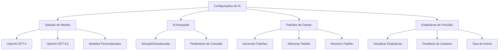
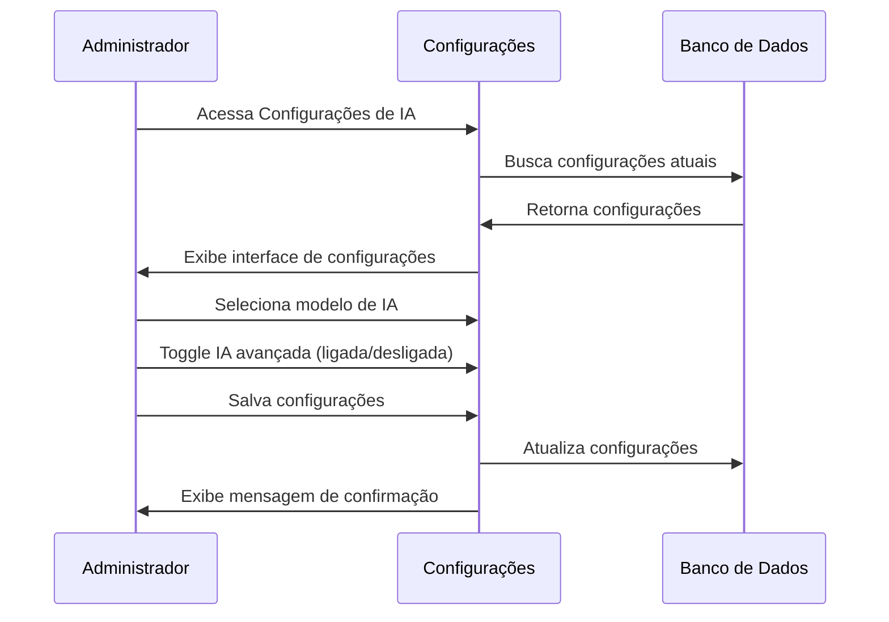
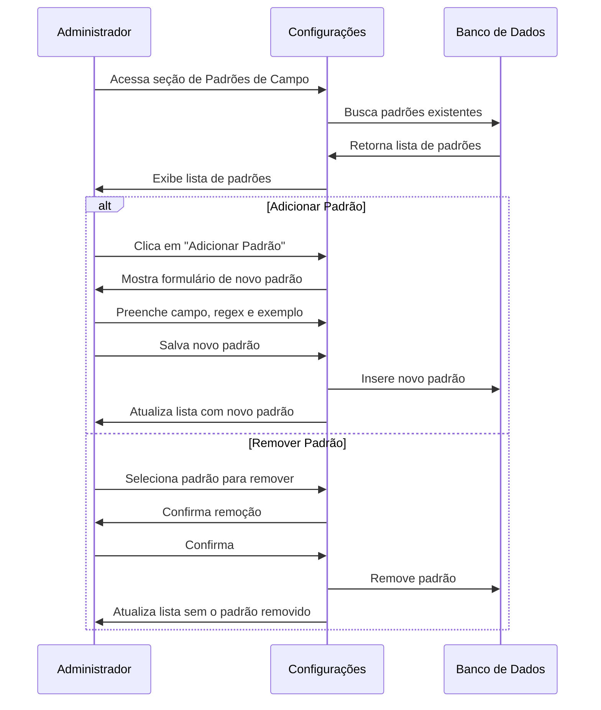
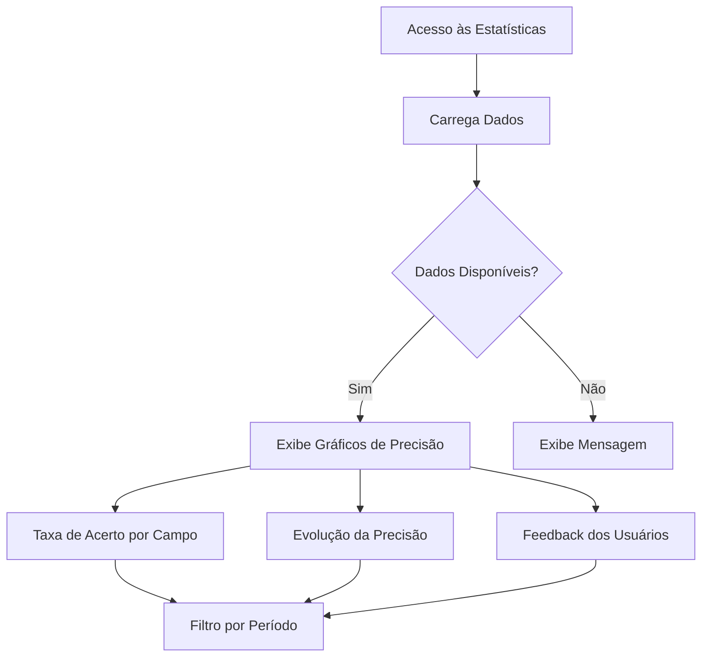

# Configurações de IA

## Visão Geral

O módulo de Configurações de IA permite gerenciar os parâmetros relacionados à inteligência artificial do sistema, incluindo modelos utilizados, padrões de campo e estatísticas de precisão.

## Componentes Principais

## Fluxos de Configuração

### Seleção de Modelo de IA

### Gerenciamento de Padrões de Campo

### Visualização de Estatísticas de Precisão

## Tabelas do Banco de Dados

### Tabela: `configuracoes`

| Coluna | Tipo | Descrição | Exemplo |
|--------|------|-----------|---------|
| chave | TEXT | Identificador da configuração | 'ia_avancada_ativa' |
| valor | TEXT | Valor da configuração | 'true' ou 'false' |
| descricao | TEXT | Descrição da configuração | 'Ativa/desativa recursos avançados de IA' |
| created_at | TIMESTAMP | Data de criação | 2023-01-01 12:00:00 |
| updated_at | TIMESTAMP | Data da última atualização | 2023-01-01 12:00:00 |
| updated_by | UUID | ID do usuário que atualizou | uuid |

### Tabela: `padroes_campo`

| Coluna | Tipo | Descrição | Exemplo |
|--------|------|-----------|---------|
| id | UUID | Identificador único do padrão | uuid |
| nome_campo | TEXT | Nome do campo associado ao padrão | 'cnpj' |
| regex | TEXT | Expressão regular do padrão | '\d{2}\.\d{3}\.\d{3}/\d{4}-\d{2}' |
| descricao | TEXT | Descrição do padrão | 'Formato de CNPJ' |
| exemplo | TEXT | Exemplo de valor que atende ao padrão | '12.345.678/0001-90' |
| ativo | BOOLEAN | Indica se o padrão está ativo | true |
| created_at | TIMESTAMP | Data de criação | 2023-01-01 12:00:00 |
| updated_at | TIMESTAMP | Data da última atualização | 2023-01-01 12:00:00 |

### Tabela: `ia_feedback`

| Coluna | Tipo | Descrição | Exemplo |
|--------|------|-----------|---------|
| id | UUID | Identificador único do feedback | uuid |
| campo | TEXT | Nome do campo avaliado | 'objeto_licitacao' |
| valor_original | TEXT | Valor extraído pela IA | 'Aquisição de software...' |
| valor_corrigido | TEXT | Valor corrigido pelo usuário | 'Aquisição de licenças de software...' |
| correto | BOOLEAN | Se o valor original estava correto | false |
| user_id | UUID | ID do usuário que forneceu feedback | uuid |
| processo_id | UUID | ID do processo relacionado | uuid |
| created_at | TIMESTAMP | Data do feedback | 2023-01-01 12:00:00 |

## Configurações de IA Disponíveis

| Configuração | Chave no Banco | Valores Possíveis | Descrição |
|--------------|----------------|-------------------|-----------|
| IA Avançada | ia_avancada_ativa | 'true', 'false' | Ativa/desativa recursos avançados de IA |
| Modelo de IA | modelo_ia | 'gpt-4', 'gpt-3.5-turbo', 'custom' | Define qual modelo de IA será utilizado |
| Temperatura | temperatura_ia | '0' a '1' (string) | Controla a criatividade das respostas (0 = mais determinístico, 1 = mais criativo) |
| Tokens Máximos | max_tokens | '500' a '4000' (string) | Máximo de tokens por resposta |
| Timeout de Consulta | timeout_consulta | '30' a '120' (string) | Tempo máximo de espera por resposta (segundos) |

## Impacto no Sistema

A configuração da IA afeta diretamente:

1. **Extração de Dados** - Precisão na extração de informações de editais
2. **Sugestões Automáticas** - Qualidade das sugestões apresentadas aos usuários
3. **Análises Preditivas** - Precisão das análises e previsões
4. **Consumo de API** - Custos associados ao uso de modelos diferentes
