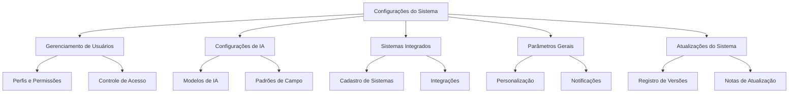
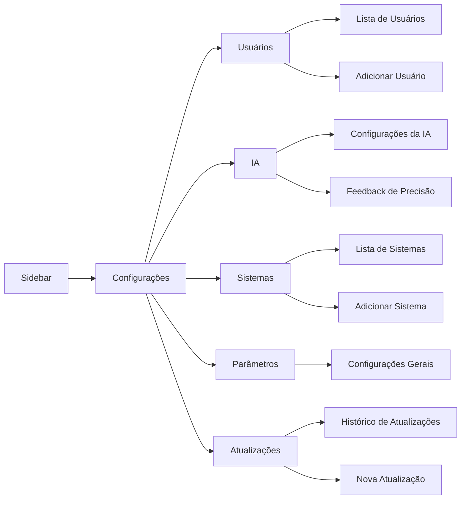
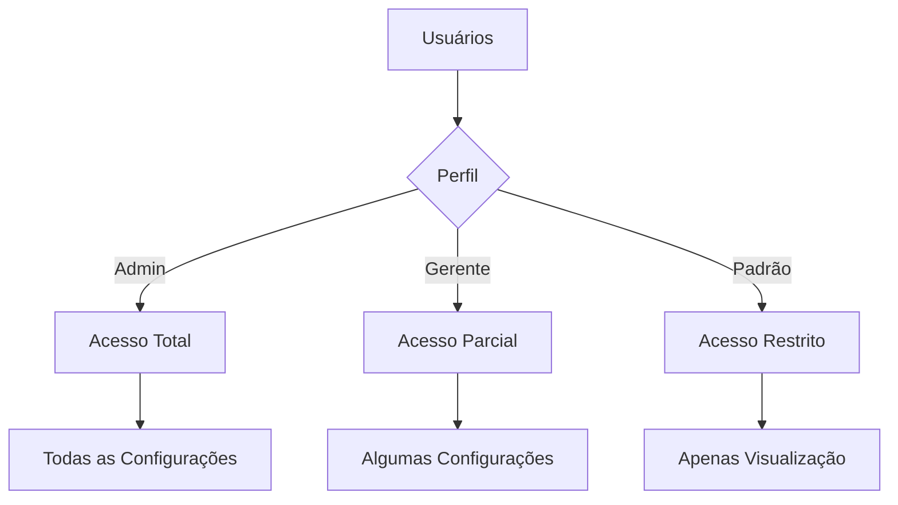

# Estrutura do Módulo de Configurações do Sistema

## Visão Geral

O módulo de Configurações do Sistema oferece uma interface centralizada para gerenciar diversos aspectos do sistema Editais Comerciais, permitindo personalização, controle de acesso e otimização da experiência do usuário.

## Componentes Principais

## Estrutura de Navegação

O acesso ao módulo é feito através da barra lateral (sidebar), que exibe as opções de configuração de acordo com as permissões do usuário logado. O layout segue o padrão de outras telas do sistema, mantendo consistência visual.

## Permissões e Acesso

O acesso às funcionalidades de configuração é controlado por perfis de usuário. Apenas administradores e usuários com permissões específicas podem visualizar e modificar estas configurações.

## Tabelas do Banco de Dados Relacionadas

| Tabela | Descrição | Principais Colunas |
|--------|-----------|-------------------|
| `configuracoes` | Armazena parâmetros gerais do sistema | `chave`, `valor`, `descricao` |
| `users` | Usuários do sistema | `id`, `email`, `nome`, `role`, `avatar_url`, `status` |
| `system_updates` | Registro de atualizações do sistema | `id`, `versao`, `titulo`, `descricao`, `data`, `importancia` |
| `update_reads` | Controle de leituras das atualizações | `update_id`, `user_id`, `read_at` |
| `sistemas` | Sistemas integrados | `id`, `nome`, `descricao`, `url`, `status`, `setor_id` |
| `setores` | Setores da empresa | `id`, `nome` |
