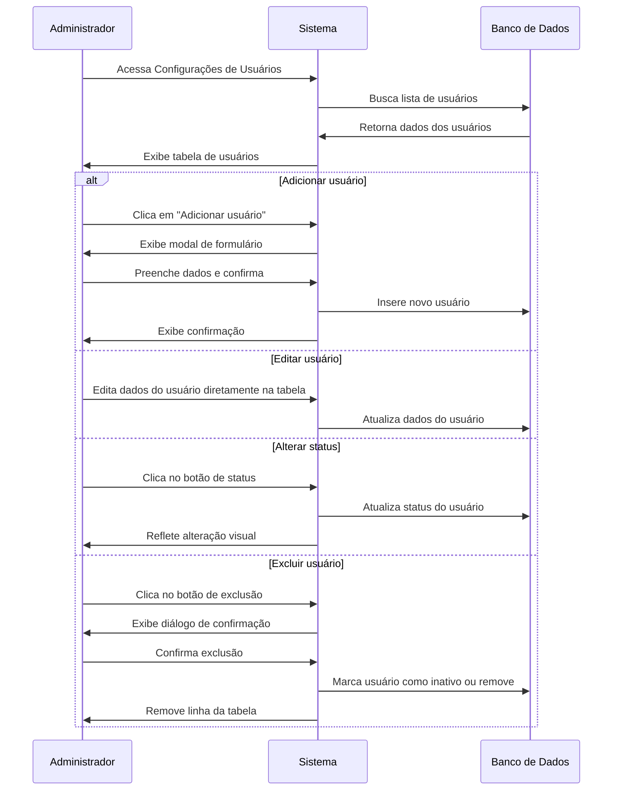
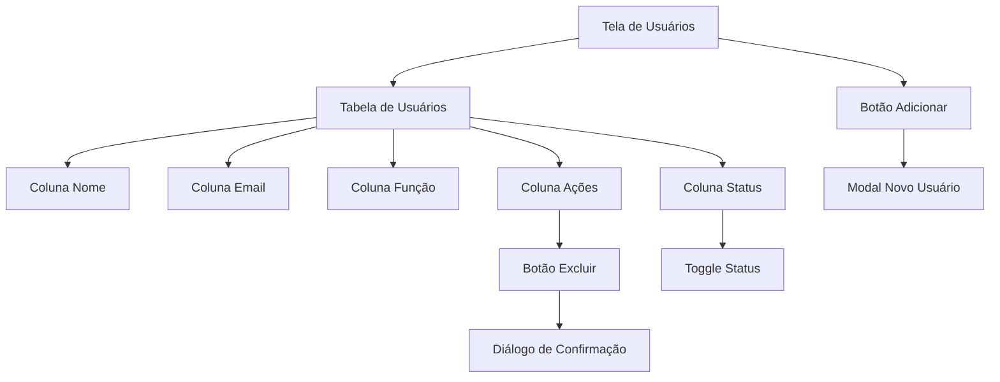
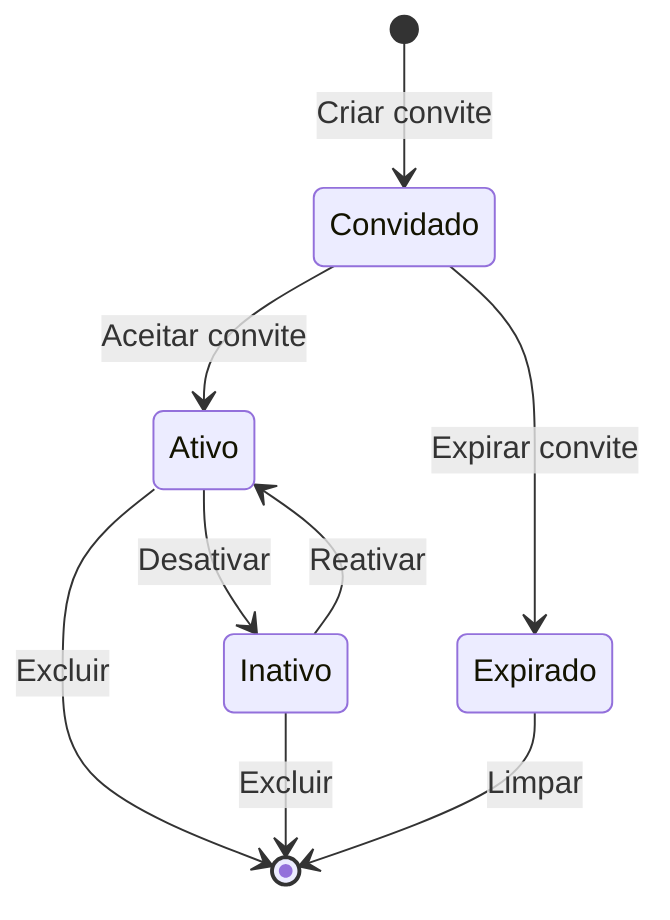

# Gerenciamento de Usuários

## Visão Geral

O módulo de Gerenciamento de Usuários permite criar, visualizar, editar e desativar contas de usuários no sistema Editais Comerciais, controlar perfis de acesso e gerenciar permissões.

## Fluxo Principal

## Interface de Usuário

A interface de gerenciamento de usuários apresenta uma tabela estilo planilha com edição inline e controles para gerenciar os usuários.

## Estados de Usuário

## Tabela do Banco de Dados

### Tabela: `users`

| Coluna | Tipo | Descrição |
|--------|------|-----------|
| id | UUID | Identificador único do usuário |
| email | TEXT | Email do usuário (login) |
| nome | TEXT | Nome completo do usuário |
| avatar_url | TEXT | URL para avatar/foto do usuário |
| role | TEXT | Função do usuário (admin, gerente, padrao) |
| status | TEXT | Status do usuário (ativo, inativo, convidado) |
| created_at | TIMESTAMP | Data de criação da conta |
| updated_at | TIMESTAMP | Data da última atualização |
| last_login | TIMESTAMP | Data do último login |
| convite_expira | TIMESTAMP | Data de expiração do convite (se aplicável) |
| telefone | TEXT | Telefone de contato |

## Permissões por Perfil

| Ação | Admin | Gerente | Usuário Padrão |
|------|-------|---------|----------------|
| Visualizar usuários | ✓ | ✓ | ✗ |
| Adicionar usuários | ✓ | ✗ | ✗ |
| Editar usuários | ✓ | ✗ | ✗ |
| Desativar usuários | ✓ | ✗ | ✗ |
| Excluir usuários | ✓ | ✗ | ✗ |
| Alterar próprio perfil | ✓ | ✓ | ✓ |

## Integrações

O módulo de gerenciamento de usuários se integra com:

1. **Autenticação Supabase** - Para a criação e gerenciamento de credenciais
2. **Sistema de Notificações** - Para envio de convites e notificações de alteração de status
3. **Log de Atividades** - Para registro de ações realizadas no gerenciamento de usuários
