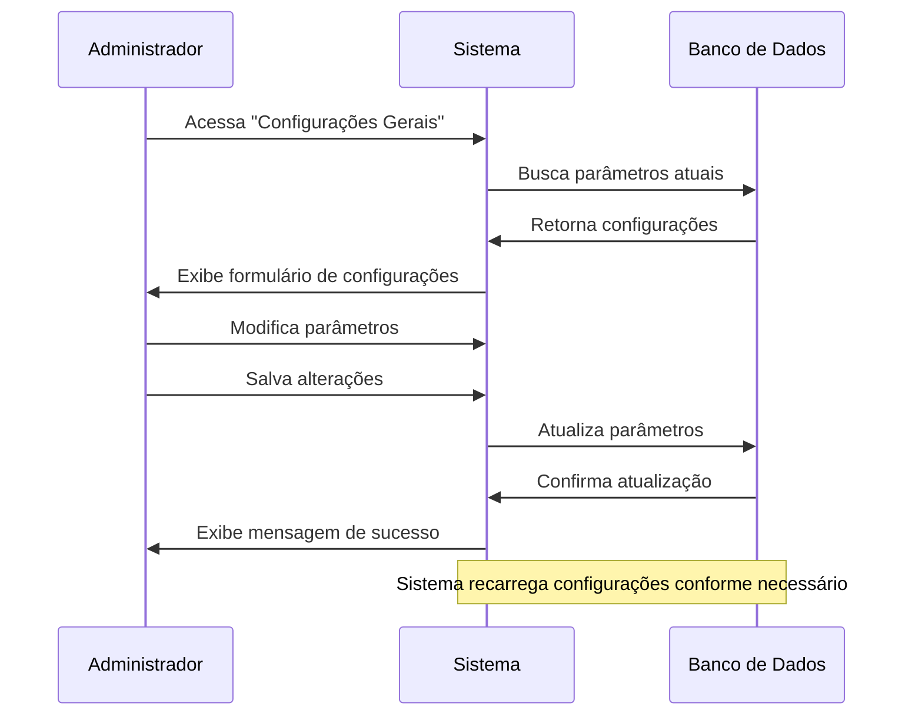
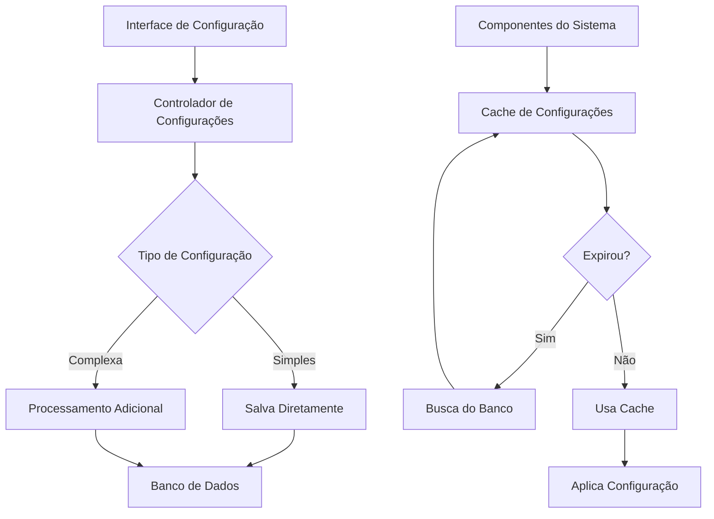

# Parâmetros Gerais do Sistema

## Visão Geral

O módulo de Parâmetros Gerais permite configurar aspectos globais do sistema Editais Comerciais, desde personalização visual até comportamentos funcionais específicos. Estas configurações são centralizadas e afetam o sistema como um todo.

## Categorias de Configurações

```mermaid
graph TD
    A[Parâmetros Gerais] --> B[Configurações Visuais]
    A --> C[Configurações de Notificações]
    A --> D[Configurações de Processos]
    A --> E[Configurações de Segurança]
    A --> F[Valores Padrão]
    A --> G[Configurações de Exportação]
    
    B --> B1[Tema do Sistema]
    B --> B2[Logo da Empresa]
    B --> B3[Cores Primárias]
    
    C --> C1[Email de Notificações]
    C --> C2[Frequência de Alertas]
    C --> C3[Canais de Notificação]
    
    D --> D1[Prazos de Alertas]
    D --> D2[Status Padrão]
    D --> D3[Estados de Processo]
    
    E --> E1[Política de Senhas]
    E --> E2[Tempo de Sessão]
    E --> E3[Tentativas de Login]
    
    F --> F1[Valores de Combos]
    F --> F2[Textos Padrão]
    F --> F3[Mensagens do Sistema]
    
    G --> G1[Formatos Disponíveis]
    G --> G2[Campos Incluídos]
    G --> G3[Modelos de Relatório]
```

## Fluxo de Gerenciamento

## Sistema de Configuração

## Tabela do Banco de Dados

### Tabela: `configuracoes`

| Coluna | Tipo | Descrição | Exemplo |
|--------|------|-----------|---------|
| chave | TEXT | Identificador da configuração | 'tema_sistema' |
| valor | TEXT | Valor da configuração | 'claro' ou 'escuro' |
| descricao | TEXT | Descrição da configuração | 'Tema de interface do sistema' |
| categoria | TEXT | Categoria da configuração | 'visual' |
| tipo_dado | TEXT | Tipo de dado esperado | 'texto', 'numero', 'booleano', 'json' |
| opcoes | TEXT (JSON) | Valores possíveis | '["claro", "escuro"]' |
| created_at | TIMESTAMP | Data de criação | 2023-01-01 12:00:00 |
| updated_at | TIMESTAMP | Data da última atualização | 2023-01-01 12:00:00 |
| updated_by | UUID | ID do usuário que atualizou | uuid |

## Principais Parâmetros Configuráveis

### Configurações Visuais

| Chave | Descrição | Valores Possíveis | Padrão |
|-------|-----------|-------------------|--------|
| tema_sistema | Tema de interface do sistema | 'claro', 'escuro', 'auto' | 'claro' |
| cor_primaria | Cor primária da interface | código hex | '#193155' |
| cor_secundaria | Cor secundária da interface | código hex | '#254677' |
| logo_url | URL para o logotipo da empresa | string URL | '' |
| favicon_url | URL para o favicon | string URL | '' |

### Configurações de Notificações

| Chave | Descrição | Valores Possíveis | Padrão |
|-------|-----------|-------------------|--------|
| email_notificacoes | Email de origem para notificações | string email | '' |
| alerta_prazo_dias | Dias de antecedência para alertar sobre prazos | número | '7' |
| canais_notificacao | Canais habilitados para notificações | array JSON | '["email", "sistema"]' |
| notificar_atualizacoes | Notificar sobre atualizações do sistema | 'true', 'false' | 'true' |
| frequencia_alertas | Frequência de envio de alertas | 'diario', 'semanal', 'imediato' | 'diario' |

### Configurações de Processos

| Chave | Descrição | Valores Possíveis | Padrão |
|-------|-----------|-------------------|--------|
| estados_processo | Estados possíveis para processos | array JSON | '[...]' |
| status_padrao_novos | Status padrão para novos processos | string | 'analise' |
| dias_alerta_amarelo | Dias para alerta amarelo | número | '5' |
| dias_alerta_vermelho | Dias para alerta vermelho | número | '2' |
| formato_codigo_gpi | Formato do código GPI | string | 'GPI-{ANO}-{SEQ}' |

### Configurações de Segurança

| Chave | Descrição | Valores Possíveis | Padrão |
|-------|-----------|-------------------|--------|
| politica_senha_min_caracteres | Mínimo de caracteres para senha | número | '8' |
| politica_senha_requer_especiais | Requer caracteres especiais na senha | 'true', 'false' | 'true' |
| tempo_sessao_minutos | Minutos até expirar sessão | número | '60' |
| max_tentativas_login | Número máximo de tentativas de login | número | '5' |
| bloquear_ip_apos_falhas | Bloquear IP após falhas consecutivas | 'true', 'false' | 'true' |

### Exportação de Dados

| Chave | Descrição | Valores Possíveis | Padrão |
|-------|-----------|-------------------|--------|
| formatos_exportacao | Formatos disponíveis para exportação | array JSON | '["excel", "pdf", "csv"]' |
| modelo_relatorio_padrao | ID do modelo de relatório padrão | UUID string | '' |
| incluir_logo_relatorios | Incluir logo nos relatórios exportados | 'true', 'false' | 'true' |
| nome_empresa_relatorio | Nome da empresa para relatórios | string | '' |

## Interface de Usuário

A interface de configuração de parâmetros gerais é organizada por categorias, com cada seção contendo os parâmetros relacionados:

1. **Formulário por Categorias**: Divide os parâmetros em seções lógicas
2. **Validação em Tempo Real**: Verifica valores conforme o usuário digita
3. **Visualização Prévia**: Para configurações visuais, quando aplicável
4. **Controles Contextuais**: Exibe apenas controles relevantes para o tipo de dado

## Comportamento do Sistema

O sistema possui um mecanismo para gerenciar configurações em tempo real:

1. **Carregamento Inicial**: Ao iniciar, o sistema carrega todas as configurações
2. **Cache**: Mantém configurações em cache para melhor desempenho
3. **Atualização Dinâmica**: Alguns parâmetros podem ser atualizados sem reiniciar o sistema
4. **Validação**: Impede valores inválidos conforme o tipo de dado esperado
5. **Valores Padrão**: Para configurações ausentes, aplica valores padrão predefinidos

## Impacto das Configurações

As configurações afetam vários aspectos do sistema:

1. **Aparência**: Temas, cores e elementos visuais
2. **Comportamento**: Fluxos de trabalho, alertas e notificações
3. **Segurança**: Políticas de acesso e proteção
4. **Integração**: Configurações para sistemas externos
5. **Usabilidade**: Valores padrão e comportamentos esperados
