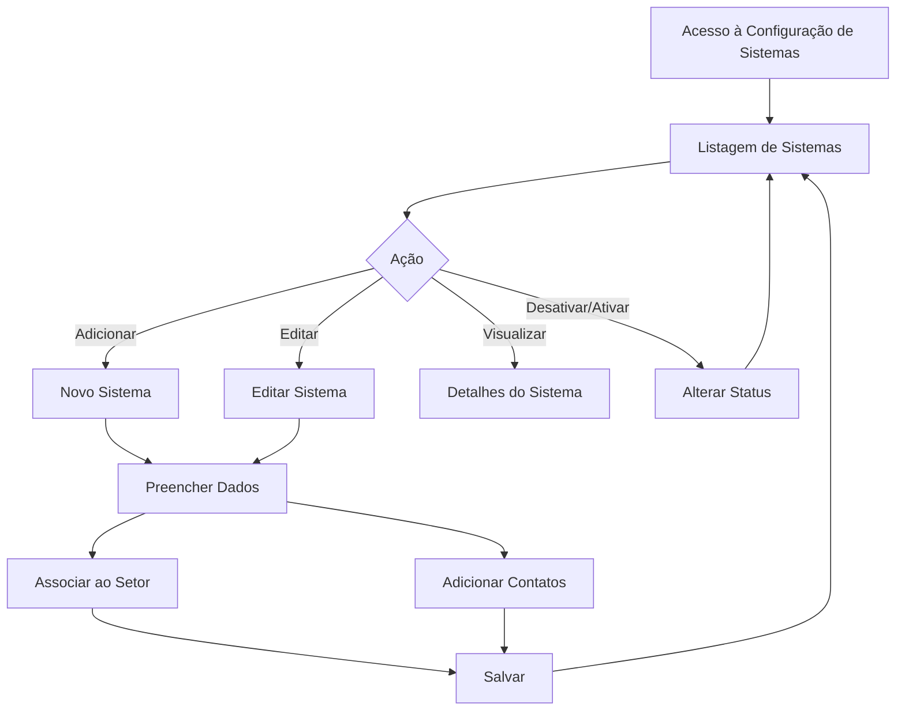
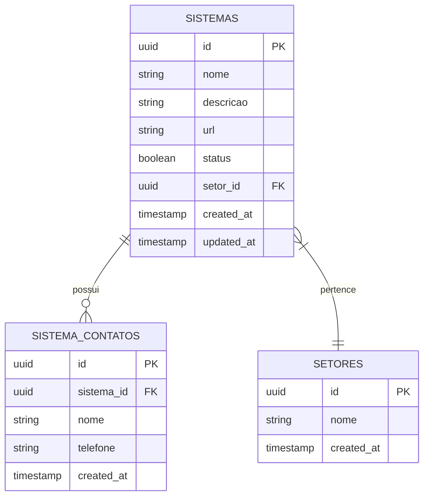
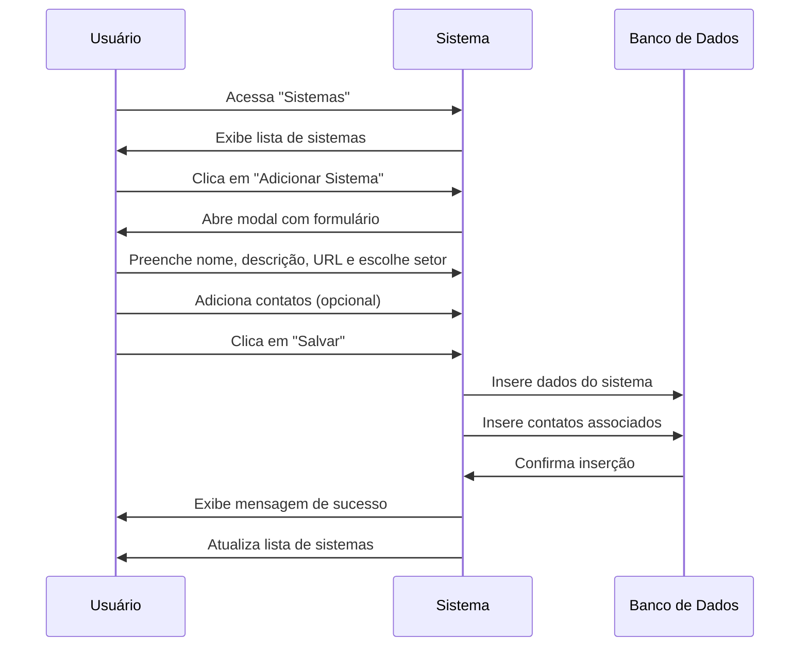
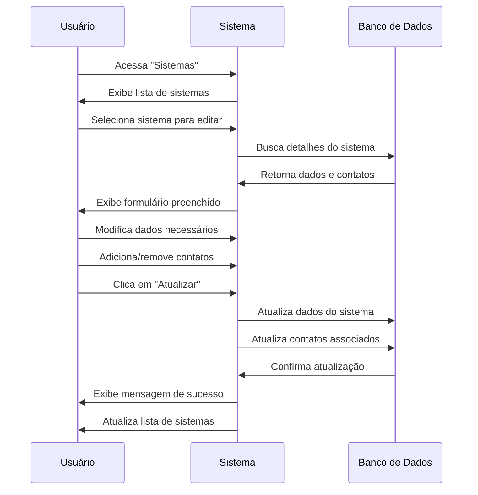

# Sistemas Integrados

## Visão Geral

O módulo de Sistemas Integrados permite gerenciar os sistemas que a empresa comercializa e que podem ser oferecidos nos processos licitatórios. Esta configuração é essencial para o módulo de Processos, onde os sistemas são associados às oportunidades de licitação.

## Fluxo de Gestão de Sistemas

## Modelo de Dados

## Fluxo de Trabalho

### Adicionar Novo Sistema

### Editar Sistema Existente

## Tabelas do Banco de Dados

### Tabela: `sistemas`

| Coluna | Tipo | Descrição |
|--------|------|-----------|
| id | UUID | Identificador único do sistema |
| nome | TEXT | Nome do sistema |
| descricao | TEXT | Descrição do sistema |
| url | TEXT | URL da página/documentação do sistema |
| status | BOOLEAN | Status do sistema (ativo/inativo) |
| setor_id | UUID | ID do setor ao qual o sistema pertence |
| created_at | TIMESTAMP | Data de criação do registro |
| updated_at | TIMESTAMP | Data da última atualização |

### Tabela: `setores`

| Coluna | Tipo | Descrição |
|--------|------|-----------|
| id | UUID | Identificador único do setor |
| nome | TEXT | Nome do setor |
| created_at | TIMESTAMP | Data de criação do registro |

### Tabela: `sistema_contatos`

| Coluna | Tipo | Descrição |
|--------|------|-----------|
| id | UUID | Identificador único do contato |
| sistema_id | UUID | ID do sistema ao qual o contato está associado |
| nome | TEXT | Nome do contato |
| telefone | TEXT | Telefone do contato |
| created_at | TIMESTAMP | Data de criação do registro |

## Interface de Usuário

O gerenciamento de sistemas possui duas visualizações principais:

1. **Lista de Sistemas**: Exibe todos os sistemas cadastrados com opções de filtro, busca e ações rápidas.
2. **Formulário de Sistema**: Para adição e edição de sistemas, incluindo gerenciamento de contatos.

### Lista de Sistemas

A lista apresenta os sistemas em formato de tabela ou cards, exibindo:
- Nome do sistema
- Setor
- Status (ativo/inativo)
- Número de contatos associados
- Ações disponíveis

### Formulário de Sistema

O formulário de adição/edição contém:
- Campos básicos (nome, descrição, URL)
- Seletor de setor
- Gerenciador de contatos (adição/remoção dinâmica)
- Opções para salvar ou cancelar

## Integrações com Outros Módulos

O módulo de Sistemas Integrados se relaciona com:

1. **Processos Licitatórios**: Os sistemas são associados a processos para identificar quais produtos estão sendo ofertados
2. **Implementações**: Registro de implantações realizadas após a vitória em licitações
3. **Relatórios**: Dados para análises estatísticas sobre quais sistemas são mais comercializados
