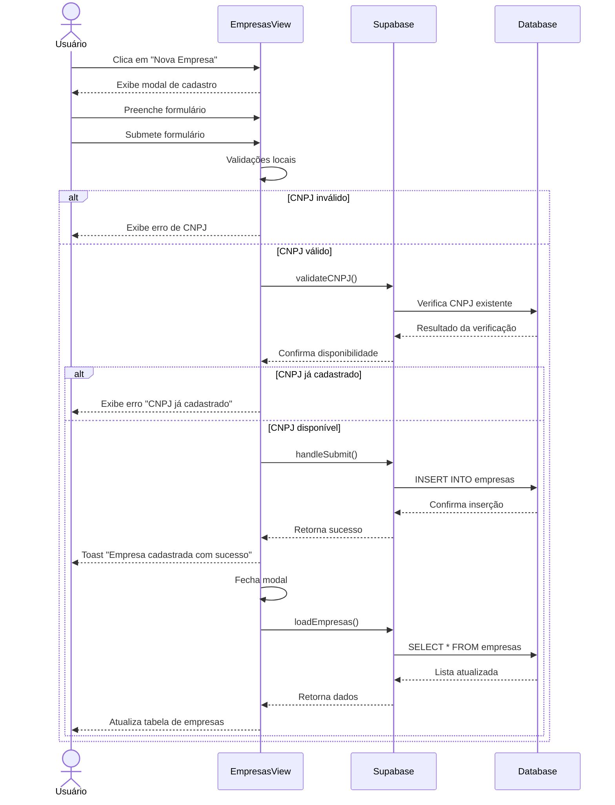

# Funcionalidade: Adicionar Empresa

## Descrição

Esta funcionalidade permite adicionar novas empresas ao sistema através de um formulário modal. O sistema realiza validações de dados, especialmente do CNPJ, para garantir a integridade das informações.

## Fluxo da Funcionalidade



## Interface de Usuário

O modal de cadastro de empresas apresenta:

- Campos para dados da empresa (nome, CNPJ, razão social, contato, telefone, email)
- Validação em tempo real do formato do CNPJ
- Mensagens de erro específicas para cada campo
- Botões para cancelar e salvar
- Feedback visual de validação para os campos obrigatórios

## Validações Realizadas

### Validações Locais

- Nome: Obrigatório
- CNPJ: Obrigatório e formato válido (XX.XXX.XXX/XXXX-XX)
- Razão Social: Obrigatório
- Email: Formato válido quando fornecido

### Validação do CNPJ no Servidor

```javascript
const validateCNPJ = async () => {
  if (!formData.value.cnpj) {
    cnpjError.value = 'CNPJ é obrigatório';
    return false;
  }

  // Remove caracteres especiais para validação
  const cnpj = formData.value.cnpj.replace(/[^\d]/g, '');
  
  if (cnpj.length !== 14) {
    cnpjError.value = 'CNPJ inválido';
    return false;
  }

  // Verifica duplicidade no banco
  const { data } = await supabase
    .from('empresas')
    .select('id')
    .eq('cnpj', cnpj)
    .single();

  if (data) {
    cnpjError.value = 'CNPJ já cadastrado';
    return false;
  }

  cnpjError.value = '';
  return true;
}
```

## Formatação de Entrada

O sistema aplica formatação automática durante a digitação do CNPJ e do telefone:

```javascript
const formatarCNPJ = (e) => {
  let value = e.target.value.replace(/\D/g, '');
  if (value.length > 14) value = value.substring(0, 14);
  
  // Formato: 00.000.000/0000-00
  if (value.length > 12) {
    formData.value.cnpj = 
      value.replace(/^(\d{2})(\d{3})(\d{3})(\d{4})(\d{2})$/, "$1.$2.$3/$4-$5");
  } else if (value.length > 8) {
    formData.value.cnpj = 
      value.replace(/^(\d{2})(\d{3})(\d{3})(\d+)$/, "$1.$2.$3/$4");
  } else if (value.length > 5) {
    formData.value.cnpj = 
      value.replace(/^(\d{2})(\d{3})(\d+)$/, "$1.$2.$3");
  } else if (value.length > 2) {
    formData.value.cnpj = 
      value.replace(/^(\d{2})(\d+)$/, "$1.$2");
  } else {
    formData.value.cnpj = value;
  }
}

const formatarTelefone = (e) => {
  let value = e.target.value.replace(/\D/g, '');
  
  if (value.length > 11) value = value.substring(0, 11);
  
  if (value.length > 10) {
    formData.value.telefone = value.replace(/^(\d{2})(\d{5})(\d{4})$/, "($1) $2-$3");
  } else if (value.length > 6) {
    formData.value.telefone = value.replace(/^(\d{2})(\d{4})(\d+)$/, "($1) $2-$3");
  } else if (value.length > 2) {
    formData.value.telefone = value.replace(/^(\d{2})(\d+)$/, "($1) $2");
  } else {
    formData.value.telefone = value;
  }
}
```

## Submissão do Formulário

```javascript
const handleSubmit = async () => {
  try {
    // Remove caracteres não numéricos do CNPJ
    const cnpjLimpo = formData.value.cnpj.replace(/[^\d]/g, '');
    
    if (!await validateCNPJ()) {
      return;
    }

    const empresaData = {
      nome: formData.value.nome,
      cnpj: cnpjLimpo,
      razao_social: formData.value.razao_social,
      contato: formData.value.contato,
      telefone: formData.value.telefone,
      email: formData.value.email,
      updated_at: new Date().toISOString()
    };

    // Inserir nova empresa
    const { error } = await supabase
      .from('empresas')
      .insert(empresaData);

    if (error) throw error;
    showToastMessage('Empresa cadastrada com sucesso!');

    await loadEmpresas();
    resetForm();
  } catch (error) {
    console.error('Erro ao salvar empresa:', error);
    
    if (error.code === '23505') {
      showToastMessage('CNPJ já cadastrado no sistema', 'error');
    } else {
      showToastMessage('Erro ao salvar empresa. Por favor, tente novamente.', 'error');
    }
  }
}
```

## Tabela do Banco de Dados

| Tabela | Coluna | Tipo | Descrição |
|--------|--------|------|-----------|
| empresas | id | uuid | Identificador único (gerado automaticamente) |
| empresas | nome | text | Nome da empresa |
| empresas | cnpj | text | CNPJ da empresa (único) |
| empresas | razao_social | text | Razão social da empresa |
| empresas | contato | text | Nome do contato principal |
| empresas | telefone | text | Telefone de contato |
| empresas | email | text | Email de contato |
| empresas | created_at | timestamp | Data de criação |
| empresas | updated_at | timestamp | Data de última atualização |
