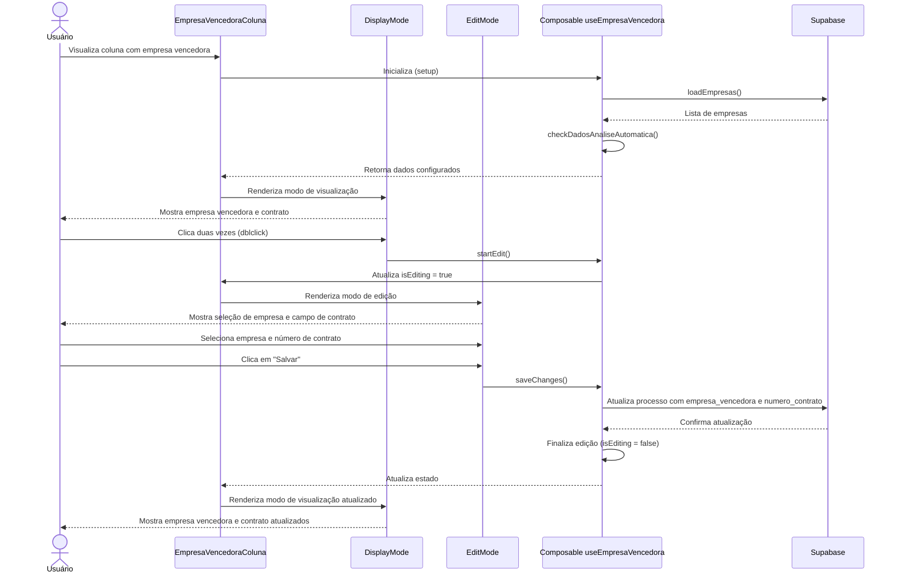

# Componente: EmpresaVencedora

## Descrição

O componente `EmpresaVencedora` permite visualizar e editar informações sobre a empresa vencedora de um processo licitatório. Ele é usado na tabela de processos para mostrar qual empresa venceu a licitação e o número do contrato associado.

## Estrutura do Componente

O componente é dividido em três partes principais:

1. **Componente Principal**: Coordena os modos de visualização e edição
2. **DisplayMode**: Exibe os dados da empresa vencedora
3. **EditMode**: Permite selecionar uma empresa e número de contrato

## Fluxo de Funcionamento



## Interface de Usuário

### Modo de Visualização

- Nome da empresa vencedora em destaque
- Número do contrato abaixo do nome
- Indicação visual quando não há empresa selecionada
- Ação de duplo clique para editar

### Modo de Edição

- Dropdown para selecionar empresa
- Campo para inserir número de contrato
- Botões para salvar e cancelar a edição

## Composable: useEmpresaVencedora

Este composable gerencia a lógica do componente:

```javascript
export function useEmpresaVencedora(props, emit) {
  const empresas = ref([]);
  const isEditing = ref(false);
  const selectedEmpresa = ref('');
  const numeroContrato = ref('');
  const dadosAnalise = ref(null);
  
  // Carrega lista de empresas cadastradas
  const loadEmpresas = async () => {
    try {
      const { data, error } = await supabase
        .from('empresas')
        .select('*')
        .order('nome');
      
      if (error) throw error;
      empresas.value = data || [];
    } catch (error) {
      console.error('Erro ao carregar empresas:', error);
    }
  };
  
  // Verifica dados de análise automática
  const checkDadosAnaliseAutomatica = () => {
    if (props.processo.analise_dados) {
      try {
        const analiseData = 
          typeof props.processo.analise_dados === 'string' 
            ? JSON.parse(props.processo.analise_dados)
            : props.processo.analise_dados;
        
        if (analiseData?.empresa_vencedora) {
          dadosAnalise.value = {
            empresa: analiseData.empresa_vencedora,
            contrato: analiseData.numero_contrato
          };
        }
      } catch (e) {
        console.error('Erro ao processar dados de análise', e);
      }
    }
  };
  
  // Inicializa dados com base no processo
  if (props.processo.empresa_vencedora) {
    selectedEmpresa.value = props.processo.empresa_vencedora;
  }
  
  if (props.processo.numero_contrato) {
    numeroContrato.value = props.processo.numero_contrato;
  }
  
  // Computa o nome da empresa a partir do ID
  const empresaNome = computed(() => {
    if (!selectedEmpresa.value) return null;
    
    const empresa = empresas.value.find(e => e.id === selectedEmpresa.value);
    return empresa?.nome || null;
  });
  
  // Inicia modo de edição
  const startEdit = () => {
    isEditing.value = true;
  };
  
  // Cancela edição
  const cancelEdit = () => {
    selectedEmpresa.value = props.processo.empresa_vencedora || '';
    numeroContrato.value = props.processo.numero_contrato || '';
    isEditing.value = false;
  };
  
  // Salva alterações
  const saveChanges = async () => {
    try {
      const { error } = await supabase
        .from('processos')
        .update({
          empresa_vencedora: selectedEmpresa.value || null,
          numero_contrato: numeroContrato.value || null,
          updated_at: new Date().toISOString()
        })
        .eq('id', props.processo.id);
      
      if (error) throw error;
      
      emit('update');
      isEditing.value = false;
    } catch (error) {
      console.error('Erro ao salvar alterações:', error);
    }
  };
  
  return {
    empresas,
    isEditing,
    selectedEmpresa,
    numeroContrato,
    dadosAnalise,
    empresaNome,
    loadEmpresas,
    checkDadosAnaliseAutomatica,
    startEdit,
    cancelEdit,
    saveChanges
  };
}
```

## Componentes Internos

### DisplayMode.vue

```html
<template>
  <div class="display-mode" @dblclick="$emit('dblclick')">
    <div v-if="empresaNome" class="info-container">
      <span class="empresa-nome">{{ empresaNome }}</span>
      <span v-if="numeroContrato" class="contrato-numero">
        Contrato: {{ numeroContrato }}
      </span>
      <span v-if="dadosAnalise && !empresaNome" class="dados-analise">
        Sugestão: {{ dadosAnalise.empresa }}
      </span>
    </div>
    <div v-else class="sem-empresa">
      Não definido
    </div>
  </div>
</template>
```

### EditMode.vue

```html
<template>
  <div class="editing-mode">
    <div class="edit-container">
      <select 
        :value="selectedEmpresa"
        @input="$emit('update:selected-empresa', $event.target.value)"
        class="empresa-select"
      >
        <option value="">Selecione a empresa vencedora...</option>
        <option v-for="empresa in empresas" :key="empresa.id" :value="empresa.id">
          {{ empresa.nome }}
        </option>
      </select>
      
      <input 
        :value="numeroContrato"
        @input="$emit('update:numero-contrato', $event.target.value)"
        class="contrato-input" 
        placeholder="Nº do Contrato" 
        type="text"
      />
      
      <div class="edit-actions">
        <button @click="$emit('save')" class="btn-save">Salvar</button>
        <button @click="$emit('cancel')" class="btn-cancel">Cancelar</button>
      </div>
    </div>
  </div>
</template>
```

## Propriedades e Eventos

### Propriedades (Props)

| Nome | Tipo | Descrição |
|------|------|-----------|
| processo | Object | Objeto com dados do processo |

### Eventos (Emits)

| Nome | Parâmetros | Descrição |
|------|------------|-----------|
| update | - | Emitido quando os dados são atualizados |

## Implementação na Tabela de Processos

O componente pode ser usado na tabela de processos da seguinte forma:

```html
<template>
  <table>
    <thead>
      <tr>
        <!-- Outras colunas -->
        <th>Empresa Vencedora</th>
        <!-- Outras colunas -->
      </tr>
    </thead>
    <tbody>
      <tr v-for="processo in processos" :key="processo.id">
        <!-- Outras colunas -->
        <td>
          <EmpresaVencedoraColuna 
            :processo="processo" 
            @update="atualizarLista"
          />
        </td>
        <!-- Outras colunas -->
      </tr>
    </tbody>
  </table>
</template>

<script>
import EmpresaVencedoraColuna from '@/components/EmpresaVencedora/index.vue';

export default {
  components: {
    EmpresaVencedoraColuna
  },
  // resto do código
}
</script>
```
