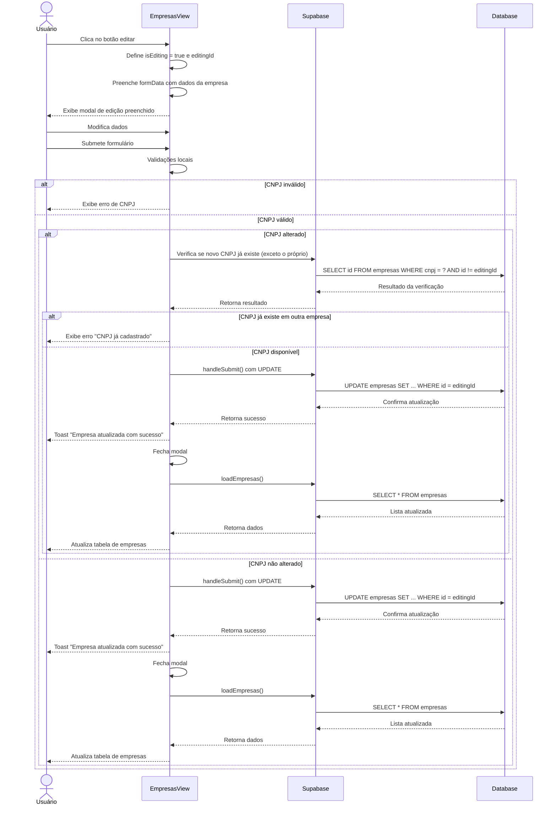

# Funcionalidade: Editar Empresa

## Descrição

Esta funcionalidade permite modificar os dados de empresas já cadastradas no sistema. O mesmo modal utilizado para adição é reaproveitado, mas pré-preenchido com os dados existentes.

## Fluxo da Funcionalidade



## Interface de Usuário

A interface para edição é a mesma do cadastro, com algumas diferenças:

- O título do modal muda para "Editar Empresa"
- Os campos são pré-preenchidos com os dados existentes
- A validação de CNPJ considera o próprio registro (para não bloquear o próprio CNPJ)
- Feedback visual específico para atualização bem-sucedida

## Preparação para Edição

```javascript
const editEmpresa = (empresa) => {
  formData.value = {
    nome: empresa.nome,
    cnpj: formatCNPJ(empresa.cnpj),
    razao_social: empresa.razao_social,
    contato: empresa.contato || '',
    telefone: empresa.telefone || '',
    email: empresa.email || ''
  };
  editingId.value = empresa.id;
  isEditing.value = true;
  showModal.value = true;
}
```

## Validação de CNPJ Durante Edição

```javascript
// Validação de CNPJ para edição (ignora o próprio registro)
if (!formData.value.cnpj) {
  cnpjError.value = 'CNPJ é obrigatório';
  return false;
}

if (cnpjLimpo.length !== 14) {
  cnpjError.value = 'CNPJ inválido';
  return false;
}

// Verifica se o CNPJ existe em outro registro
const { data } = await supabase
  .from('empresas')
  .select('id')
  .eq('cnpj', cnpjLimpo)
  .neq('id', editingId.value)
  .single();

if (data) {
  cnpjError.value = 'CNPJ já cadastrado';
  return false;
}

cnpjError.value = '';
```

## Submissão da Edição

```javascript
const handleSubmit = async () => {
  try {
    // Remove caracteres não numéricos do CNPJ
    const cnpjLimpo = formData.value.cnpj.replace(/[^\d]/g, '');
    
    // Se estiver editando, não precisa verificar o próprio CNPJ como duplicado
    if (isEditing.value) {
      // Validação de CNPJ para edição (ignora o próprio registro)
      // ... (código da validação)
    } else {
      if (!await validateCNPJ()) {
        return;
      }
    }

    const empresaData = {
      nome: formData.value.nome,
      cnpj: cnpjLimpo,
      razao_social: formData.value.razao_social,
      contato: formData.value.contato,
      telefone: formData.value.telefone,
      email: formData.value.email,
      updated_at: new Date().toISOString()
    };

    if (isEditing.value) {
      // Atualizar empresa existente
      const { error } = await supabase
        .from('empresas')
        .update(empresaData)
        .eq('id', editingId.value);

      if (error) throw error;
      showToastMessage('Empresa atualizada com sucesso!');
    } else {
      // Inserir nova empresa
      // ... (código existente)
    }

    await loadEmpresas();
    resetForm();
  } catch (error) {
    console.error('Erro ao salvar empresa:', error);
    
    if (error.code === '23505') {
      showToastMessage('CNPJ já cadastrado no sistema', 'error');
    } else {
      showToastMessage('Erro ao salvar empresa. Por favor, tente novamente.', 'error');
    }
  }
}
```

## Resetar Formulário

```javascript
const resetForm = () => {
  formData.value = {
    nome: '',
    cnpj: '',
    razao_social: '',
    contato: '',
    telefone: '',
    email: ''
  };
  editingId.value = null;
  isEditing.value = false;
  showModal.value = false;
  cnpjError.value = '';
}
```

## Campos Atualizados

| Campo | Validação | Formatação |
|-------|-----------|------------|
| nome | Obrigatório | - |
| cnpj | Obrigatório, formato válido, único (exceto próprio) | XX.XXX.XXX/XXXX-XX |
| razao_social | Obrigatório | - |
| contato | Opcional | - |
| telefone | Opcional | (XX) XXXXX-XXXX |
| email | Opcional, formato válido | - |
