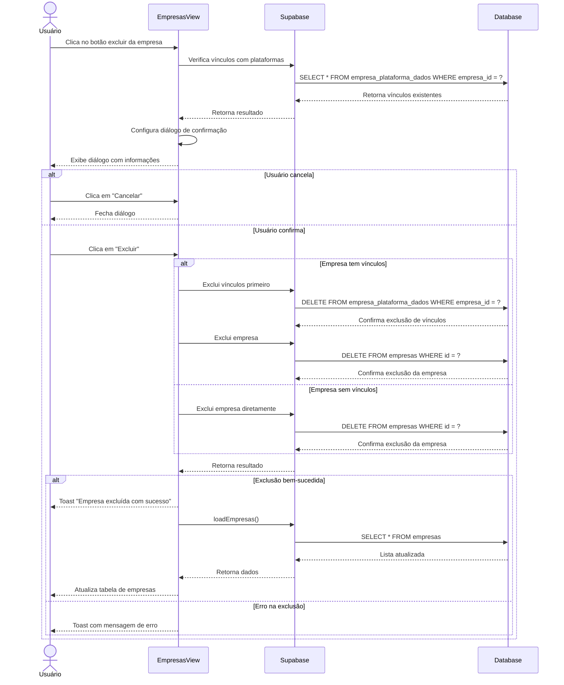

# Funcionalidade: Excluir Empresa

## Descrição

Esta funcionalidade permite excluir empresas do sistema, desde que não estejam vinculadas a plataformas ou processos. Antes da exclusão, o sistema verifica dependências e exibe um diálogo de confirmação com informações relevantes.

## Fluxo da Funcionalidade



## Interface de Usuário

- Botão de exclusão na tabela principal
- Diálogo de confirmação com:
  - Título "Confirmar Exclusão"
  - Informações sobre a empresa
  - Alerta sobre vinculações existentes (quando aplicável)
  - Botões "Cancelar" e "Excluir"
- Feedback visual através de toast após a operação

## Verificação de Dependências

Antes de exibir o diálogo de confirmação, o sistema verifica se a empresa possui vinculações:

```javascript
const handleDelete = async (empresa) => {
  try {
    // Primeiro verifica se existem dados vinculados
    const { data: vinculacoes, error: checkError } = await supabase
      .from('empresa_plataforma_dados')
      .select('id')
      .eq('empresa_id', empresa.id);
    
    if (checkError) throw checkError;
    
    // Configura o diálogo de confirmação
    empresaToDelete.value = {
      ...empresa,
      temVinculacoes: vinculacoes && vinculacoes.length > 0,
      qtdVinculacoes: vinculacoes ? vinculacoes.length : 0
    };
    
    // Mostra o diálogo de confirmação
    showDeleteDialog.value = true;
    
  } catch (error) {
    console.error('Erro ao verificar vinculações da empresa:', error);
    showToastMessage('Erro ao verificar vinculações da empresa', 'error');
  }
}
```

## Processo de Exclusão

Quando o usuário confirma a exclusão:

```javascript
const confirmDelete = async () => {
  if (!empresaToDelete.value) return;
  
  try {
    const empresa = empresaToDelete.value;
    
    if (empresa.temVinculacoes) {
      // Exclui primeiro as vinculações
      const { error: deleteVinculacoesError } = await supabase
        .from('empresa_plataforma_dados')
        .delete()
        .eq('empresa_id', empresa.id);
      
      if (deleteVinculacoesError) throw deleteVinculacoesError;
    }

    // Agora exclui a empresa
    const { error } = await supabase
      .from('empresas')
      .delete()
      .eq('id', empresa.id);

    if (error) throw error;
    
    await loadEmpresas();
    showToastMessage('Empresa excluída com sucesso!', 'success');
    hideDeleteDialog();
  } catch (error) {
    console.error('Erro ao excluir empresa:', error);
    showToastMessage(error.message || 'Erro ao excluir empresa', 'error');
    hideDeleteDialog();
  }
}
```

## Tabelas do Banco de Dados Afetadas

| Tabela | Operação | Condição |
|--------|----------|----------|
| empresa_plataforma_dados | DELETE | WHERE empresa_id = ? |
| empresas | DELETE | WHERE id = ? |

## Regras e Restrições

1. **Vinculações**: Se a empresa tem vinculações com plataformas, estas são excluídas automaticamente
2. **Restrição de integridade**: Se a empresa for referenciada em processos como vencedora, a exclusão não será possível
3. **Irreversibilidade**: A confirmação avisa que a exclusão não pode ser desfeita
4. **Permissões**: Apenas usuários autorizados podem excluir empresas

## Diálogo de Confirmação

```html
<dialog-confirmation
  :show="showDeleteDialog"
  :title="'Confirmar Exclusão'"
  :message="`Deseja realmente excluir a empresa ${empresaToDelete?.nome}?`"
  :warning="empresaToDelete?.temVinculacoes 
    ? `Atenção: Esta empresa possui ${empresaToDelete.qtdVinculacoes} vinculações com plataformas que também serão excluídas.`
    : 'Esta ação não poderá ser desfeita!'"
  confirm-text="Excluir"
  @cancel="hideDeleteDialog"
  @confirm="confirmDelete"
/>
```
