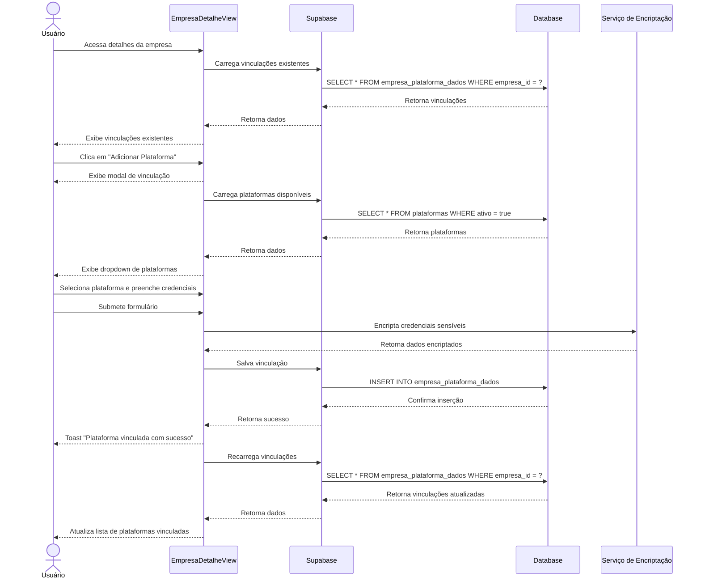

# Funcionalidade: Integração com Plataformas

## Descrição

Esta funcionalidade permite vincular empresas cadastradas com plataformas de licitação, armazenando credenciais de acesso e informações de autenticação de forma segura.

## Fluxo da Funcionalidade



## Interface de Usuário

A interface para gerenciar vinculações de plataformas inclui:

1. **Lista de Plataformas Vinculadas**:
   - Nome da plataforma
   - Status da vinculação
   - Data da última atualização
   - Ações (editar, desativar/ativar, excluir)

2. **Modal de Adição/Edição**:
   - Seleção da plataforma (dropdown)
   - Campos para credenciais (usuário, senha)
   - Campo para chave de certificado (quando aplicável)
   - Campo de observações
   - Botões para cancelar e salvar

## Encriptação de Dados Sensíveis

As credenciais são encriptadas antes do armazenamento:

```javascript
const encriptarCredenciais = (credenciais) => {
  // Implementação simplificada - na prática, usar uma biblioteca de criptografia
  const chave = import.meta.env.VITE_ENCRYPTION_KEY;
  const senha = credenciais.senha;
  
  // Implementação de criptografia segura aqui
  const senhaCriptografada = /* lógica de criptografia */;
  
  return {
    ...credenciais,
    senha_encrypted: senhaCriptografada,
    senha: undefined // Remove a senha em texto claro
  };
}
```

## Vinculação de Plataforma

```javascript
const vincularPlataforma = async (empresaId, plataformaId, credenciais) => {
  try {
    // Encripta dados sensíveis
    const credenciaisSeguras = encriptarCredenciais(credenciais);
    
    // Formata dados para inserção
    const vinculacaoData = {
      empresa_id: empresaId,
      plataforma_id: plataformaId,
      credenciais: credenciaisSeguras,
      status: 'ACTIVE',
      created_at: new Date().toISOString(),
      updated_at: new Date().toISOString()
    };
    
    // Insere no banco
    const { error } = await supabase
      .from('empresa_plataforma_dados')
      .insert(vinculacaoData);
      
    if (error) throw error;
    
    return { success: true };
  } catch (error) {
    console.error('Erro ao vincular plataforma:', error);
    
    if (error.code === '23505') {
      return { success: false, error: 'Esta empresa já está vinculada a esta plataforma.' };
    }
    
    return { success: false, error: 'Erro ao vincular plataforma. Tente novamente.' };
  }
}
```

## Gerenciamento de Status de Vinculação

```javascript
const alterarStatusVinculacao = async (vinculacaoId, novoStatus) => {
  try {
    const { error } = await supabase
      .from('empresa_plataforma_dados')
      .update({ 
        status: novoStatus,
        updated_at: new Date().toISOString() 
      })
      .eq('id', vinculacaoId);
      
    if (error) throw error;
    
    const statusText = novoStatus === 'ACTIVE' ? 'ativada' : 'desativada';
    showToastMessage(`Plataforma ${statusText} com sucesso!`);
    
    return { success: true };
  } catch (error) {
    console.error(`Erro ao ${novoStatus === 'ACTIVE' ? 'ativar' : 'desativar'} vinculação:`, error);
    return { success: false, error };
  }
}
```

## Exclusão de Vinculação

```javascript
const excluirVinculacao = async (vinculacaoId) => {
  try {
    const { error } = await supabase
      .from('empresa_plataforma_dados')
      .delete()
      .eq('id', vinculacaoId);
      
    if (error) throw error;
    
    showToastMessage('Vinculação removida com sucesso!');
    return { success: true };
  } catch (error) {
    console.error('Erro ao remover vinculação:', error);
    return { success: false, error };
  }
}
```

## Estrutura dos Dados

### Tabela: empresa_plataforma_dados

| Coluna | Tipo | Descrição |
|--------|------|-----------|
| id | uuid | Identificador único |
| empresa_id | uuid | ID da empresa (FK) |
| plataforma_id | uuid | ID da plataforma (FK) |
| credenciais | jsonb | Objeto com credenciais encriptadas |
| status | text | Status da vinculação (ACTIVE, INACTIVE, SUSPENDED) |
| created_at | timestamp | Data de criação |
| updated_at | timestamp | Data de última atualização |

### Estrutura do objeto 'credenciais'

```javascript
{
  "usuario": "nome_usuario",
  "senha_encrypted": "senha_criptografada",
  "nivel_acesso": "ADMIN|USER|VIEWER",
  "ultimo_acesso": "2023-06-15T14:30:00Z",
  "certificado": {
    "possui": true,
    "validade": "2024-12-31"
  },
  "observacoes": "Texto com observações sobre o acesso"
}
```

## Considerações de Segurança

1. **Encriptação**: Senhas e dados sensíveis são encriptados antes do armazenamento
2. **Controle de Acesso**: Apenas usuários autorizados podem visualizar e gerenciar vinculações
3. **Auditoria**: Registros de data/hora para criação e modificação
4. **Validação**: Verificações para evitar vinculações duplicadas
5. **Estados**: Possibilidade de suspender uma vinculação sem excluí-la
