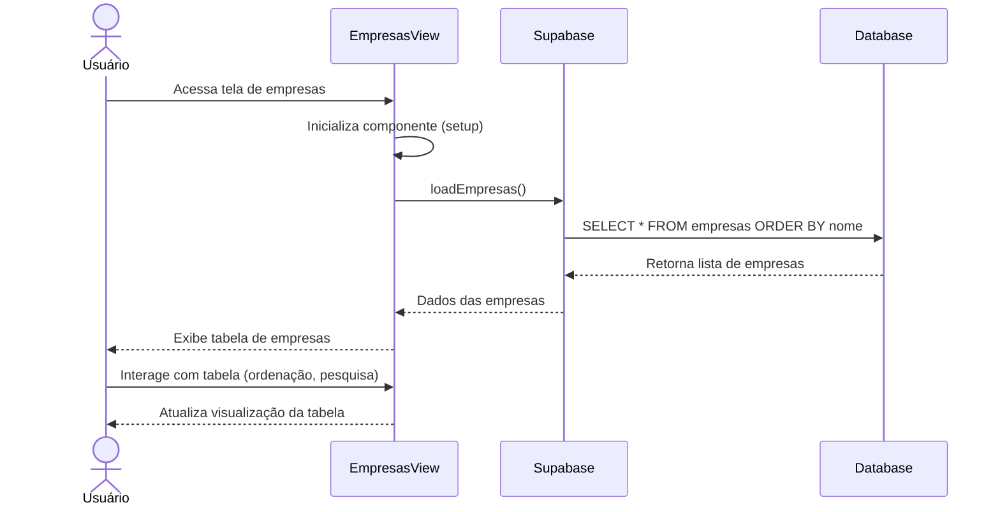

# Funcionalidade: Listar Empresas

## Descrição

Esta funcionalidade exibe uma tabela com todas as empresas cadastradas no sistema, permitindo visualização, pesquisa, ordenação e acesso às demais operações (adicionar, editar, excluir).

## Fluxo da Funcionalidade



## Interface de Usuário

A tabela de empresas apresenta as seguintes características:

- Cabeçalho com título "Empresas Cadastradas"
- Botão para adicionar nova empresa
- Campo de pesquisa para filtrar empresas
- Tabela com colunas para Nome, CNPJ (formatado), Razão Social, Contato e Ações
- Botões de ação para editar e excluir cada empresa
- Paginação para navegação entre páginas de resultados

## Dados Recuperados

Os dados são carregados da tabela `empresas` usando a função `loadEmpresas`:

```javascript
const loadEmpresas = async () => {
  try {
    isLoading.value = true;
    loadError.value = null;
    
    const { data, error } = await supabase
      .from('empresas')
      .select('*')
      .order('nome');

    if (error) throw error;
    
    empresas.value = data || [];
  } catch (error) {
    console.error('Erro ao carregar empresas:', error);
    loadError.value = 'Falha ao carregar empresas. Por favor, tente novamente.';
  } finally {
    isLoading.value = false;
  }
}
```

## Estados da Interface

A interface gerencia os seguintes estados:

| Estado | Propriedade | Descrição |
|--------|-------------|-----------|
| Carregando | isLoading | Indica se a operação de carregamento está em andamento |
| Erro | loadError | Armazena mensagem de erro caso o carregamento falhe |
| Dados | empresas | Armazena a lista de empresas carregadas |

## Formatação de Dados

Os dados exibidos na tabela passam por formatação, especialmente o CNPJ:

```javascript
const formatCNPJ = (cnpj) => {
  if (!cnpj) return '-';
  
  // Formata o CNPJ no padrão 00.000.000/0000-00
  cnpj = cnpj.replace(/[^\d]/g, '');
  return cnpj.replace(/(\d{2})(\d{3})(\d{3})(\d{4})(\d{2})/, '$1.$2.$3/$4-$5');
}
```

## Componentes Reutilizados

- **TheSidebar**: Menu lateral de navegação
- **ToastNotification**: Sistema de notificações toast
- **ConfirmDialog**: Modal de confirmação para exclusões
- **LoadingSpinner**: Indicador visual de carregamento

## Recursos Adicionais

- **Pesquisa**: Filtragem da tabela por nome, CNPJ ou razão social
- **Ordenação**: Possibilidade de ordenar a tabela por diferentes colunas
- **Responsividade**: Layout adaptável para diferentes tamanhos de tela
- **Atualização Automática**: Exibição imediata de alterações após operações CRUD
