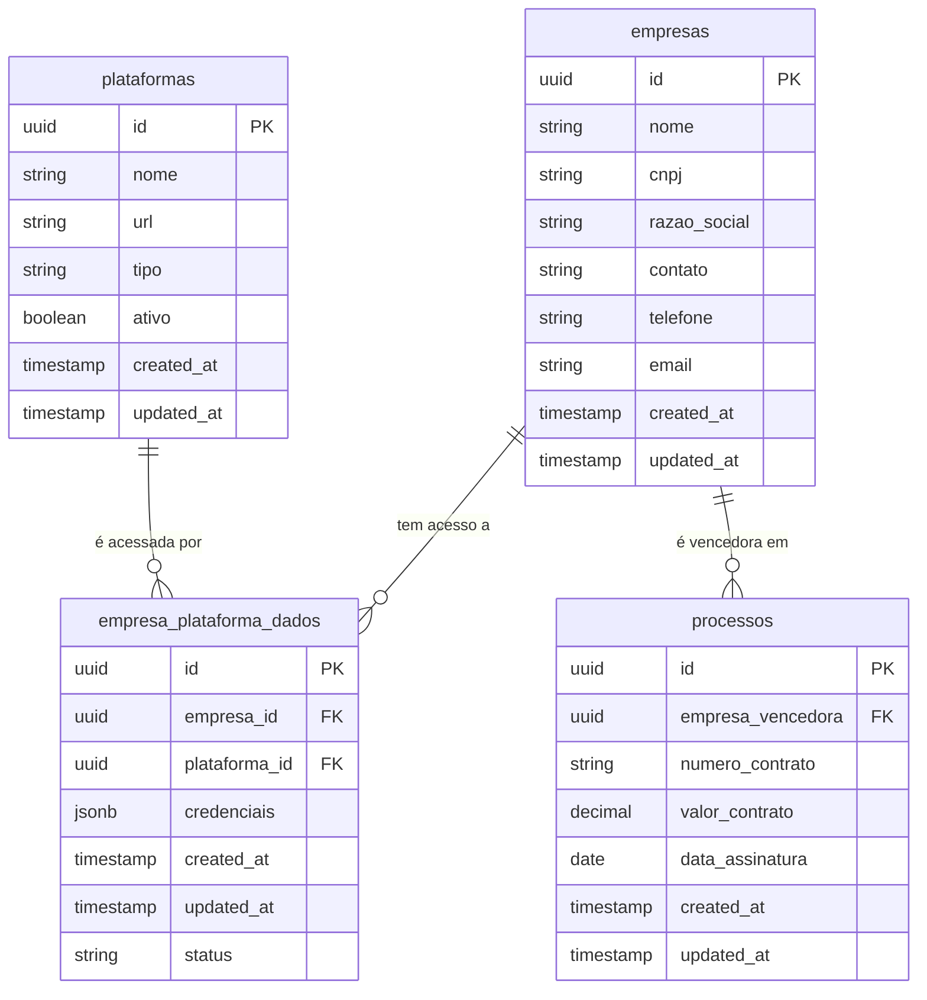

# Modelo de Dados - Empresas

## Visão Geral do Modelo

Este documento detalha a estrutura de dados relacionada ao módulo de Empresas, incluindo tabelas, relacionamentos, e especificações de campos.

## Diagrama ER



## Detalhamento das Tabelas

### Tabela: empresas

Esta é a tabela principal que armazena informações cadastrais das empresas.

| Coluna | Tipo | Nulável | Descrição | Restrições |
|--------|------|---------|-----------|------------|
| id | uuid | não | Identificador único da empresa | Chave primária, default: gen_random_uuid() |
| nome | text | não | Nome comercial da empresa | - |
| cnpj | text | não | CNPJ no formato limpo (apenas números) | Único |
| razao_social | text | não | Razão social completa | - |
| contato | text | sim | Nome do contato principal | - |
| telefone | text | sim | Telefone de contato | - |
| email | text | sim | Email de contato | - |
| created_at | timestamp with time zone | não | Data de criação | Default: now() |
| updated_at | timestamp with time zone | não | Data de última atualização | Default: now() |

#### Índices da tabela empresas

- Índice primário: id
- Índice único: cnpj
- Índice para pesquisa: nome
- Índice para pesquisa: razao_social

### Tabela: empresa_plataforma_dados

Esta tabela estabelece relacionamentos entre empresas e plataformas, armazenando credenciais de acesso.

| Coluna | Tipo | Nulável | Descrição | Restrições |
|--------|------|---------|-----------|------------|
| id | uuid | não | Identificador único do vínculo | Chave primária, default: gen_random_uuid() |
| empresa_id | uuid | não | ID da empresa | Chave estrangeira |
| plataforma_id | uuid | não | ID da plataforma | Chave estrangeira |
| credenciais | jsonb | sim | Credenciais de acesso em formato JSON | - |
| created_at | timestamp with time zone | não | Data de criação | Default: now() |
| updated_at | timestamp with time zone | não | Data de última atualização | Default: now() |
| status | text | não | Status do vínculo | Default: 'ACTIVE', CHECK (status IN ('ACTIVE', 'INACTIVE', 'SUSPENDED')) |

#### Índices da tabela empresa_plataforma_dados

- Índice primário: id
- Índice composto único: (empresa_id, plataforma_id)
- Índice para pesquisa: empresa_id
- Índice para pesquisa: plataforma_id
- Índice para filtragem: status

### Tabela: plataformas

Esta tabela armazena informações sobre plataformas de licitação.

| Coluna | Tipo | Nulável | Descrição | Restrições |
|--------|------|---------|-----------|------------|
| id | uuid | não | Identificador único da plataforma | Chave primária, default: gen_random_uuid() |
| nome | text | não | Nome da plataforma | - |
| url | text | sim | URL de acesso principal | - |
| tipo | text | não | Tipo da plataforma | CHECK (tipo IN ('GOV', 'PRIVATE', 'OTHER')) |
| ativo | boolean | não | Indica se a plataforma está ativa | Default: true |
| created_at | timestamp with time zone | não | Data de criação | Default: now() |
| updated_at | timestamp with time zone | não | Data de última atualização | Default: now() |

### Tabela: processos (Relacionada)

Esta tabela se relaciona com `empresas` através da coluna `empresa_vencedora`.

| Coluna | Tipo | Nulável | Descrição | Restrições |
|--------|------|---------|-----------|------------|
| id | uuid | não | Identificador único do processo | Chave primária |
| empresa_vencedora | uuid | sim | ID da empresa vencedora | Chave estrangeira |
| numero_contrato | text | sim | Número do contrato gerado | - |
| valor_contrato | numeric | sim | Valor do contrato | - |
| ... | ... | ... | (outros campos do processo) | ... |

## Chaves Estrangeiras

- `empresa_plataforma_dados.empresa_id` → `empresas.id`
  - ON DELETE: CASCADE (excluir vínculos quando a empresa é excluída)
  - ON UPDATE: CASCADE (atualizar vínculos quando o ID da empresa é atualizado)

- `empresa_plataforma_dados.plataforma_id` → `plataformas.id`
  - ON DELETE: CASCADE (excluir vínculos quando a plataforma é excluída)
  - ON UPDATE: CASCADE (atualizar vínculos quando o ID da plataforma é atualizado)

- `processos.empresa_vencedora` → `empresas.id`
  - ON DELETE: SET NULL (desassociar o processo quando a empresa é excluída)
  - ON UPDATE: CASCADE (atualizar associação quando o ID da empresa é atualizado)

## Estrutura do JSON em Campos JSONB

### Campo: credenciais (tabela empresa_plataforma_dados)

```javascript
{
  "usuario": "nome_usuario",
  "senha_encrypted": "senha_criptografada",
  "nivel_acesso": "ADMIN|USER|VIEWER",
  "ultimo_acesso": "2023-06-15T14:30:00Z",
  "certificado": {
    "possui": true,
    "validade": "2024-12-31"
  },
  "observacoes": "Texto com observações sobre o acesso"
}
```

## SQL para Criação das Tabelas

```sql
-- Tabela de empresas
CREATE TABLE IF NOT EXISTS empresas (
    id UUID PRIMARY KEY DEFAULT gen_random_uuid(),
    nome TEXT NOT NULL,
    cnpj TEXT NOT NULL UNIQUE,
    razao_social TEXT NOT NULL,
    contato TEXT,
    telefone TEXT,
    email TEXT,
    created_at TIMESTAMP WITH TIME ZONE DEFAULT now() NOT NULL,
    updated_at TIMESTAMP WITH TIME ZONE DEFAULT now() NOT NULL
);

CREATE INDEX idx_empresas_nome ON empresas(nome);
CREATE INDEX idx_empresas_razao_social ON empresas(razao_social);

-- Tabela de plataformas
CREATE TABLE IF NOT EXISTS plataformas (
    id UUID PRIMARY KEY DEFAULT gen_random_uuid(),
    nome TEXT NOT NULL,
    url TEXT,
    tipo TEXT NOT NULL CHECK (tipo IN ('GOV', 'PRIVATE', 'OTHER')),
    ativo BOOLEAN DEFAULT TRUE NOT NULL,
    created_at TIMESTAMP WITH TIME ZONE DEFAULT now() NOT NULL,
    updated_at TIMESTAMP WITH TIME ZONE DEFAULT now() NOT NULL
);

-- Tabela de relacionamento entre empresas e plataformas
CREATE TABLE IF NOT EXISTS empresa_plataforma_dados (
    id UUID PRIMARY KEY DEFAULT gen_random_uuid(),
    empresa_id UUID NOT NULL REFERENCES empresas(id) ON DELETE CASCADE,
    plataforma_id UUID NOT NULL REFERENCES plataformas(id) ON DELETE CASCADE,
    credenciais JSONB,
    status TEXT NOT NULL DEFAULT 'ACTIVE' CHECK (status IN ('ACTIVE', 'INACTIVE', 'SUSPENDED')),
    created_at TIMESTAMP WITH TIME ZONE DEFAULT now() NOT NULL,
    updated_at TIMESTAMP WITH TIME ZONE DEFAULT now() NOT NULL,
    UNIQUE (empresa_id, plataforma_id)
);

CREATE INDEX idx_empresa_plataforma_empresa ON empresa_plataforma_dados(empresa_id);
CREATE INDEX idx_empresa_plataforma_plataforma ON empresa_plataforma_dados(plataforma_id);
CREATE INDEX idx_empresa_plataforma_status ON empresa_plataforma_dados(status);
```

## Políticas de Segurança (RLS)

```sql
-- Política para empresas - somente usuários autenticados podem ler
ALTER TABLE empresas ENABLE ROW LEVEL SECURITY;

CREATE POLICY "Permitir leitura para usuários autenticados"
    ON empresas FOR SELECT
    TO authenticated
    USING (true);

-- Apenas usuários com role 'admin' podem modificar
CREATE POLICY "Permitir modificação para admins"
    ON empresas FOR ALL
    TO authenticated
    USING ((SELECT role FROM profiles WHERE user_id = auth.uid()) = 'admin');

-- Política similar para empresa_plataforma_dados
ALTER TABLE empresa_plataforma_dados ENABLE ROW LEVEL SECURITY;

CREATE POLICY "Permitir leitura para usuários autenticados"
    ON empresa_plataforma_dados FOR SELECT
    TO authenticated
    USING (true);

CREATE POLICY "Permitir modificação para admins"
    ON empresa_plataforma_dados FOR ALL
    TO authenticated
    USING ((SELECT role FROM profiles WHERE user_id = auth.uid()) = 'admin');
```
