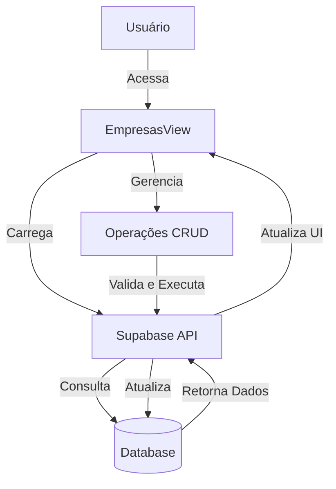
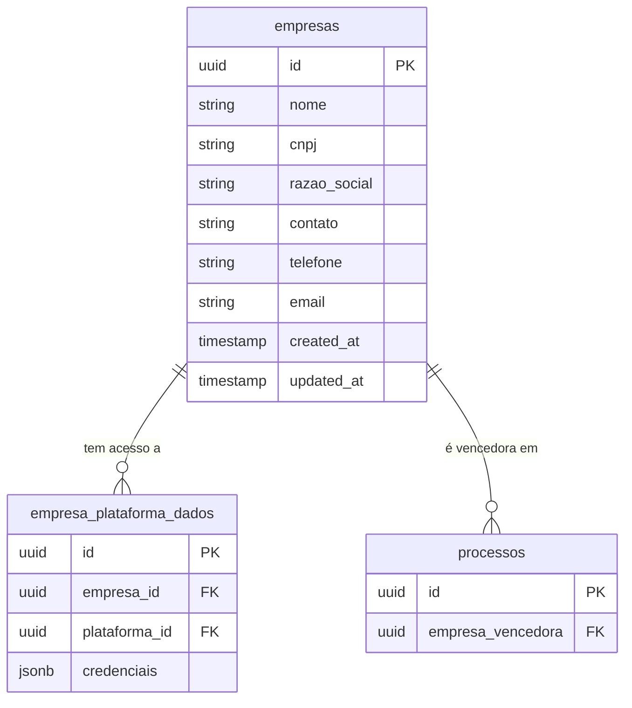
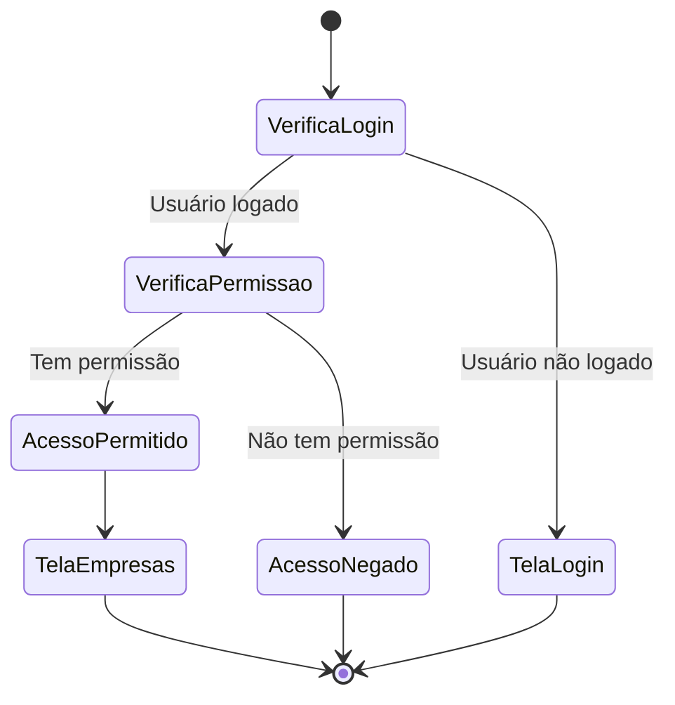

# Visão Geral - Gerenciamento de Empresas

## Descrição da Funcionalidade

A tela de "Gerenciamento de Empresas" permite o controle completo do cadastro de empresas que participam das licitações ou são vencedoras de contratos. Esta interface possibilita aos usuários visualizar, adicionar, editar e excluir empresas, além de gerenciar vínculos entre empresas e plataformas.

## Acesso

- Disponível para usuários autenticados com permissões adequadas
- Caminho: Menu Principal > Cadastros > Empresas

## Funcionalidades Principais

1. **Listar Empresas**: Visualização de todas as empresas cadastradas no sistema
2. **Adicionar Empresa**: Inclusão de novas empresas com validação de CNPJ
3. **Editar Empresa**: Modificação dos dados de uma empresa existente
4. **Excluir Empresa**: Remoção de uma empresa do sistema (com verificação de vínculos)
5. **Visualizar Detalhes**: Consulta de informações detalhadas de uma empresa

## Diagrama de Arquitetura

## Modelo de Dados Simplificado

## Permissões e Acesso

A funcionalidade de Empresas é acessível para usuários com permissões adequadas, seguindo as políticas de segurança do Supabase:

## Componentes Principais

1. **EmpresasView.js**: Componente principal que gerencia a tela de empresas
2. **Modal de Cadastro/Edição**: Interface para adicionar ou editar empresas
3. **Diálogo de Confirmação**: Utilizado para confirmar exclusões
4. **Toast Notifications**: Feedback visual para o usuário após operações

## Tabelas do Banco de Dados

| Tabela | Descrição |
|--------|-----------|
| empresas | Armazena as informações cadastrais das empresas |
| empresa_plataforma_dados | Relaciona empresas com plataformas de licitação (vínculo N:N) |
| processos | Contém referência à empresa vencedora de cada processo |

## Tecnologias Utilizadas

- Vue.js para a interface do usuário
- Supabase como backend e banco de dados
- Validações de CNPJ e formulários em tempo real
- Sistema de notificações por toast
