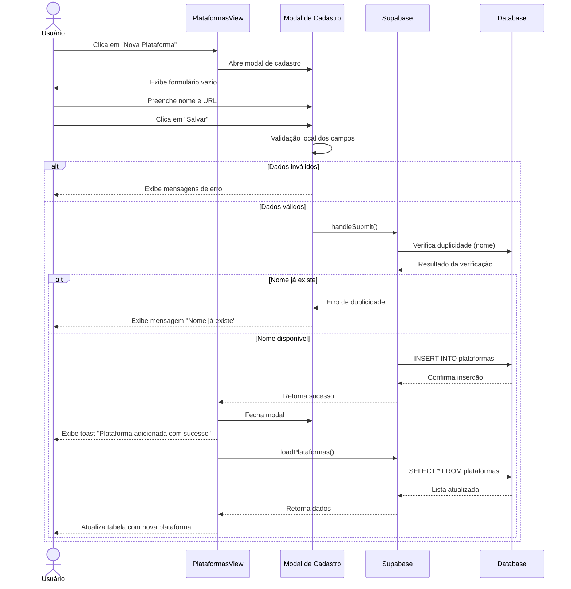

# Funcionalidade: Adicionar Plataforma

## Descrição

Esta funcionalidade permite adicionar novas plataformas de licitação ao sistema através de um modal de cadastro. O usuário fornece informações básicas como nome e URL da plataforma.

## Fluxo da Funcionalidade



## Interface de Usuário

O modal de cadastro de plataformas contém:

- Título "Nova Plataforma"
- Campo para o nome da plataforma (obrigatório)
- Campo para a URL da plataforma (obrigatório)
- Botões de "Cancelar" e "Salvar"
- Indicadores visuais para campos obrigatórios não preenchidos
- Mensagens de erro específicas quando necessário

## Validações Realizadas

O formulário realiza as seguintes validações:

1. **Campos obrigatórios**: Verifica se nome e URL foram preenchidos
2. **Duplicidade**: Verifica se já existe uma plataforma com o mesmo nome

```javascript
// Verificação básica de campos obrigatórios
if (!formData.value.nome || !formData.value.url) {
  showToast('Nome e URL são obrigatórios', 'error');
  return;
}

// Se o estado estiver selecionado, faz validações adicionais
if (formData.value.estado) {
  const valid = validacoesCruzadas.validarEstadoPlataforma(
    formData.value.estado, 
    novaPlatforma.value.nome
  )
  
  if (!valid) {
    showToast(`Atenção: "${novaPlatforma.value.nome}" não é uma plataforma comum para o estado ${formData.value.estado}`, 'warning')
    // A mensagem é exibida, mas permite continuar com o salvamento
  }
}
```

## Submissão do Formulário

O processo de inserção no banco de dados é realizado através da função `handleSubmit`:

```javascript
const handleSubmit = async () => {
  try {
    // Verificação básica de campos obrigatórios
    if (!formData.value.nome || !formData.value.url) {
      showToast('Nome e URL são obrigatórios', 'error');
      return;
    }

    const { data: { user } } = await supabase.auth.getUser();
    if (!user) {
      throw new Error('Usuário não autenticado');
    }

    // 1. Salvar dados da plataforma
    const plataformaData = {
      nome: formData.value.nome,
      url: formData.value.url,
      responsavel_id: user.id
    };

    // Inserir nova plataforma
    const { data, error } = await supabase
      .from('plataformas')
      .insert(plataformaData)
      .select();

    if (error) throw error;
    
    // 2. Se empresas foram selecionadas, criar vínculos
    if (empresasSelecionadas.value.length > 0) {
      const vinculacoes = empresasSelecionadas.value.map(empresaId => ({
        empresa_id: empresaId,
        plataforma_id: data[0].id,
        responsavel_id: user.id,
        created_at: new Date().toISOString()
      }));

      const { error: vinculacaoError } = await supabase
        .from('empresa_plataforma_dados')
        .insert(vinculacoes);

      if (vinculacaoError) throw vinculacaoError;
    }

    await loadPlataformas(selectedEmpresa.value?.id);
    closeModal();
    showToast('Plataforma cadastrada com sucesso!', 'success');
  } catch (error) {
    console.error('Erro ao salvar plataforma:', error);
    showToast(`Erro ao salvar plataforma: ${error.message}`, 'error');
  }
};
```

## Resetar Formulário

Após salvar ou cancelar, o formulário é resetado:

```javascript
const closeModal = () => {
  showModal.value = false;
  editingId.value = null;
  formData.value = { nome: '', url: '' };
  empresasSelecionadas.value = [];
}
```

## Tabela e Colunas

### Inserção na tabela plataformas

| Coluna | Tipo | Descrição | Valor |
|--------|------|-----------|-------|
| id | uuid | Identificador único | Gerado automaticamente |
| nome | text | Nome da plataforma | Fornecido pelo usuário |
| url | text | URL de acesso | Fornecido pelo usuário |
| responsavel_id | uuid | ID do usuário que criou | ID do usuário atual |
| created_at | timestamp | Data de criação | Gerado automaticamente |
| updated_at | timestamp | Data de atualização | Gerado automaticamente |

### Inserção na tabela empresa_plataforma_dados (opcional)

Se empresas forem selecionadas durante a criação, são inseridos registros na tabela de relacionamento:

| Coluna | Tipo | Descrição | Valor |
|--------|------|-----------|-------|
| empresa_id | uuid | ID da empresa | ID da empresa selecionada |
| plataforma_id | uuid | ID da plataforma | ID da plataforma criada |
| responsavel_id | uuid | ID do usuário responsável | ID do usuário atual |
| created_at | timestamp | Data de criação | Data atual |
