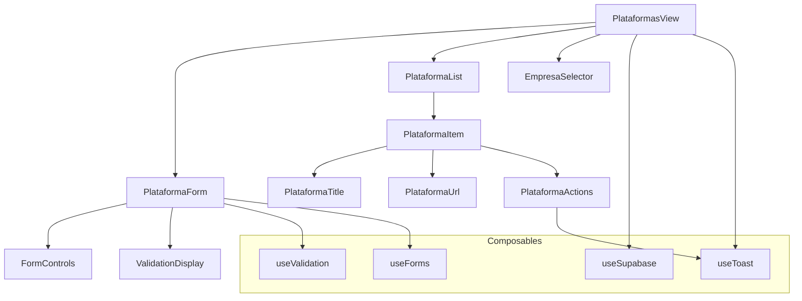
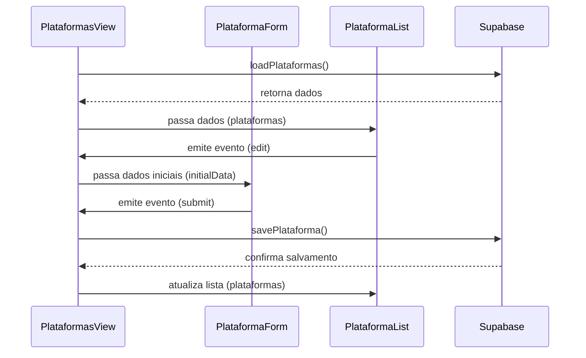

# Arquitetura de Componentes

## Descrição

Esta documentação detalha a arquitetura de componentes utilizados no módulo de Gerenciamento de Plataformas, apresentando a estrutura, relacionamentos e responsabilidades de cada componente.

## Visão Geral da Arquitetura



## Componentes Principais

### PlataformasView

Componente principal que coordena todo o módulo de plataformas.

**Responsabilidades:**

- Gerenciar o estado global da tela
- Carregar dados iniciais
- Coordenar operações CRUD
- Gerenciar modais e diálogos

**Estado Interno:**

```javascript
// Estado do componente
const plataformas = ref([]);
const isLoading = ref(false);
const showModal = ref(false);
const showDeleteDialog = ref(false);
const showDadosModal = ref(false);
const editingId = ref(null);
const plataformaToDelete = ref(null);
const selectedEmpresa = ref(null);
const empresas = ref([]);
```

**Ciclo de Vida:**

```javascript
// Carrega dados iniciais ao montar o componente
onMounted(() => {
  loadPlataformas();
  loadEmpresas();
  
  // Configurar subscription para atualizações em tempo real
  const channel = supabase.channel('plataformas-updates')
    .on('postgres_changes', 
      { event: '*', schema: 'public', table: 'plataformas' }, 
      () => loadData()
    )
    .subscribe();
  
  SupabaseManager.addSubscription('plataformas-updates', channel);
});

// Limpa recursos ao desmontar
onUnmounted(() => {
  const channel = SupabaseManager.getSubscription('plataformas-updates');
  if (channel) {
    supabase.removeChannel(channel);
    SupabaseManager.removeSubscription('plataformas-updates');
  }
});
```

### PlataformaForm

Componente de formulário para adicionar e editar plataformas.

**Props:**

- `isEditing`: Boolean - Indica se está em modo de edição
- `initialData`: Object - Dados iniciais para edição
- `empresas`: Array - Lista de empresas disponíveis para vínculo
- `selectedEmpresa`: Object - Empresa selecionada para vinculação específica

**Eventos:**

- `submit`: Evento emitido ao submeter formulário
- `cancel`: Evento emitido ao cancelar formulário

**Template:**

```html
<form @submit.prevent="handleSubmit">
  <div class="form-grid">
    <!-- Campo: Nome da Plataforma -->
    <div class="form-group">
      <label for="nome">Nome da Plataforma*</label>
      <input 
        id="nome" 
        v-model="formData.nome" 
        class="form-control" 
        type="text" 
        required
      />
    </div>
    
    <!-- Campo: URL da Plataforma -->
    <div class="form-group">
      <label for="url">URL da Plataforma*</label>
      <input 
        id="url" 
        v-model="formData.url" 
        class="form-control" 
        type="text" 
        required
      />
    </div>
    
    <!-- Campos específicos de empresa quando aplicável -->
    <template v-if="selectedEmpresa">
      <!-- Campos de login, senha, etc... -->
    </template>
    
    <!-- Seleção de empresas quando aplicável -->
    <template v-else>
      <!-- Lista de seleção de empresas -->
    </template>
  </div>
  
  <div class="modal-actions">
    <button type="button" class="btn-cancel" @click="$emit('cancel')">
      Cancelar
    </button>
    <button type="submit" class="btn-save">
      {{ isEditing ? 'Atualizar' : 'Salvar' }}
    </button>
  </div>
</form>
```

### PlataformaList

Lista de plataformas com opções de filtragem e ações.

**Props:**

- `plataformas`: Array - Lista de plataformas a exibir
- `isLoading`: Boolean - Estado de carregamento
- `selectedEmpresa`: Object - Empresa selecionada para filtro (opcional)

**Eventos:**

- `edit`: Evento para editar plataforma
- `delete`: Evento para excluir plataforma
- `manage-dados`: Evento para gerenciar dados específicos

**Template:**

```html
<div class="plataformas-container">
  <div v-if="isLoading" class="loading-indicator">
    <span class="loader"></span>
  </div>
  
  <table v-else class="plataformas-table">
    <thead>
      <tr>
        <th>Nome</th>
        <th>URL</th>
        <!-- Colunas condicionais baseadas em selectedEmpresa -->
        <template v-if="selectedEmpresa">
          <th>Login</th>
          <th>Senha</th>
          <th>Validade</th>
          <th>Observações</th>
        </template>
        <th>Ações</th>
      </tr>
    </thead>
    <tbody>
      <tr v-for="plataforma in plataformas" :key="plataforma.id">
        <!-- Células da tabela -->
      </tr>
    </tbody>
  </table>
</div>
```

### EmpresaSelector

Componente para selecionar empresa para filtragem.

**Props:**

- `empresas`: Array - Lista de empresas disponíveis
- `selectedEmpresa`: Object - Empresa atual selecionada

**Eventos:**

- `select`: Evento emitido ao selecionar empresa
- `clear`: Evento emitido ao limpar seleção

## Composables Utilizados

### useSupabase

Gerencia a conexão e operações com o Supabase.

```javascript
export function useSupabase() {
  const loadPlataformas = async (empresaId = null) => {
    // Implementação da consulta ao Supabase...
  };
  
  const savePlataforma = async (data, id = null) => {
    // Implementação do salvamento...
  };
  
  const deletePlataforma = async (id) => {
    // Implementação da exclusão...
  };
  
  return {
    loadPlataformas,
    savePlataforma,
    deletePlataforma
    // Outros métodos...
  };
}
```

### useValidation

Gerencia validações de formulários.

```javascript
export function useValidation() {
  const validateNome = (nome) => {
    // Validação de nome...
  };
  
  const validateUrl = (url) => {
    // Validação de URL...
  };
  
  return {
    validateNome,
    validateUrl
    // Outros métodos de validação...
  };
}
```

## Fluxo de Dados Entre Componentes



## Estado Compartilhado

### Injeção de Dependências

O componente principal fornece estado e funções via props:

```javascript
// Em PlataformasView
provide('plataformaOperations', {
  editPlataforma,
  deletePlataforma,
  manageDados
});

// Em componentes filhos
const plataformaOperations = inject('plataformaOperations');
```

### Composição de Estado

A arquitetura usa composição para gerenciar estado complexo:

```javascript
// Composição de estado em PlataformasView
const { 
  plataformas, 
  isLoading, 
  loadPlataformas 
} = useSupabase();

const { 
  showToast 
} = useToast();

const {
  showModal,
  openModal,
  closeModal
} = useModal();
```

## Responsividade

Os componentes adaptam-se a diferentes tamanhos de tela através de media queries e classes condicionais:

```html
<div :class="['main-content', sidebar.collapsed && 'expanded']">
  <!-- Conteúdo responsivo -->
</div>
```

```css
/* Media queries para adaptação */
@media (max-width: 768px) {
  .form-grid {
    grid-template-columns: 1fr;
  }
  
  .plataformas-table {
    font-size: 14px;
  }
}
```

## Reusabilidade

Vários componentes são construídos para serem reutilizados em diferentes contextos:

1. **FormControls**: Componentes genéricos de entrada de formulário
2. **ConfirmDialog**: Diálogo de confirmação reutilizável
3. **ToastNotification**: Sistema de notificação utilizado em todo o sistema

## Detalhes de Implementação

### Lazy Loading

Componentes pesados são carregados sob demanda:

```javascript
const PlataformaForm = defineAsyncComponent(() => 
  import('@/components/PlataformaForm.vue')
);
```

### Virtual Scrolling

Para listas grandes de plataformas, o sistema utiliza rolagem virtual:

```html
<virtual-scroller
  class="table-container"
  :items="plataformasFiltered"
  :item-height="50"
  page-mode
>
  <template v-slot="{ item: plataforma }">
    <plataforma-item :plataforma="plataforma" />
  </template>
</virtual-scroller>
```

### Memoização de Funções

Otimizações de performance através de memoização:

```javascript
const getPlataformaById = useMemo((id) => {
  return plataformas.value.find(p => p.id === id);
});
```
