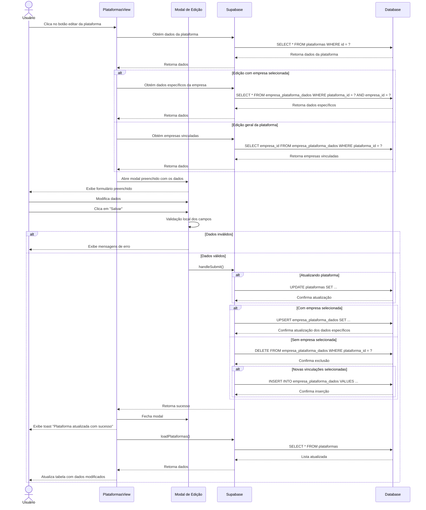

# Funcionalidade: Editar Plataforma

## Descrição

Esta funcionalidade permite modificar dados de plataformas existentes, incluindo informações básicas (como nome e URL) e, quando aplicável, os dados de acesso específicos para uma empresa selecionada.

## Fluxo da Funcionalidade



## Interface de Usuário

O modal de edição apresenta diferentes interfaces dependendo do contexto:

1. **Edição com empresa selecionada**:
   - Campos básicos da plataforma (nome, URL)
   - Campos específicos da empresa (login, senha, data de validade, observações)

2. **Edição geral da plataforma**:
   - Campos básicos (nome, URL)
   - Lista de seleção de empresas para vincular à plataforma

## Carregamento de Dados para Edição

```javascript
const editPlataforma = async (plataforma) => {
  editingId.value = plataforma.id
  
  // Dados básicos da plataforma
  formData.value = {
    nome: plataforma.nome,
    url: plataforma.url
  }

  if (selectedEmpresa.value) {
    // Modo edição com empresa específica
    const dadosEspecificos = plataforma.dados_especificos || {}
    formData.value = {
      ...formData.value,
      login: dadosEspecificos.login || '',
      senha: dadosEspecificos.senha || '',
      data_validade: dadosEspecificos.data_validade || '',
      observacoes: dadosEspecificos.observacoes || ''
    }
  } else {
    // Carrega empresas vinculadas
    const { data } = await supabase
      .from('empresa_plataforma_dados')
      .select('empresa_id')
      .eq('plataforma_id', plataforma.id)

    empresasSelecionadas.value = data?.map(v => v.empresa_id) || []
  }

  showModal.value = true
}
```

## Submissão do Formulário

A lógica de atualização é complexa e considera diferentes cenários:

```javascript
const handleSubmit = async () => {
  try {
    // Verificação básica de campos obrigatórios
    if (!formData.value.nome || !formData.value.url) {
      showToast('Nome e URL são obrigatórios', 'error');
      return;
    }
    
    const { data: { user } } = await supabase.auth.getUser();
    if (!user) {
      throw new Error('Usuário não autenticado');
    }

    // 1. Atualizar dados básicos da plataforma
    const plataformaData = {
      nome: formData.value.nome,
      url: formData.value.url,
      responsavel_id: user.id
    };

    const { error } = await supabase
      .from('plataformas')
      .update(plataformaData)
      .eq('id', editingId.value);

    if (error) throw error;

    // 2. Gerenciar vinculações com empresas
    if (!selectedEmpresa.value && empresasSelecionadas.value.length > 0) {
      // Remove vinculações antigas
      await supabase
        .from('empresa_plataforma_dados')
        .delete()
        .eq('plataforma_id', editingId.value);

      // Insere novas vinculações
      const vinculacoes = empresasSelecionadas.value.map(empresaId => ({
        empresa_id: empresaId,
        plataforma_id: editingId.value,
        responsavel_id: user.id,
        created_at: new Date().toISOString()
      }));

      if (vinculacoes.length > 0) {
        const { error: vinculacaoError } = await supabase
          .from('empresa_plataforma_dados')
          .insert(vinculacoes);

        if (vinculacaoError) throw vinculacaoError;
      }
    }

    // 3. Se tiver empresa selecionada, atualiza dados específicos
    if (selectedEmpresa.value) {
      const dadosEspecificos = {
        plataforma_id: editingId.value,
        empresa_id: selectedEmpresa.value.id,
        login: formData.value.login || null,
        senha: formData.value.senha || null,
        data_validade: formData.value.data_validade || null,
        observacoes: formData.value.observacoes || null,
        responsavel_id: user.id
      };

      const { error } = await supabase
        .from('empresa_plataforma_dados')
        .upsert(dadosEspecificos, {
          onConflict: 'empresa_id,plataforma_id'
        });

      if (error) throw error;
    }

    await loadPlataformas(selectedEmpresa.value?.id);
    closeModal();
    showToast('Plataforma atualizada com sucesso!', 'success');
  } catch (error) {
    console.error('Erro ao salvar:', error);
    showToast(`Erro ao atualizar plataforma: ${error.message}`, 'error');
  }
};
```

## Tabelas e Colunas Atualizadas

### Tabela: plataformas

| Coluna | Tipo | Descrição |
|--------|------|-----------|
| nome | text | Nome da plataforma |
| url | text | URL de acesso |
| responsavel_id | uuid | ID do usuário que atualizou |
| updated_at | timestamp | Data da atualização (automática) |

### Tabela: empresa_plataforma_dados

Dependendo do cenário, os seguintes dados podem ser atualizados:

| Coluna | Tipo | Descrição |
|--------|------|-----------|
| login | text | Nome de usuário para acesso |
| senha | text | Senha para acesso |
| data_validade | date | Data de validade do acesso |
| observacoes | text | Observações adicionais |
| responsavel_id | uuid | ID do usuário responsável |
| updated_at | timestamp | Data de atualização |
