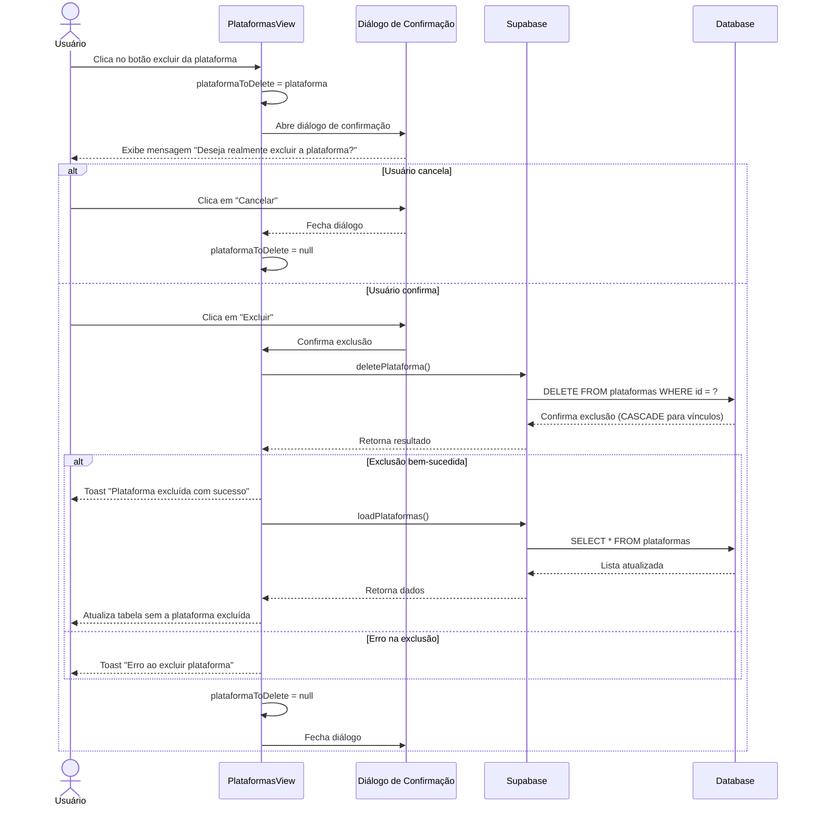

# Funcionalidade: Excluir Plataforma

## Descrição

Esta funcionalidade permite excluir plataformas do sistema. Antes da exclusão, o sistema verifica possíveis dependências e exibe um diálogo de confirmação para evitar exclusões acidentais.

## Fluxo da Funcionalidade



## Interface de Usuário

- Botão de exclusão na tabela principal (ícone de lixeira)
- Diálogo de confirmação com:
  - Título "Confirmar Exclusão"
  - Mensagem perguntando se deseja excluir a plataforma
  - Aviso sobre a irreversibilidade da ação
  - Botões "Cancelar" e "Excluir"
- Feedback visual com toast após a operação

## Diálogo de Confirmação

O componente mostra um diálogo de confirmação antes da exclusão:

```javascript
const confirmarExclusao = (plataforma) => {
  plataformaToDelete.value = plataforma;
  showDeleteDialog.value = true;
};

const cancelarExclusao = () => {
  showDeleteDialog.value = false;
  plataformaToDelete.value = null;
};
```

## Processo de Exclusão

```javascript
const deletePlataforma = async () => {
  try {
    if (!plataformaToDelete.value) return;
    
    const { error } = await supabase
      .from('plataformas')
      .delete()
      .eq('id', plataformaToDelete.value.id);

    if (error) throw error;
    
    await loadPlataformas(selectedEmpresa.value?.id);
    showToast('Plataforma excluída com sucesso!', 'success');
  } catch (error) {
    console.error('Erro ao excluir plataforma:', error);
    showToast('Erro ao excluir plataforma: ' + error.message, 'error');
  } finally {
    showDeleteDialog.value = false;
    plataformaToDelete.value = null;
  }
};
```

## Efeito em Cascata

A exclusão de uma plataforma dispara efeitos em cascata em tabelas relacionadas:

1. **empresa_plataforma_dados**: Todos os registros associados à plataforma são automaticamente excluídos devido à restrição de chave estrangeira com CASCADE.

## Tabelas e Colunas Afetadas

### Tabela: plataformas

Registro completo excluído com base no ID da plataforma.

### Tabela: empresa_plataforma_dados

| Coluna | Tipo | Condição |
|--------|------|----------|
| plataforma_id | uuid | Registros excluídos onde plataforma_id = ID da plataforma excluída (CASCADE) |

## Restrição de Integridade Referencial

```sql
CREATE TABLE empresa_plataforma_dados (
    id UUID PRIMARY KEY DEFAULT gen_random_uuid(),
    empresa_id UUID NOT NULL REFERENCES empresas(id) ON DELETE CASCADE,
    plataforma_id UUID NOT NULL REFERENCES plataformas(id) ON DELETE CASCADE,
    /* outras colunas */
    UNIQUE (empresa_id, plataforma_id)
);
```

Esta definição garante que quando uma plataforma é excluída, todos os seus vínculos com empresas também são removidos automaticamente.
